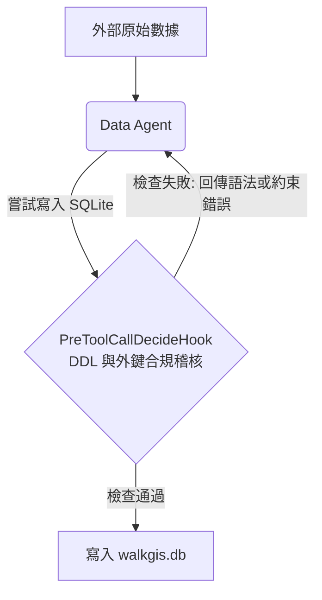
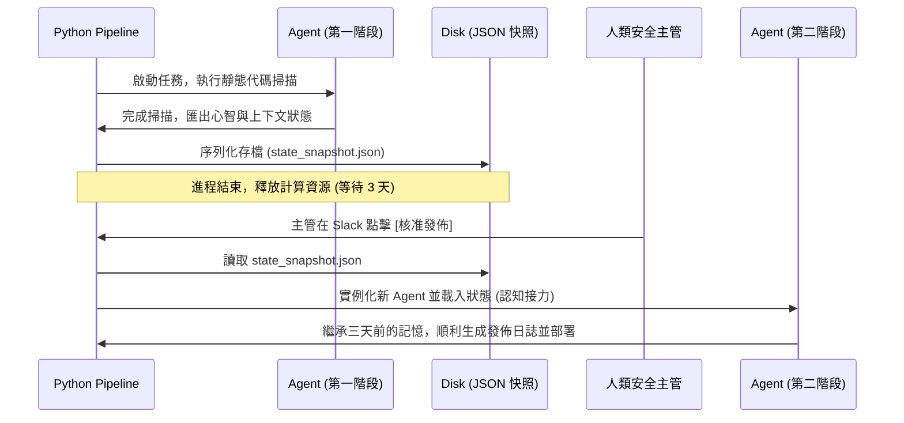
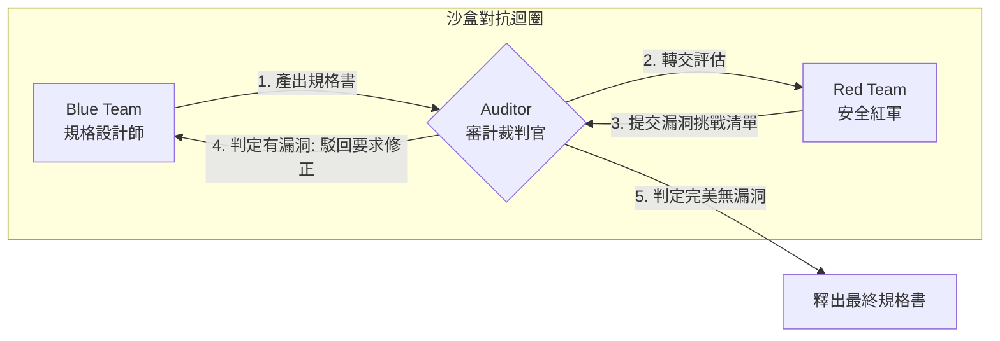

# 🚀 Antigravity SDK 進階延伸 Labs 設計說明書

本說明書為您規劃了多個具備前瞻性、解決企業級複雜場景的延伸 Labs 與 Loop Engineering 核心概念範例。此文檔主要作為系統設計與架構規劃，無須實作代碼，旨在幫助您理解未來 Agentic AI 在長週期、高安全要求、多代理對抗以及認知自我演進場景下的設計心法。

---

## 📂 第一部分：學術/系統架構型延伸 Labs (保留 ID 與未來空間)

### 🔄 Lab 7：資料自動合規 Agent (Data Compliance Agent with RAG & SQLite Verification)
*   **核心觀念**：**Stateful Loop (狀態迴圈)**。讓 Agent 扮演資料工程師，在「嘗試寫入 $\rightarrow$ 觸發資料庫約束/合規失敗 $\rightarrow$ 自動清洗資料 $\rightarrow$ 重新寫入」的閉環中自主運行。
*   **物理對合檢核**：將 SQLite 的 DDL 約束（如 Foreign Key, Unique Constraints）與 RAG 知識庫中的「合規政策」結合成雙重檢驗網。

#### 1. 場景描述
企業需要將外部合作夥伴提供的多種格式（不規則的 CSV、JSON）地理資訊與 POI 數據，自動導入本地的 `walkgis.db` 資料庫。但這些數據往往存在欄位名稱不合規、座標格式錯誤或缺少必要外鍵等問題。

#### 2. 架構設計與運作流程

*   **第一步**：Agent 讀取原始的髒數據，並嘗試產生寫入 SQL。
*   **第二步**：Hook 攔截並偵測到「欄位名稱拼寫不合規」或「行政區劃代碼不存在於主表」。Hook 拒絕寫入，並回傳精準的資料庫約束錯誤訊息（如 `FOREIGN KEY constraint failed`）。
*   **第三步**：Agent 接收到錯誤，觸發自我修正迴圈。它先呼叫 `SQLiteQueryTool` 查詢主表的行政區劃代碼，自動在記憶體中進行資料對齊與清洗。
*   **第四步**：Agent 重新發起寫入，通過 Hook 驗證，成功導入。

---

### 📦 Lab 8：長週期認知接力 Agent (Long-running Agent with Cognitive Handover)
*   **核心觀念**：**Cognitive Continuity (認知連續性)** 與冷熱記憶體切換。解決大型 LLM 在長達數天的任務中，因為中斷、Token 限制而遺忘上下文的痛點。
*   **狀態序列化**：透過 SDK 將 Agent 的心智狀態序列化（Serialize），實作「非同步人機協作」與「跨 Session 斷點續傳」。

#### 1. 場景描述
一個軟體產品的發佈審查流程：
*   **第一階段**：Agent 進行程式碼靜態掃描與相依性漏洞檢查（耗時 10 分鐘）。
*   **第二階段**：等待安全主管人工審核（非同步，可能需要等待 3 天）。
*   **第三階段**：主管批准後，Agent 根據第一階段的掃描結果，自動生成發佈日誌並部署。

#### 2. 架構設計與運作流程

*   **第一階段（Cold Memory Export）**：掃描完成後，呼叫 SDK 中的 `agent.export_session_state()`，將對話歷史與推理軌跡（Thoughts）打包成快照 JSON 存入磁碟，並釋放計算資源。
*   **第二階段（Cognitive Handover）**：三天後主管核准，啟動腳本實例化全新 Agent，並呼叫 `agent.import_session_state()` 瞬間繼承三天前的所有記憶，直接執行發佈日誌與部署。

---

### 🛡️ Lab 9：紅藍軍對抗與規格自審拓撲 (Red-Blue Team Adversarial Loop)
*   **核心觀念**：**Adversarial Loop (對抗式迴圈)** 與多 Agent 動態拓撲。不依賴人類，讓兩個性格與目標互斥的 Agent 在沙盒中進行對抗，快速逼出技術方案的極限。
*   **動態拓撲協調**：由第三個「裁判官」Agent 監控對抗品質，決定迴圈的終止條件。

#### 1. 場景描述
在系統工程設計中，撰寫「系統規格書（Specification）」最怕遺漏邊界條件或存在邏輯漏洞。我們透過三代理人拓撲，在發佈前對規格書進行極限壓力測試。

#### 2. 架構設計與運作流程

*   **藍軍 (Blue Agent)**：目標是撰寫出無懈可擊的系統設計規格書。
*   **紅軍 (Red Agent)**：扮演挑剔的駭客，目標是尋找規格書中任何邏輯漏洞、安全威脅與邊界缺失。
*   **裁判官 (Auditor Agent)**：作為中立的第三方，評判紅軍提出的漏洞是否成立。若判定成立，則回傳 `DENY` 給藍軍強迫其進行修改迴圈，直到紅軍再也找不到有效漏洞且裁判官給出 `PASS` 為止。

---

### 🕳️ Lab 10：保留空間 (預留給未來進階 MCP 與底層跨主機通訊協定實驗)

---

## 📂 第二部分：音樂教室實戰教學課程教案 (Lab 11-17)

本系列 Labs 專門為「**音樂教室自動化營運與教學流程**」設計，旨在教導學生如何跳脫單純的 Prompt 撰寫，利用 **Antigravity SDK** 建立一套真正能分工協作、處理行政、排課、提醒與教材生成的 AI Agent 生態系。

### 📌 音樂教室 Agent 協作工作流總覽
```
家長傳 LINE 諮詢
      ↓
[Lab 11] 招生 Agent 回覆 (意圖規劃與任務拆解)
      ↓
[Lab 12] 行政 Agent 建立學生資料 (本地工具與資料庫串接)
      ↓
[Lab 13] 排課 Agent 安排老師時段 (資源約束與自我修正)
      ↓
[Lab 14] 提醒 Agent 發送上課通知 (非同步背景定時觸發)
      ↓
[Lab 15] 課後回饋 Agent 生成結構化報告 (Schema 驗證與轉換)
      ↓
[Lab 16] 教材 Agent 自動出考卷 (多重工具鏈與 Cloze 生成)
      ↓
[Lab 17] 營運分析 Agent 自主檢索 (全域雙環學習優化)
```

---

### 🎹 Lab 11：【招生 Agent】智慧 Leads 諮詢與意圖規劃
*   **教學觀念**：**如何讓 Agent 規劃 (Planning) 與拆解任務 (Decomposition)**。
*   **音樂教室場景**：
    家長在 LINE 傳送諮詢訊息：「我女兒今年 7 歲想學小提琴，完全沒基礎，請問有推薦的老師和體驗課收費嗎？」
*   **Lab 設計重點**：
    1.  **任務拆解示範**：展示 Agent 收到訊息後，如何不直接吐出死板罐頭回覆，而是先在 Thoughts 串流中進行規劃：
        *   步驟 A：判斷家長意圖與關鍵字（7 歲兒童、無基礎、想學小提琴、詢問體驗課收費）。
        *   步驟 B：擬定回覆大綱（親切歡迎 $\rightarrow$ 推薦適合 7 歲的小提琴入門陳老師 $\rightarrow$ 報價體驗課收費與提供預約時段 $\rightarrow$ 引導留下聯絡電話）。
    2.  **教學重點**：引導學生觀察 `response.thoughts` 串流，體會 LLM 在執行動作前的「認知拆解與心智模型規劃」過程。

---

### 📝 Lab 12：【行政 Agent】自訂本地資料庫寫入工具
*   **教學觀念**：**如何呼叫自訂工具 (Tools) 與進行資料串接 (Data Integration)**。
*   **音樂教室場景**：
    招生 Agent 成功引導家長留下報名資料（家長：王媽媽，電話：0912345678，學生：王小美）。行政 Agent 必須自動將其記錄到教室的 CRM 系統中。
*   **Lab 設計重點**：
    1.  **型別感知工具綁定**：教導學生在 Python 中宣告一個標準函數 `create_student_lead(student_name: str, parent_name: str, phone: str)`。
    2.  **實務操作**：將此函數直接傳入 `LocalAgentConfig(tools=[create_student_lead])`。展示 Agent 如何自主從聊天上下文中提取實體，並精準將引數帶入該函數，完成本地 SQLite 資料庫（`music_studio.db`）的串接。

---

### 📅 Lab 13：【排課 Agent】資源衝突排定與自我修正
*   **教學觀念**：**如何設計工作流程自我修正 (Self-Correction) 與業務邏輯約束**。
*   **音樂教室場景**：
    家長希望預約「星期六下午 2 點」陳老師的小提琴體驗課。但資料庫顯示陳老師該時段已有學生。
*   **Lab 設計重點**：
    1.  **自動化約束檢查**：實作一個 `PreToolCallDecideHook`。當 Agent 企圖呼叫 `schedule_lesson(teacher, time_slot)` 時，Hook 在背景查詢排課衝突。
    2.  **自適應修正迴圈**：Hook 偵測到陳老師時間衝突，回傳 `allow=False`，並提供備選時段：「陳老師該時段已滿，但星期六下午 4 點或星期日上午 10 點有空檔。」
    3.  **教學成果**：學生將目睹 Agent 收到 Hook 的拒絕反饋後，在 Loop 中自動調整策略，產生新的對話向家長建議替代時段，直至成功預約。

---

### ⏰ Lab 14：【提醒 Agent】非同步背景工作與通知派發
*   **教學觀念**：**非同步背景任務 (Asynchronous Tasks) 與事件觸發器 (Triggers)**。
*   **音樂教室場景**：
    課程排定後，系統必須在上課前 24 小時，自動發送 LINE 提醒通知給家長。
*   **Lab 設計重點**：
    1.  **時間觸發機制**：使用 SDK 中的 `triggers` 或 `schedule` 定時器。
    2.  **非同步工作流**：當系統時間到達「課前 24 小時」，背景任務被喚醒，實例化提醒 Agent。Agent 根據排課快照資料，自主生成親切的繁體中文 LINE 提醒訊息，並呼叫 `send_line_message` 工具發送。

---

### 📊 Lab 15：【課後回饋 Agent】多維度結構化報告生成
*   **教學觀念**：**結構化資料轉換 (Structured Output) 與 Schema 驗證**。
*   **音樂教室場景**：
    下課後，小提琴陳老師在系統隨手輸入了零散的評語草稿：「小美今天按弦手貼得不夠，音準有點飄。彈了篠崎第一冊第 12 首。回家要練第三指，下禮拜要帶譜。」
*   **Lab 設計重點**：
    1.  **Pydantic Schema 限制**：在 SDK 配置中傳入 `response_schema=StudentFeedbackModel`。
    2.  **轉換成果**：Agent 接收老師的非結構化草稿，自動將其分類轉換成精美的結構化 JSON 報告（包含：當日曲目、音準評估、待加強指法、下週作業、給家長的叮嚀）。這使家長能獲得清晰透明的學習回饋。

---

### 📝 Lab 16：【教材 Agent】型別感知克漏字與樂理考卷生成
*   **教學觀念**：**多重本地工具鏈整合 (Custom Tool Chaining)**。
*   **音樂教室場景**：
    為了幫助小美溫習樂理，教材 Agent 需要出題考驗她的音符五線譜知識。
*   **Lab 設計重點**：
    1.  **工具鏈協作**：Agent 需要先呼叫 `get_music_theory_bank(level='beginner')` 讀取題庫，再呼叫 `generate_quiz(questions, format='GIFT')` 產生考卷。
    2.  **教學重點**：教導學生如何讓 Agent 根據複雜任務，自主排定多個工具的執行順序，並將上一個工具的輸出作為下一個工具的輸入。

---

### 📈 Lab 17：【營運分析 Agent】全域雙環學習優化
*   **教學觀念**：**雙環學習 (Double-Loop Learning) 與認知自我修正**。
*   **音樂教室場景**：
    分析近三個月的學生退課率。Agent 一開始推測是收費問題，但多次比對收費工具後發現無誤。
*   **Lab 設計重點**：
    1.  **內環探索失敗**：Agent 重複比對學費無效（單環）。
    2.  **外環認知跳脫**：`OnToolErrorHook` 觸發外環機制，Agent 轉而呼叫 `search_student_notes` 檢索這三個月所有學生的「課後回饋報告」與「請假紀錄」。
    3.  **假設修正**：Agent 驚覺退課率高的學生，請假次數皆偏高，且陳老師的評語中多次提到「練習進度跟不上」。Agent 最終更新了它的全域營運報告假設——「退課主因是練習挫折感，而非學費高低」，並主動向主任提議「增設補課輔導機制」。
