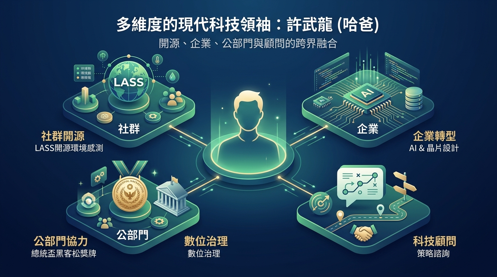

# 👨‍💻 哈爸自介 (許武龍)

> 📢 **最新公告 (News)**  
> [👉 **啟動「哈爸顧問與演講服務」！陪伴企業與個人在 Agentic AI 時代精準落地**](https://wuulong.github.io/wuulong-notes-blog/posts/20260715_haba_consulting_and_speaking_services_launch/)

**許武龍（哈爸）**，LASS 創辦人、2021 總統盃黑客松卓越團隊領隊、TAIDE 創始專案經理。

我是一位長期在開放社群貢獻的實踐者，熱愛 Linux、開源軟體與公民科技。在年過 43 歲後，我選擇離開科技業的高階主管職位，轉型成為自由的「創客顧問（Maker Consultant）」，致力於推動開放社群與跨界協力。我的技術背景起始於晶片設計公司產品線處長與系統架構師，專長涵蓋生成式 AI、嵌入式系統設計、通訊系統、軟體系統設計、開放資料與公私協力（PPP, Public-Private Partnership）。目前擔任多個社群管理者、企業 AI 轉型顧問以及公部門審查委員。

> **🌟 聯絡資訊 (Contact)**
> *   **電子信箱**：wuulong @ gmail.com
> *   **Facebook**：[wuulong.hsu](https://www.facebook.com/wuulong.hsu)
> *   **部落格**：[哈爸筆記 (本站首頁)](../../)

---

## 🗺️ 跨界融合：主要經歷

我的職涯與社群歷程橫跨了「社群開源」、「企業創新」、「公部門協力」與「科技顧問」四個核心維度，並致力於推動這四者之間的深度對合與共創。

### 1. 🌐 社群開源 (Community & Open Source)
*   **LASS (Location Aware Sensing System) 創辦人**：
    推動台灣最具代表性的開源環境感測社群，自主發起與推廣「空氣盒子（Airbox）」與「水社群」。推動公民科技實踐，以開源硬體、開放數據為起點，實現真正的公私協力與科技社會關懷。
*   **FBTUG (FarmBot Taiwan User Group) 發起人**：
    發起並推廣 FarmBot 台灣使用者社群，結合開源硬體與智慧農業，探索自動化農作與科技落地農業的新可能。
*   **HCOS (Home Care Open System) 發起人**：
    創辦「開放在宅照護系統」社群，關切高齡化社會下的科技照護解決方案，以開源與系統性思維輔助基層照護。
*   **交大機械系友會秘書長（84A級）**：
    負責系友會秘書處運作，並利用自動化系統與 AI 協作工具開發「系友資源媒合引擎」，推動校友資源與新技術需求的精準對位。
*   **公私協力實踐分享**：
    受邀至台大城鄉所等學術機構，進行「如何用公私協力以開放資料為主題影響公部門 — LASS 經驗談」專題分享。

### 2. 🏢 企業創新 (Enterprise & Industry)
*   **產品線處長與系統架構師**：
    於晶片設計公司長期擔任核心產品開發負責人與架構師，熟悉嵌入式系統設計、電信與通訊標準系統。
*   **國際標準認證標準制定**：
    參與國際 **HomeGrid Forum G.hn 認證標準**的制定，並多次主持國際產品互通測試（Plugfest）。
*   **國際講者與認證講師**：
    擔任 **Computex 國際論壇講者**、Linux 系統與 Java 認證講師。
*   **企業 AI 實體專案**：
    主導多項企業級 AI 智慧助理與自動化流程設計（例如 TzuChi AI Empowerment 慈愛企業 AI 賦能等專案）。

### 3. 🏛️ 公部門體系 (Public Sector & Governance)
*   **TAIDE 創始專案經理 (Project Manager)**：
    主導並協作台灣本土大語言模型 **TAIDE (Taiwan AI Dialogue Engine)** 專案初期之管理與評測基準建立，確保大模型生成內容符合在地語境與公部門安全稽核規範。
*   **2021 總統盃黑客松卓越團隊** 領隊與核心成員。
*   **公部門諮詢委員**：
    擔任政府數位治理、開放資料與流域治理相關專案的審查專家與諮詢委員。
*   **公私協力橋樑**：
    擅長將社群或學術界複雜的技術成果（如《流域導航》）轉化為公部門易於理解與操作的國土規劃 SOP 與政策推動語言，解決官民溝通溫差。

### 4. 🧠 科技顧問 (Consulting & AI Coaching)
*   **生成式 AI 與自動化工作流推廣**：
    近年積極投入生成式 AI（GenAI）、Agentic AI 與工作流自動化（如 n8n, Make 等無程式碼/低程式碼整合工具）的研究與實戰。輔導中小企業、自學者與非營利組織進行數位轉型，提升工作與學習效率。
*   **企業 AI 轉型深度輔助**：
    擔任多家公司的 AI 技術顧問。主導企業內部 AI 種子人才培訓，傳授如何編寫聲明式 Skill、設定安全防護網以及設計長週期記憶接力。
*   **系統工程與人機協作方法論推廣**：
    倡導以**系統工程（Systems Engineering）** 作為人機協作的思維鷹架。實施從需求（REQ）、規格（SPC）到測試案例（TCV）的嚴格追溯鏈（Traceability Chain）管理，並開發紅藍軍規格對抗與無狀態單輪優化等落地工具。
*   **哈爸顧問與演講服務**：
    正式啟動顧問諮詢窗口，提供實體演講/企業培訓（T01）、線上即時諮詢（M01）與深度介入業務推動（M02/M03）等服務。

## 💡 核心哲學：哈爸自學心法

在 AI 時代的浪潮下，自學已不再是單向吸收或讀多少書的競賽，而是一場關於「奪回認知主權」與「建構個人架構」的自我革命。我的核心自學方法論包含四大支柱：

1.  **問題定錨與痛點引擎**：自學的核心是「不斷解決問題的文件化過程」，拒絕虛空理論，以解決真實世界的痛點作為學習燃料。
2.  **雙核共生與認知分工**：主導原創品位與決策的「左核（人腦）」與負責大吞吐量執行與運算的「右核（AI）」協同辯證，定下格律、填充細節，避免大腦被 AI 掏空。
3.  **輸出驅動與微縮時間 (Output-driven)**：以「寫一本書」或「建構可運行的系統」等大目標強迫跨域，實現「微縮時間 (Time Compression)」的極限學習。
4.  **主權實體化與自動化治理**：將成果物理性落地轉化為數位器官（如封裝成 Skill），並透過工作流進行治理，確立人機共生的主權架構。

*   👉 深入閱讀完整方法論與演化階段：[哈爸自學心法專題](../hapa-hacker-learning/)

---

## 🔗 相關資源導覽

想進一步了解我的專案、公開報導與過往成果，歡迎瀏覽以下知識庫專題頁面：

*   [👉 哈爸自學心法](../hapa-hacker-learning/)：收錄哈爸在 AI 時代人機協作、自學心法演化與痛點引擎的完整框架。
*   [👉 網路報導與公開資料](./media-coverage.md)：收錄並分類歷年來主流媒體專訪、自造者運動紀錄與公共參與報導。
*   [👉 LASS 時代媒體報導](./lass-media.md)：收錄 LASS 創立與發展時期（2015 - 2021 年）各大主流與創客媒體之報導與論文文獻連結清單。
*   [👉 哈爸 GitHub 公開專案清單](../github-repos/)：收錄並依時間排序我的 38+ 個公開開源專案與簡介。
*   [👉 哈爸的演講與授課歷程](../talks/)：收錄 2026 至今及歷史存檔 of 78+ 場公開演講與工作坊紀錄。
