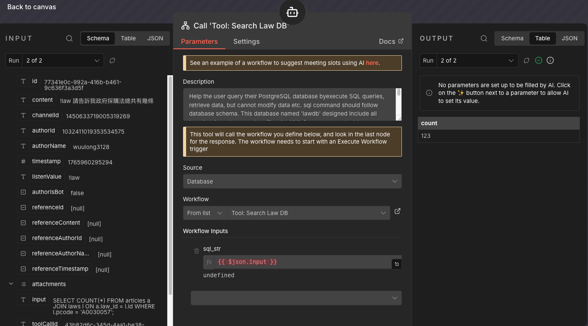

接續上一篇 **[【踩坑筆記】用 n8n 打造 Discord Bot](/posts/20251217_n8n-discord-bot-troubleshooting/)**，在經歷了無數次 "Token 錯誤" 和 "Intent 沒開" 的崩潰後，我的機器人終於會說話了。

但只會 "Echo" (我說什麼它回什麼) 的機器人實在太無聊。既然都已經在 n8n 上了，何不直上雲端，幫它接個最強的大腦？

這篇文章紀錄了我將它從「鸚鵡」進化成「智慧助理 (Agent)」的過程。

## 第一階段：接上大腦 (LLM Integration)

一開始的想法很簡單：把 Discord 收到的訊息，丟給 Google Gemini，再把 Gemini 的回覆丟回 Discord。

在 n8n 裡，這只需要替換中間的節點：
*   **移除**：原本直接把 Input 接到 Output 的線。
*   **加入**：`Google Gemini Chat Model` 節點。

就這樣，我的機器人瞬間變成了一個無所不知的 Chatbot。您可以問它 "Python 怎麼學？" 或 "幫我寫首詩"，它都能對答如流。

但這時候的它，還有兩個致命弱點：
1.  **沒有記憶**：每一句話對它來說都是新的，它不知道我上一句罵過它。
2.  **會亂掰 (Hallucination)**：問它複雜的數學或最新的新聞，它會一本正經地胡說八道。

## 第二階段：賦予手腳 (Agentic AI)

為了解決上述問題，我接觸到了 **Agentic AI** 的概念。
簡單來說，就是不再讓 LLM「憑空想像」，而是給它一組 **工具 (Tools)**，讓它自己決定何時該用工具來找答案。

在 n8n 裡，這透過 **`AI Agent`** 節點來實現。這是我目前的架構圖：

*(在此處想像一張完美的 n8n 節點連接圖)*

### 架構解析

這個架構由四個核心部分組成，就像一個完整的人腦運作機制：

1.  **中樞指揮官 (AI Agent 節點)**：
    這是整個流程的大腦。它接收使用者的問題，進行 **推理 (Reasoning)**。
    *   *「用戶問天氣？那我應該去查天氣工具。」*
    *   *「用戶問數學？那我應該用計算機。」*

2.  **大腦模型 (Model)**：
    我掛載了 **Google Gemini Chat Model**。它負責理解語意和生成最終的自然語言回覆。

3.  **短期記憶 (Memory)**：
    我接上了 **Window Buffer Memory**。這讓機器人擁有了「短期記憶」，能記得我們前幾句的對話內容，聊天不再像鬼打牆。

4.  **雙手工具 (Tools)**：
    這是 Agentic AI 的靈魂。我給了它兩個法寶：
    *   **Calculator (計算機)**：專門處理數學運算，解決 LLM 算數不準的問題。
    *   **Wikipedia (維基百科)**：即使是免費版，也能讓它查詢模型訓練資料以外的知識。

## 實際體驗：它真的在「思考」

當我問它：「請問 35436 乘以 1234 等於多少？還有 Python 是哪一年發布的？」

如果是以前的 Chatbot，它可能會直接猜一個數字。
但現在，看著 n8n 的執行 Log，你會看到 Agent 忙碌的過程：

1.  *Agent 思考*：「這句有數學題，我應該呼叫 **Calculator**。」-> **執行計算**。
2.  *Agent 思考*：「還有歷史題，我應該呼叫 **Wikipedia** 查 "Python programming language"。」-> **閱讀維基百科**。
3.  *Agent 總結*：「結合計算結果 43,728,024 和維基百科的 1991 年...」-> **生成回覆**。

這就是 Agentic AI 的魅力。它不再是單純的文字接龍，而是真正具有 **「解決問題能力」** 的智慧體。

## 第三階段：打造法律專家 (SQL Tool Integration)

現在它已經會算數、會查維基了。但我的終極目標是讓它能查詢我自己建立的 **Postgres 法律資料庫**。

這一步是最具挑戰性，也最迷人的地方。我並沒有寫死什麼「關鍵字查詢」功能，而是做了一個 **「通用 SQL 執行器」**，並透過 Prompt Engineering 讓 AI 自己學會寫 SQL。

*(圖：接上了 Postgres 資料庫的 Agentic Workflow 完整架構)*

### 關鍵設定解析

要達成這個效果，不再是靠程式碼，而是靠「溝通」。設定上只有這兩個重點：

#### 1. 工具端 (The Hand)：只負責執行

我建立了一個 Sub-Workflow，它的邏輯非常暴力簡單：
*   **Input**: 接收一個字串參數，我們把它定義為 `sql_str`。
*   **Action**: 把這個字串原封不動地丟給 Postgres 節點去執行 (Execute Query)。
*   **Output**: 回傳 SQL 執行的結果。

它就像一隻手，完全不管內容，給什麼執行什麼。

#### 2. Agent 端 (The Brain)：教它資料結構

這才是真正的魔法所在。
在主流程的 **Call Workflow Tool** 節點中，我在 **Description** 欄位寫了一大段「說明書」。

這段說明書不只是說「這是查資料庫用的」，更重要的是**把資料庫的 Schema 全部告訴它**！

我的 Description 大概是這樣寫的：
> "Help the user query their PostgreSQL database by executing SQL queries. This database named 'lawdb' includes a table named **'articles'** with columns **'id', 'content', 'chapter'**..."

*(圖：關鍵的設定細節。注意 Description 欄位裡，我把 Table Schema 都塞進去了，這樣 Gemini 才知道怎麼寫 SQL)*

### 成果：Text-to-SQL

當我問它：「政府採購法總共有幾條？」

Gemini 的思考過程是這樣的：
1.  **理解問題**：用戶想算數量 (Count)。
2.  **查詢記憶**：看過 Tool Description，知道有一個 `articles` 表。
3.  **生成 SQL**：它自己寫出了 `SELECT COUNT(*) FROM articles WHERE ...`。
4.  **呼叫工具**：把這段 SQL 丟給我的 Sub-Workflow。
5.  **回答**：「總共有 123 條。」

這就是 **Agentic AI** 強大的地方。我不需要為每一個查詢需求寫程式，我只需要把「資料結構」教給它，剩下的 SQL，它自己會寫！

### AI 協作宣告 (AI Collaboration Disclosure)

>  
> 
>
> **本文內容由 AI 協作生成**：
> 1.  **素材來源**：作者 n8n 實作截圖與學習筆記。
> 2.  **AI 工具**：使用 Antigravity (Gemini) 協助整理 Agentic AI 概念與文章撰寫。
> 3.  **人工審核**：由哈爸本人確認技術細節準確性並進行最終潤飾。
