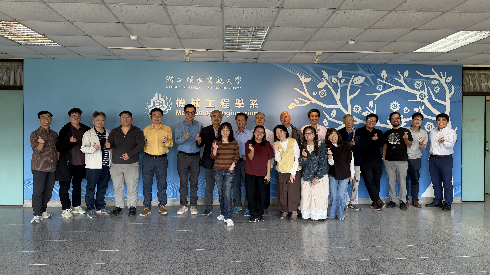

交大機械系即將迎來 50 歲生日了！

為了迎接這個重要的里程碑，籌備小組於今日 (12/17) 召開了規劃會議。我有幸參與其中，感受到大家對於傳承系史的熱情。我們不只是要辦一場活動，更希望透過這次機會，把機械系走過半世紀的軌跡完整保留下來。

以下為各位系友報告本次會議的重點摘要：

*(會議合照：籌備小組成員熱烈討論中)*

*(會議摘要心智圖：從文物收集、活動日程到永續展示的完整規劃)*

## 📅 關鍵日期：4 月 11 日 (系友回娘家)

請大家先把這一天空下來！配合學校校慶，我們規劃了一整天的精彩活動：

*   **上午 (09:00-11:00)**：系友報到 & 慶祝大會
*   **中午 (11:00-13:30)**：團圓餐會、系友交流、學生專題展示 (看學弟妹們造火箭、賽車！)
*   **下午 (13:30)**：**50 週年特展這開幕茶會** (地點：圖書館)

## 🏛️ 雙展區規劃：看見歷史與未來

這次特展將分為兩個主戰場，帶您穿梭時光隧道：

1.  **圖書館展區 (六樓挑高區)**：與校慶特展同步，展出最具歷史價值的實體文物。
2.  **系館展區 (工五館)**：展示系上大型實體成果 (如火箭、賽車)，以及我們熟悉的系圖空間回憶。

## 💡 創新亮點：系史資料集 (Data Release)

這是我在會中特別提出的建議，也獲得了系上的認同。我們認為，珍貴的歷史不應只封存在倉庫裡。

我們計畫將收集到的老照片、公文、教科書等進行 **「數位化與資料集化」**。這不僅是為了保存，更是為了**活化**。釋出的資料可以結合最新的 **GenAI 技術**，例如自動生成系史年表、老照片修復、或是透過 AI 講述老照片背後的故事。讓歷史資料變成可以被互動、被研究的活水。

## 🤝 我們需要您的幫忙！

為了讓展覽更豐富，我們正在強力徵集：
*   **老照片/影片** (迎新、宿營、實驗課的點滴)
*   **實體文物** (當年的筆記、儀器、甚至是系服)

您可以選擇將實體文物寄回系辦 (展後可歸還)，或是直接上傳電子檔。
[歷屆系友照片](https://drive.google.com/drive/folders/11WKB-5OxsVsELpbdzo3IzkgTAZcbMcaT?usp=drive_link)
機械 50，不僅是系的生日，更是我們共同記憶的慶典。期待在 4 月 11 日見到大家！

### AI 協作宣告 (AI Collaboration Disclosure)

>  
> 
>
> **本文內容由 AI 協作生成**：
> 1.  **素材來源**：12/17 籌備會議錄音摘要。
> 2.  **AI 工具**：使用 Antigravity (Gemini) 協助整理會議重點與撰寫部落格文章。
> 3.  **人工審核**：由哈爸還在等待相關素材以進行內容準確性確認。
