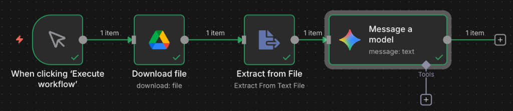

昨天我們用 n8n 打造了一個會自動觀測 Discord 頻道的 AI 機器人，今天我要進一步強化它的大腦，讓它**能夠讀取我的私人文件**。

這就是現在最紅的 **RAG (Retrieval-Augmented Generation，檢索增強生成)** 的基礎型態。我們不只依賴 AI 模型原本的知識，而是「餵」給它我們自己的資料（例如公司的規章、個人的筆記、專案的規格書），讓它根據這些資料來回答問題。

而這一切，透過 n8n + Google Drive + Google Gemini，完全不用寫複雜的程式碼就能實現！

## 🛠️ 實作目標

1.  讓 n8n 有權限讀取我的 Google Drive 檔案。
2.  下載指定的 Markdown 文件。
3.  將文件內容解析成純文字。
4.  將文字餵給 Gemini，讓它回答關於文件的問題。

## 🚧 卡關筆記：Google OAuth 的 403 陷阱

在設定 Google Drive 憑證時，我遇到了一個經典錯誤：
`Access blocked: ... has not completed the Google verification process`


### 原因與解法
這是因為我的 GCP 專案處於 **「Testing (測試)」** 階段，而 Google 為了安全，預設封鎖所有人的存取權。

**解決步驟：**
1.  進入 GCP Console 的 **OAuth consent screen**。
2.  找到 **Test users (測試使用者)** 區塊。
3.  點擊 **[+ ADD USERS]**，把我不死心一直登入失敗的那個 Email 加進去。
4.  存檔後，回到 n8n 再登入一次，搞定！

> 💡 **小提醒**：如果這裡選了 "Publish App" 變成 Production 狀態，Google 就會要求嚴格的驗證。對於個人玩具專案，保持在 Testing 模式並設定白名單是最簡單的。

## 🧩 Workflow 設計

這是目前成功運作的「單一文件問答」流程圖：



### 關鍵節點解析

1.  **Google Drive (Download)**:
    *   負責根據 File ID 下載檔案。
    *   這一步得到的輸出是 **Binary Data** (二進位檔案)，Gemini 還看不懂。
2.  **Extract from File**:
    *   這是一個神奇的節點 (n8n 內建)，它能自動識別 PDF、Word、HTML 等格式，並將其內容「抽」出來變成純文字 (Text)。
3.  **Google Gemini**:
    *   在 Prompt 裡，我們使用這樣的結構：
        ```text
        你現在是這份文件的專家。請根據以下內容回答問題：
        
        【參考文件】：
        {{ $json.text }}
        
        【問題】：
        這份文件裡提到的露營地點有哪些？
        ```


## 🚀 下一步

現在我的 n8n 已經能「看懂」Drive 上的文件了。下一步，我打算把這功能與昨天的 Discord Bot 結合：

*   在 Discord 輸入指令 `!kb 2026露營計畫`。
*   Bot 自動去 Drive 搜尋相關文件。
*   讀取內容後，直接在 Discord 回答我的問題。

這樣我就擁有一個隨身攜帶的個人知識庫助理了！

### AI 協作宣告 (AI Collaboration Disclosure)

>  
> 
>
> **本文內容由 AI 協作生成**：
> 1.  **素材來源**：作者實際 n8n 實作截圖與需求。
> 2.  **AI 工具**：使用 Antigravity (Gemini) 協助整理 Google OAuth 流程與撰寫技術筆記。
> 3.  **人工審核**：由哈爸本人確認實作流程與技術細節準確性。
