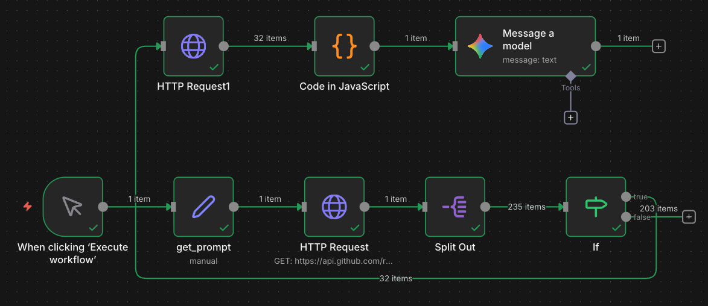

## 📉 Google Search 的極限：索引焦慮

在上一篇文章中，我們嘗試使用 Google Custom Search 來讓 AI 搜尋部落格內容。但我們很快撞到了一堵牆：**索引延遲**。

當我剛發布一篇關於「Discord Welcome Bot」的文章，Google Bot 還沒來爬取，SEO 工具也還沒生效。這時候問 AI，它只會回答：「搜尋不到相關資料」。這對於想要打造「即時」助手的人來說，是無法接受的。

## 💡 新思路：Repo 就是最好的資料庫

既然我們的部落格是基於 Hugo 並託管在 GitHub 上，所有的文章內容 (Markdown) 其實都已經躺在 Repo 裡了。

**為什麼不直接讓 AI 去讀 Repo 呢？**

這在以前很難做（因為 Context Window 有限），但現在有了 **Gemini 1.5 Pro (2M Context)**，我們可以豪邁地把整個部落格的 Markdown 全部餵給它！

## 🛠️ n8n 實作流程 (The Workflow)

我們的目標是：**一次抓取所有文章 -> 合併成大文本 -> 丟給 AI**。


*(請將剛才成功的 n8n 流程圖截圖命名為 `n8n_github_rag_workflow.png` 並放入文章目錄)*

### 1. 一網打盡：GitHub Tree API
我們不需要一個個列出目錄 (List Directory)，直接使用 GitHub 的 **Get Tree (Recursive)** API，一個 Request 就能拿到成千上萬個檔案路徑。

*   **Node**: HTTP Request
*   **URL**: `https://api.github.com/repos/{owner}/{repo}/git/trees/{branch}?recursive=1`
*   **Output**: 包含整個 Repo 所有檔案結構的 JSON。

### 2. 精準過濾：Filter
Tree API 回傳的東西很雜（包含圖片、CSS、Hugo 設定檔）。我們需要用 **If** 或 **Filter** 節點進行篩選：
*   路徑結尾是 `.md`
*   位於 `content/posts/` 目錄下
*   排除 `_index.md` (如果是 Section 頁面)

### 3. 獲取內文：Raw Content
拿到檔案路徑後，直接用 HTTP Request 下載 **Raw** 內容：
*   **URL**: `https://raw.githubusercontent.com/{owner}/{repo}/{branch}/{path}`
*   **技巧**：這步會批次執行 (Batch)，n8n 會併發下載幾十篇文章。

### 4. 合併上下文：Code Node
這是最後的魔術動作。我們寫一小段 JavaScript，將下載回來的幾十個 Markdown 檔案合併成一個大字串。

```javascript
let bigText = "";
for (const item of items) {
  // 假設前面的 HTTP Request 已經把內容放在 json.data
  bigText += `\n\n=== File: ${item.json.path} ===\n\n`;
  bigText += item.json.data;
}
return [{ json: { context: bigText } }];
```

### 5. 最終推理：LLM (Gemini)
將合併後的 `bigText` 作為 System Prompt 的一部分：「你是哈爸筆記的助手，以下是所有文章內容...」，或是直接作為 User Context。

## 🚀 成果驗證

當我問：「哈爸實驗室 Discord 的邀請連結是什麼？」
AI **不再依賴 Google 索引**，而是直接閱讀了原始碼中的 `20251218_discord-welcome-bot.md`，準確回答：
> 「連結是 https://discord.gg/DMknUBmV...」

這就是 **Repo-to-Context RAG** 的威力：**零延遲、全覆蓋、低成本**。

---
### AI 協作宣告 (AI Collaboration Disclosure)

>  
> 
>
> **本文內容由 AI 協作生成**：
> 1.  **實作驗證**：哈爸 (人類) 設計 n8n 流程並成功執行。
> 2.  **流程圖**：n8n 自動化產出。
> 3.  **文章撰寫**：AI (Gemini) 協助整理技術細節與邏輯。
