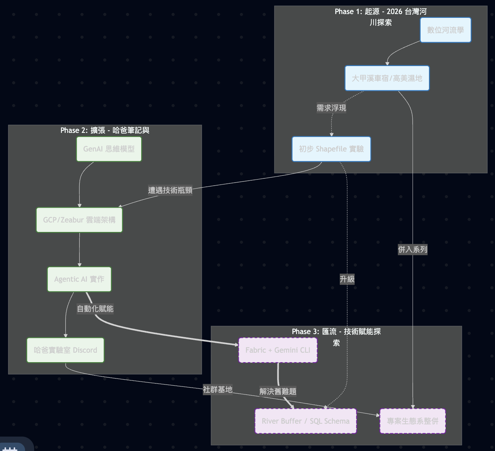

## 為什麼要「匯流」？

這段時間以來，我同時維護著兩個 Hugo 網站：「哈爸筆記」與「2026 台灣河流探索」。

「哈爸筆記」是我整理技術、GenAI 與生活思考的**大腦**。
「河川探索」則是我實踐這些技術、走出戶外的**雙腳**。

隨著專案的推進，我發現這兩者其實密不可分。我在研究 GIS 圖資處理（河川）時，用上了 Python Fabric 與 Gemini CLI（技術）；我在規劃社群互動（河川）時，實作了 Discord Bot 與 n8n 自動化（技術）。

既然**技術是為了探索服務，而探索需要技術支持**，那麼將兩者分開維護，不僅分散了我的注意力，也讓讀者難以看見全貌。

因此，我決定將它們「匯流」。

## 變更說明 (What's Changing?)

1.  **內容完整遷移**：
    原「河川探索」網站的所有文章（包含大甲溪車宿攻略、GIS 圖層研究、專案啟動筆記等），都已經完整遷移至本站。
    
2.  **新的入口**：
    您可以在本站的 **[Series (系列) -> 2026 台灣河流探索]()** 中，找到所有相關文章。這樣結構化的呈現，反而比原本獨立網站的平鋪直敘更具系統性。

3.  **舊站退役**：
    原有的獨立 Repo 與 GitHub Pages 網站將會在近期停止更新，並最終下線或設定重導向至此。請原本有訂閱或書籤的朋友，改為關注本站。

## 哈爸實驗室：技術與應用生態全景圖
這張圖展示了「哈爸筆記」作為核心技術引擎，如何支撐並孵化出「2026 台灣河流探索」這個實踐場域。

- [mermaid.live link](https://mermaid.live/edit#pako:eNqNVmtPGlkY_isnY5qMWUAHGNDZuImKGBNN3Er2Q9eNGeEgk8IMGWC3rWi0u1a8VTd46VqsWm1Fjdd6YanaP-M5M3zav7BnOMNFpdudD3DmvJfnPc_znheGGb8SgIzADKliNAR8nn4ZkOfRI9DS0gJwdgtdzaPDVe1m19igRn9YjMU8MAh8UgR2SzIEQSkcFmRFhpZYXFWeQrr2K2FFFepcLpclqMhxa0x6AQXOGX32_b08j6VfoUqT1HVwXt7bUcpT12h3u9s85qv1NykQDwn2cgZSpr4yp0-dap8-AxaffkKXa_XUdL9U6A-VEJq8fEdzGcHe4fY47P-BoF1slBGmx_TNdG2EHqgOmUzUeR0dvJcvQ7jbOG_rQ4jSRkCMhURVFZ8LgAd8FfDZPgFGc2OARQup2-tzAnxXnr9e4sz6bW7sn6tVenj8-r129l4_v8T5hYpgscQglbcXqpIS4MDPvSExBgEnANPVCuyNdhdA88fa-FZ1ql9oBuMJSCr0xyVFBr62yu7jgZ-kGNlk8VLu9nqOxOLzcXSQqxcEoahrtatPlaIs2t7RFk9xfk__PI0OvzQU9t9oN6_xlyWUOa4Z1SdFomHY2dXHotQaPvgA-kJiFBKmIUBHHwu7KzWiHhYIrNYfzBLulwSsNmJLFjJj-OQlPj_U5m-S1bjUH8qB2vznZw3-i62B02fo6pzolU5pqZx28ErPvtH3lrTF9fqvymEvyWEXgBlvBXcSpCZpdrTxSlue_qYkvoEeSQ6wnVBu7QJ4bE27OMDZTfRuxuDJuAjVrl1yUBXZzvbehidQHEyooPD2VNs_wu8u8E7NgNYhKMfZ4qfkBwSBaHB7nanl2q5EIiYVVCh0uA08UsyvqIGK__3Ci0KZhT2o1DQW4R9UZRoN2G9IlpsikqHZI9KrhF3900f992vAEt1RJvt1pRwlpRwCoMFEKSoNTfE_70zPgE9RwqxXHFQJhd-BThiRZAm0d3cZrBQHSbWzR4yLLJ2RbYlgkHw1gL4fu0GfPwQjYs2QDr_CouMU3kyR1sMTM2R64aUzY4Tc9X5IkH6ZpRxpq3_gq0U0u0wIKqxk9PGjCi_lCM4G6K0p7E6gmSXKBbVW3Z-iLsnC-EFh3OxkLX1R2MglKzKXM9ptJqNofg6l83hySlvMArZYs2pO3pLcLS0krT65R5CNOosSJE12qSddm447W_gkr6emC2-3CpuzSZPZeydy2ACa2EGHf5Nja9s32s02IY6M39Kh6LwwzkPYRBMfCLMotZKknJfKMzqQOtEUaD1PhtsdpzKg0wYMivDlCTlDDeqKownNTWpnq5WSy9FEq8Jy2hi5C3_iWVJxnppKk350dLQ8ZiprB2MhP_hSgBHiagJamAhUI6Lxygwb4f1MnHQW7GcEsgyI6tN-pl8eITFRUX6iKJFSmKokhkKMEBTDMfKWiAbEOPRIIrkyFRfSYVBtVxJynBHcXDEFIwwzzxiBb7TxnJvn-GbexTk5h9tpYZ4zgp23uXi300H-NjRxdmezs2nEwrwoojbamlwOp9vezDdxbpcRNPIvuqNvyw)

## 未來展望

合併之後，我不必再費心維護兩套 Hugo 主題與發布流程，能將更多時間投入在**內容創作**與**系統實作**上。

未來的「河川探索」系列，將會有更多「硬核」的技術實踐內容加入，例如：
*   如何用 AI Agent 自動爬取水利署資料？
*   如何用開源 GIS 工具繪製自己的散步地圖？
*   結合 Discord 社群的線下探索活動紀錄。

感謝大家的支持，讓我們在「哈爸筆記」繼續這趟旅程！🚀

### AI 協作宣告 (AI Collaboration Disclosure)

>  
> 
>
> **本文內容由 AI 協作生成**：
> 1.  **素材來源**：AI 彙整架構圖。
> 2.  **AI 工具**：使用 Antigravity (Gemini) 協助撰寫文章架構與技術細節說明。
> 3.  **人工審核**：哈爸。