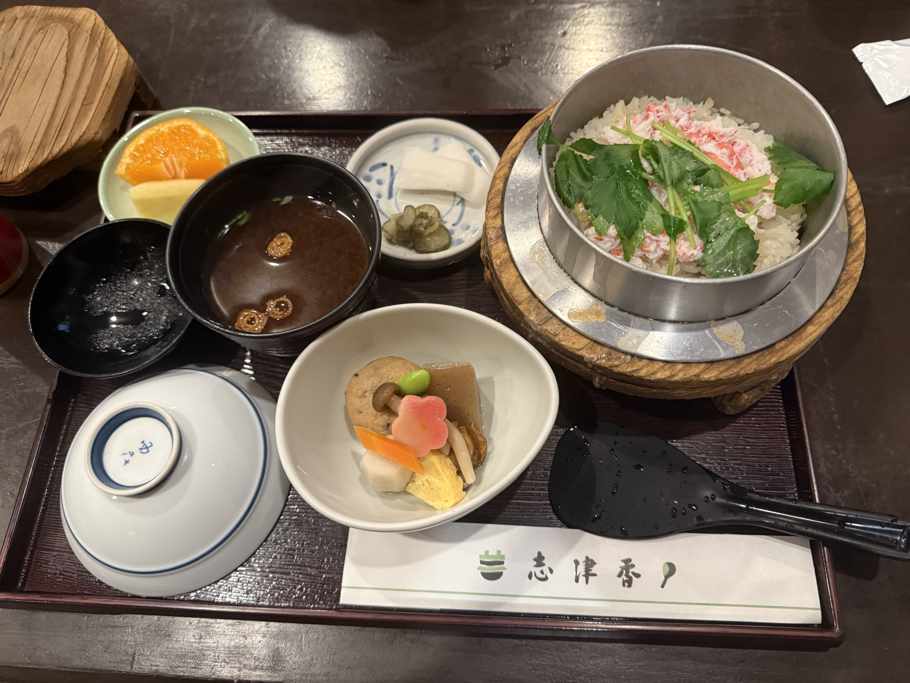
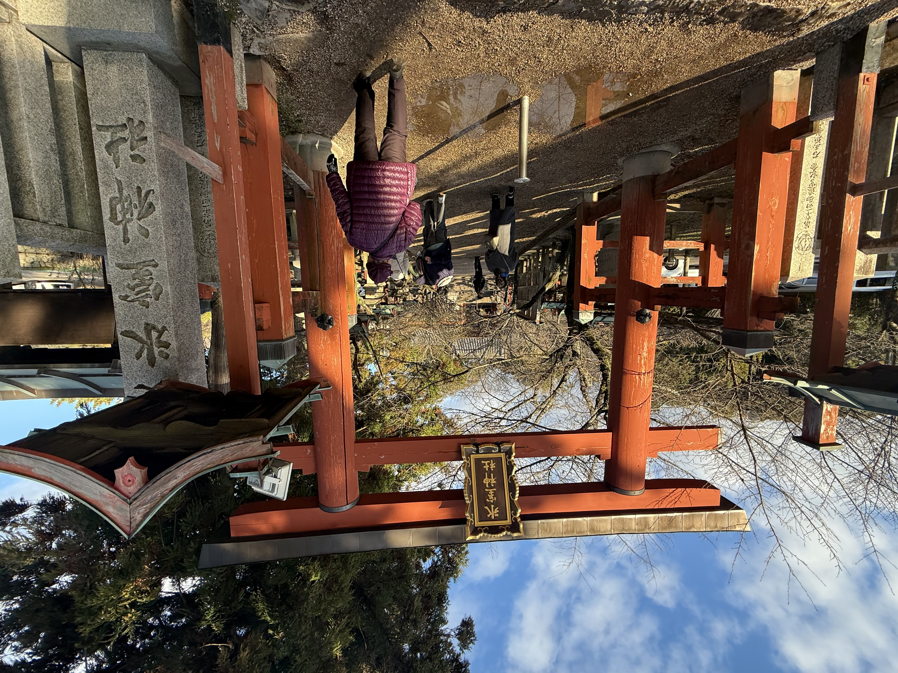
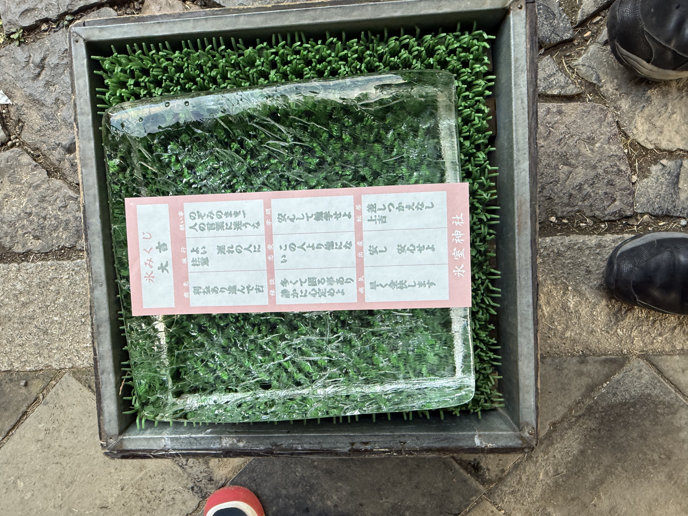
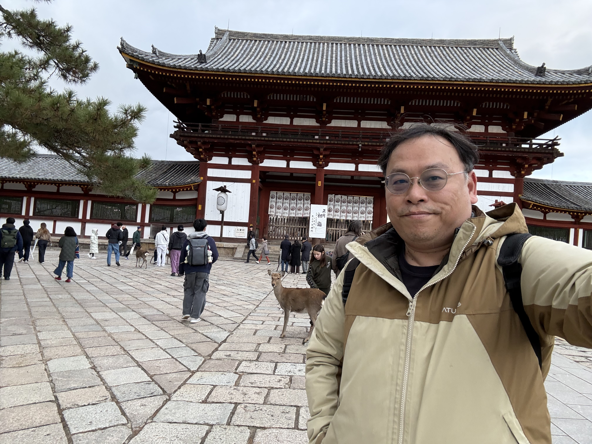
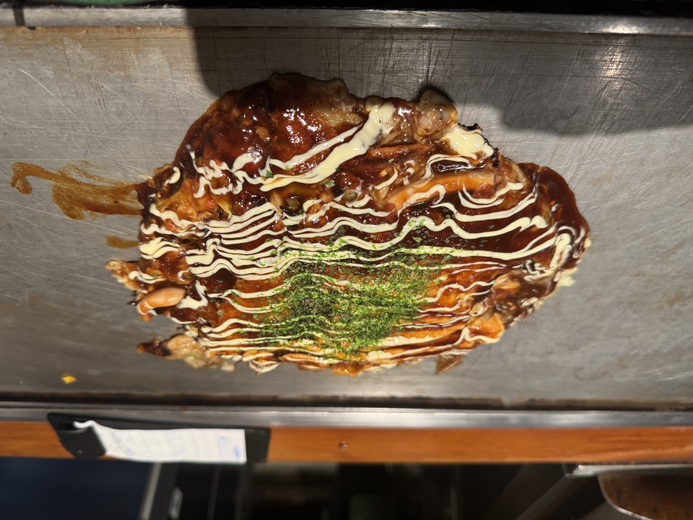

這是我日本行的第二天。今天主要前往奈良看鹿，晚上回到大阪享用美食。

以下是實際去過的地方與買吃的東西：

## 🦌 奈良公園 (Nara Park)
[官方網站](https://www3.pref.nara.jp/park/)

來到奈良當然不能錯過著名的奈良公園。
*   **餵鹿**：這是今天的重頭戲，雖然鹿很可愛，但有時候也挺熱情的，手上的鹿仙貝要拿好喔！
    
    

## 🍚 志津香釜飯 (Shizuka)
[Google Maps](https://share.google/pA7xF84tebtCANiHQ)

午餐選擇了著名的志津香釜飯。排隊人潮通常不少，但堅持傳統風味的釜飯，米飯吸滿了高湯精華，非常值得一試。

## ⛩️ 冰室神社 (Himuro Shrine)
[官方網站](https://himurojinja.jp/english-translationice-fortune/)

接著參訪了冰室神社，這裡是著名的「製冰業守護神」。除了祈求好運，欣賞神社的靜謐氛圍也是一種享受。

抽了張 第 20 號大吉的籤

## 🏯 東大寺 (Todaiji Temple)
[官方網站](https://www.todaiji.or.jp/zh/)

宏偉的東大寺，看到大佛的瞬間真的感到很震撼。
*   **大佛布丁 (Daibutsu Pudding)**：[Google Maps](https://share.google/5Lz3ZablTIb1GPr7s)
    *   參拜完特別買了有名的大佛布丁，瓶蓋上有可愛的大佛圖案，口感綿密濃郁，是很好的伴手禮或甜點。

    

## 🥘 福太郎 - 梅田店 (Fukutarou)
[官方網站](https://2951.jp/)

晚餐回到大阪梅田，選擇了福太郎大阪燒。這裡是品嚐正宗大阪燒（Okonomiyaki）與蔥燒（Negiyaki）的好地方，坐在鐵板板前看著師傅料理，香氣四溢，為第二天畫下完美的句點。

---
### AI 協作宣告 (AI Collaboration Disclosure)
>  
> 
>
> **本文內容由 AI 協作生成**：
> 1.  **素材來源**：哈爸提供行程與筆記。
> 2.  **文章生成**：Antigravity 協助整理與撰寫。
> 3.  **文章落地**：Antigravity 協助排版與發布。
