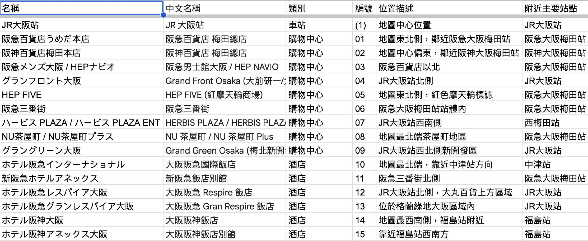
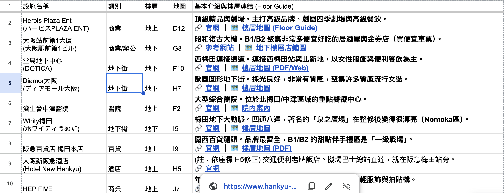

這次來大阪旅遊，除了享受美食與美景，我還做了一個特別的實驗：**練習使用生成式 AI (GenAI) 來輔助旅遊規劃與決策**。這不僅僅是問 Gemini「大阪哪裡好玩」，而是更深入地利用 AI 的邏輯推演與資料整理能力，來解決旅遊中遇到的「資訊過載」與「複雜交通」問題。

以下分享我如何運用 **NotebookLM** 與 **Agentic AI** (Antigravity) 來理解大阪梅田站這座複雜的交通樞紐。

## 1. 出發前的深度規劃：Gemini 與 NotebookLM 的協奏曲

在規劃階段，我先利用 **Gemini** 進行初步的發散式探索，詢問關於一日行程、深度旅遊建議以及景點背後的歷史文化。

*   **操作心法**：我將 Gemini 生成的對話內容匯出成 Markdown 檔案個別匯入 **NotebookLM** 作為知識庫。
*   **AI 產出**：
    *   **視覺化理解**：利用 NotebookLM 整理出的重點，可以產出更清楚、方便理解的旅遊重點圖表或指南。
    *   

這種「先用 Gemini 生成，再用 NotebookLM 固化知識」的方法，讓我對大阪的歷史脈絡與行程要點有了更紮實的認識，而不僅僅是走馬看花。

## 2. 行程當日的即時戰略：Agentic AI 的動態規劃

到了當天，行程往往需要彈性調整。例如第二天我想去「四個特定的地方」，但我只知道名字，不知道確切位置和順序。

*   **我的指令**：給 AI 四個地點（Samuhara 神社、@cosme、Motherhouse、Loft），請它確認地點、找官網、並建議順序。
*   **AI 的價值**：
    *   **地理邏輯判斷**：AI 發現其中一家神社比較遠且早開，其他三家都在梅田商圈，因此建議「先去神社，再回梅田一網打盡」。
    *   **Google Maps 整合**：它直接吐給我一個規劃好的 Google Maps 路線連結，點開就能導航。

## 3. 破解「梅田大迷宮」：結構化資訊的力量

大阪梅田車站被稱為「大迷宮」，地下地上錯綜複雜。一般的地圖看了一頭霧水，本來是一頭霧水，但跟 AI 詢問一些架構問題，能幫助自己理解交通網絡。

### 3.1 根據地圖詢問交通架構
我先給地圖照片問 AI：「大阪車站的交通架構是什麼？有哪些節點？」AI 幫我釐清了 JR 大阪站、阪急梅田、阪神梅田以及幾條地下鐵線路的相對關係，建立了我腦中的「骨架」。

*   
*   

### 3.2 車站周邊設施的 Excel 化
這是最讓我驚艷的一點。根據拿到的地圖紙張，我請 AI 列出車站周邊的主要建築物（百貨、地標），並將它們的比較資訊（如：類別、所在樓層、鄰近出口）整理成 **Table (表格)** ，匯入到 google sheet 。

*   

## 3.3 清單與樓層資訊的應用
有了上面的建築物清單後，我進一步利用 Agentic AI 的「代理」能力：

1.  **資訊獲取**：針對清單中的「LUCUA 1100」，我請 AI 去官網爬取每一層樓的店舖資訊。
2.  **決策輔助**：AI 幫我整理出「B2 是美食街」、「9F 是蔦屋書店」，讓我不用到了現場才看樓層簡介，直接知道大叔可以去 9 樓喝咖啡，老婆去 2 樓買化妝品。

## 3.4 完整地圖的 GIS 發想
我後來做了一個嘗試：取得車站周邊 1F 與地下街完整的 PDF 地圖，並利用 AI 從中提取資訊製成表格（如車站出口列表、百貨公司清單、建築物索引）。接著透過 Agentic AI 自動補充官網連結與樓層地圖。這種「地圖轉 GIS（地理資訊系統）」的概念，讓原本死板的 PDF 變成了可以檢索、篩選的動態資料庫。

[大阪・梅田駅周辺MAP 地上](https://umeda-connect.jp/common/pdf/map_ch.pdf)

## 結語：從「找資料」進化到「處理資訊」

這次體驗讓我發現，AI 不只是搜尋引擎的替代品，它是最強大的**資訊處理器**。

*   面對**過多資訊**（如旅遊攻略），用 NotebookLM 濃縮重點。
*   面對**複雜結構**（如梅田迷宮），用 Agentic AI 拆解成表格與邏輯。

這讓旅遊少了迷路的焦慮，多了更多享受當下的餘裕。下次旅行，你也可以試試看帶上這位 AI 導遊！

---

### AI 協作宣告 (AI Collaboration Disclosure)
>  
> 
>
> **本文內容由 AI 協作生成**：
> 1.  **素材來源**：哈爸的實際旅遊與 AI 使用經驗、notebooklm 生圖。
> 2.  **文章生成**：Antigravity 協助整理邏輯與撰寫草稿。
> 3.  **文章落地**：Antigravity 協助排版與發布。
