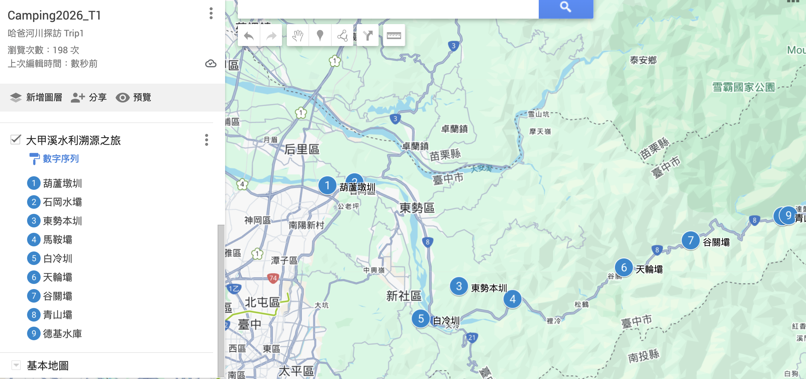
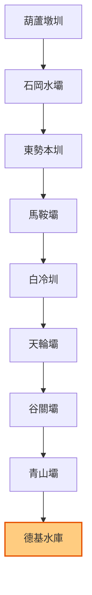

在 [WalkGIS V0.1 發布](/posts/20251229_walkgis_v0_1_release/) 與 [自動化工作流](/posts/20251229_walkgis_notebooklm_workflow/) 建置完成後，我決定來場「壓力測試」。

**挑戰目標**：在不修改一行程式碼的情況下，僅透過新增數據 (Data Injection) 與腳本 (Scripting)，快速上線兩條全新的主題地圖。

這兩條地圖分別是壯闊的**「大甲溪水利溯源之旅」**，以及小而美的**「智慧水圳玩樂地圖」**。

## 案例一：大甲溪水利溯源之旅 (The Great Dajia River Tour)

這是一條沿著台8線（中橫公路）一路向上的史詩路線，垂直落差超過 1200 公尺。

### 1. 資料建置 (Data Engineering)
我首先在 Database 中建立了一條新的 Map ID `2025_dajia_river_tour`，這條路線的特點是「由下而上」的地理排序。

*   **平原區**: 葫蘆墩圳 -> 石岡水壩 -> 東勢本圳
*   **中游區**: 馬鞍壩 -> 白冷圳 -> 天輪壩
*   **上游區**: 谷關壩 -> 青山壩 -> 德基水庫

透過 SQL 腳本，我將這 9 個點位與地圖 ID 綁定，並設定 `display_order` 確保順序正確。

### 2. 成果產出 (Outputs)



系統自動生成了包含 Mermaid 流程圖的 Markdown 頁面，讓我們能直觀地看到水流與路徑的關係。

此外，我利用 Python 腳本匯出了 **KML** 檔案供 Google My Maps 使用，並生成了一條 **[Google Maps 導航連結](https://www.google.com/maps/dir/24.279,120.7448/24.28138,120.76916/24.195,120.865/24.1844,120.9133/24.168,120.8299/24.2105,121.015/24.2333,121.0761/24.253,121.1602/24.2541,121.1652)**，直接將這條壯遊路線放進使用者的手機裡。



## 案例二：智慧水圳玩樂地圖 (Smart Water Map)


第二個挑戰是把「[農田水利署臺中管理處](https://theme.ia.gov.tw/gmap/?lang=1&office=18&q=)」推廣的智慧水利設施。這是一個針對性很強的主題，包含了許多冷門但具技術含量的點位（如自動截水閘門、低落差發電）。

### 1. 快速擴充 (Rapid Expansion)
我利用腳本批量建立了 8 個全新的景點 (Feature)，包括「后里圳低落差示範電廠」和「白冷圳馬力埔支線」。每個點位都標上了 `tags: ["智慧水圳玩樂地圖-臺中管理處"]`。

### 2. AI 賦能 (AI Integration)
針對這個較生硬的技術主題，我使用了之前開發的 `gen_notebooklm_context.sh` 腳本：

```bash
./gen_notebooklm_context.sh 2025_smart_water_fun_map_taichung
```

系統自動從資料庫抓取了這 8 個點的詳細技術資料，打包成 `walkgis_2025_smart_water_fun_map_taichung_notebooklm.md`。將這份檔案餵給 NotebookLM 後，我成功生成了一份生動的「智慧水圳親子導覽草稿」，將「截水閘門」變成了「守護農田的鋼鐵衛士」。

## 結論

這次實戰驗證了 WalkGIS 架構的靈活性：

1.  **資料庫核心**: `Maps` - `Relations` - `Features` 的三層架構極其穩固，能適應各種路線需求。
2.  **自動化工具鏈**: 從 SQL 注入到 NotebookLM 上下文生成，整條 pipeline 讓內容產製效率提升了數倍。
3.  **多樣化輸出**: 無論是給開發者的 Markdown、給用戶的 Google Maps 導航，還是給 AI 的 Context，都能從同一份數據源 (Single Source of Truth) 產出。

這不僅僅是做地圖，更是建立了一套**「地圖內容工廠」**。

---
### 🤖 AI 協作宣告
*   **本文內容**: 由人類作者規劃，Antigravity 協助撰寫。
*   **實作細節**: 文中提及的 SQL 與 Shell Script 均由本次協作中即時開發完成。
