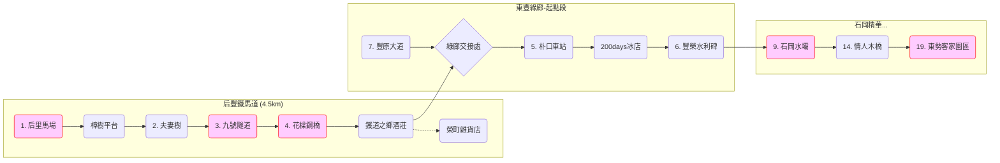

在構建「WalkGIS —— 全台散步地圖」專案的過程中，我與 AI Agent (Antigravity) 進行了一場深度的架構辯論。核心問題在於：**當我們希望 AI 能像人類一樣理解地圖時，傳統的 GIS 資料庫還是最好的選擇嗎？**

這篇文章記錄了我們如何從傳統的 SpatiaLite 方案，轉向一個更輕量、更適合 LLM 的 **"Text-based GIS"** 架構。

## 1. 痛點：AI 讀不懂二進位碼 (Binary Blob)

起初，我們理所當然地選擇了 **SpatiaLite** 作為 SQLite 的空間擴充。它是業界標準，功能強大。但是，當我嘗試讓 Agent 讀取資料庫時，問題出現了：

> Agent: "我讀取到了 `geometry` 欄位，但它是 binary blob，我無法直接解析它的座標。"

SpatiaLite 為了效能，將幾何資料存為二進位格式。這對 QGIS 很好，但對 LLM 來說，就像是一本無字天書。如果要讓 Agent 理解「后里馬場在哪裡？」，我們必須寫額外的 Python 程式碼去解碼它，這增加了依賴度與複雜性。

## 2. 決策：擁抱 WKT (AI-First Approach)

既然我們的目標是 **"Agentic GIS"**，為什麼不直接存成文字呢？
於是，我們做了一個大膽的決定：**棄用 SpatiaLite，擁抱 WKT (Well-Known Text)。**

我們將 DB Schema 修改如下：

```
CREATE TABLE walking_map_features (
    id INTEGER PRIMARY KEY,
    name TEXT NOT NULL,
    -- geometry BLOB,  <-- 傳統做法 (X)
    geometry_wkt TEXT NOT NULL  -- 新做法 (O) : POINT(120.735 24.298)
);
```

**這個改變帶來的紅利是巨大的：**
1.  **AI 原生可讀**：LLM 可以直接看懂 `POINT(120.7 24.2)`，甚至能直接生成 SQL 進行空間查詢（雖然不如 PostGIS 精確，但對散步地圖足夠了）。
2.  **零依賴 (Zero-Dependency)**：任何支援 SQLite 的環境都能跑，不需要由複雜的 C++ GIS Libraries 支援。
3.  **MCP 友善**：透過 Model Context Protocol 傳輸 JSON 時，文字格式無縫接軌。

## 3. 創新：用 Mermaid 畫地圖

解決了「幾何 (Geometry)」問題，下一個挑戰是「拓樸 (Topology)」。
散步地圖往往不是單純的點，而是有順序的「路線」。傳統 GIS 用 LineString 來畫線，但它無法表達 **"流程"** 與 **"邏輯"**。

我們引入了 **Mermaid Flowchart** 作為地圖的邏輯描述語言，存放在 `meta_data` 中：



這讓 WalkGIS 不僅能告訴你東西在哪 (Where)，還能告訴你怎麼走 (How)。

## 4. 實戰：24 個景點的自動化匯入

有了架構，我們利用一張「后豐鐵馬道導覽圖」進行了壓力測試。
透過一個 Python 腳本，結合 AI 的視覺辨識與網路搜尋能力，我們在幾分鐘內就建立了包含 24 個景點、一條 Y 字型複雜路線的完整資料庫。

## 5. 結語

WalkGIS V0.1 的誕生證明了，在 AI 時代，**「可讀性 (Readability)」可能比「儲存效率 (Efficiency)」更重要**。透過 WKT 與 Mermaid，我們打破了 GIS 與 LLM 之間的隔閡，讓地圖資料庫成為了一個 AI 隨時可以閱讀、理解並協作的故事書。

## 6. 成果展示 (Gallery & Data Preview)

為了驗證架構的可行性，我們實際匯入了 24 個景點並建立了第一張地圖。以下是目前的系統狀態快照：

### 6.1 QGIS 視覺化成果
透過 Virtual Layer 連接 `walkgis.db`，我們成功在 QGIS 地圖上渲染出所有景點 (Point) 與其屬性。


### 6.2 真實地圖對照
我們使用的底圖來源，與數位化後的資料呈現高度一致。


### 6.3 資料庫實體預覽
`walkgis.db` 目前的檔案狀態與 Schema 結構。


#### Feature 範例 (Row Data)
這是 **"后里馬場"** 在資料庫中的真實樣貌。注意到 `geometry_wkt` 是人類可讀的文字，且 `meta_data` 指向了外部的 Markdown 文件。

```json
{
  "feature_id": "20251229_houli_ranch",
  "name": "后里馬場",
  "description": "后豐鐵馬道起點，歷史悠久的馬場。",
  "geometry_type": "Point",
  "geometry_wkt": "POINT(120.73582 24.298637)",
  "meta_data": {
    "ref_doc": "features/20251229_houli_ranch.md",
    "generated_by": "batch_import"
  }
}
```

#### Map 範例 (Row Data)
這是 **"后豐東豐大環線"** 的地圖定義。最精彩的部分在於 `routes` 欄位中儲存了完整的 Mermaid 拓樸邏輯。

```json
{
  "map_id": "2025_houfeng_dongfeng_loop",
  "name": "后豐鐵馬道 & 東豐綠廊精華遊",
  "meta_data": {
    "difficulty": "Easy",
    "total_distance": "18km",
    "routes": {
      "main_route": "graph LR; subgraph Houfeng [\"后豐鐵馬道\"]; H1(1. 后里馬場) --> HA(樟樹平台); HA --> H2(2. 夫妻樹); H2 --> H3(3. 九號隧道); H3 --> H4(4. 花樑鋼橋); end; subgraph Dongfeng [\"東豐綠廊\"]; H4 --> Junction{交會點}; Junction --> D5(5. 朴口車站); D5 --> D9(9. 石岡水壩); D9 --> D14(14. 情人木橋); D14 --> D19(19. 東勢客家園區); end; class H1,H3,H4,D9,D19 highlight;"
    }
  }
}
```


---
### AI 協作宣告 (AI Collaboration Disclosure)
>  
> 
>
> **本文內容由 AI 協作生成**：
> 1.  **素材來源**：WalkGIS 專案實作與資料。
> 2.  **文章生成**：Antigravity 協助撰寫技術筆記與釋出公告。
> 3.  **文章落地**：Antigravity 協助排版與發布。
