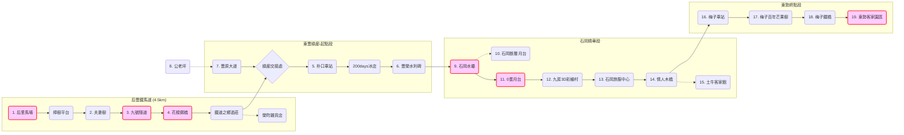

我們很高興宣布 **WalkGIS Project V0.1** 正式釋出！ 🎉

這是一個實驗性的專案，旨在探索如何讓「地圖資料」不僅是冷冰冰的座標，而是能被人類與 AI 共同閱讀、協作的「散步故事」。

## 🚀 什麼是 WalkGIS？

WalkGIS 是一個輕量級的 GIS (地理資訊系統) 資料庫。不同於傳統地圖，它使用 **WKT 文字格式** 儲存座標，並用 **Mermaid 流程圖** 來描述路線。這意味著：
*   **你可以直接讀懂它**：打開資料庫，你看到的不是亂碼，而是 `POINT(...)` 和清晰的文字描述。
*   **AI 可以幫你導覽**：未來的 AI 助理可以直接讀取這些資料，為你規劃行程。

## 🗺️ V0.1 首發路線：后豐鐵馬道 & 東豐綠廊精華遊

作為 V0.1 的展示，我們建構了台中最經典的 **「后豐鐵馬道 & 東豐自行車綠廊」** 大環線地圖。
這張地圖收錄了 **24 個精選景點**，從后里馬場出發，穿越百年的九號隧道與花樑鋼橋，一路延伸至東勢客家文化園區。

### 原圖

### 數位化的路線拓樸
看看我們如何用程式碼畫出這條路線的邏輯：

- [mermaid.live 顯示](https://mermaid.live/edit#pako:eNqFlW9v2kYcx9-K5arSIQGyfTZgI01q6kpo2qN1jzamyQ3mjwI2so3WLorUtKNNYElIurUiIaVLWEbahoY0aQfJ2jfDGftR38LONiSYZK0lS_b5873f_b73PZgnZ9WUTApkRpOKWeKbb-NJhcDX9esEOqihxtNPZ5uotmp1a3btxN57bS8-8QC9dMeTJNRSWlYyxA9JcgokABvm5gqBJPmjp3GuVE6TZ42cqhDfzVyMJmhAhwmstx__hsXoxXGACIW-IhI3gNlumu0e6r1Fa4eB-ITkhkcwgMHK1iu0d4o5H8F4BAQwTAx621a9aW_-jRfmg6AHsXixhFXpmu11u3pm7ld9EOtBM8BpbvHJoFe1f122yxvWasXHzRChsAPeBOZeZ_h7395qWEdt1H82pmQllVQuW2xud7Fzw3cv0GmFAGh5xeycBKaMFlUl4zj9021D0gzH70lVyDp5b58-xzqf3WIURHFf3RpabaKW27zbytclxd2FeU896LfM1b-s-h8LU91MoBNfxkPud5EDXJgwG8dobdc6rQxf1SctETnPuluAoaiUdE9Hjw4n_HDr3PLmiYCIu1RsnXl4jJb2hzvrX_Bt2HyLjv4cHn2w1t44rfsdu53NZSQvmtOgz6OIV58HfJjwQKf-7r6vD97bWpGmAE2dc0_fo27LbCxNhdOhXRjnGgebsraqV0A0PaIYQDNuRM2lj1BE_-4Pey_N7XU_zIxgCGh4Xv9Z2WysDP45QB8f-mk4ollA42CbD8uDft9stKeCjb-P2-IAjbcRNZrD5S3U2UGdd3ar_eXYourOZeOdqOrZ3CijGBmePLgqnDQ7WmUE0HjvzZ0ynvqKDNGjHaKjgI6OuWH9A-odW5UN83lj6uRjcCSIATo2FuCze6n92IjjAY0331us1z1qbKCV-_9jwHrbflAx629wU96gGAO4Diq_tu4vou2XgZGr0fiEymzvorM1q32AOpve4Gxe0nVRThN6UTWIdC6fF66l0-mgbmjqnCxcgxCOnkM_51JGVmCKd-NTUpzxbB7f5_rZC32aoj6rx7-7wQQMJtigyAdxHPHNX0zoI8-P_HiV_GdXGdSzUlEWtKxauFPS42QQ_8HkUqRgaCU5SBZkrSA5r-S8UyNJGlm5ICdJAT-mJG0uSSaVBawpSsr3qloYyzS1lMmSQlrK6_itVExJhizmJJy5CwRvlKzdVEuKQQoQUu4cpDBP3iWFEIxSYY6GFGS4WJSFkIkEyXt4nI-GGchRPBtlYzTHcfxCkPzFrcuEMcvyPOQhG2VYllv4D7cRwGE)

## 📂 如何取得與使用？

WalkGIS V0.1 目前已整合於本部落格的專案庫中：
`events/notes/wuulong-notes-blog/walkgis_prj/`

你可以找到：
### 📍 包含景點 (Points of Interest)

這張地圖收錄了 24 個景點，分為四個遊憩路段：

**1. 后豐鐵馬道 (Houfeng Section)**
*   [后里馬場](/wuulong-notes-blog/walkgis_prj/features/20251229_houli_ranch.md) (起點)
*   [樟樹平台](/wuulong-notes-blog/walkgis_prj/features/20251229_camphor_platform.md)
*   [夫妻樹](/wuulong-notes-blog/walkgis_prj/features/20251229_couple_tree.md)
*   [九號隧道](/wuulong-notes-blog/walkgis_prj/features/20251229_tunnel_9.md) (百年古蹟)
*   [花樑鋼橋](/wuulong-notes-blog/walkgis_prj/features/20251229_old_beam_bridge.md) (大甲溪景觀)
*   [鐵道之鄉酒莊](/wuulong-notes-blog/walkgis_prj/features/20251229_winery.md)
*   [榮町雜貨店](/wuulong-notes-blog/walkgis_prj/features/20251229_rongting_grocery.md)
*   [綠廊交接處](/wuulong-notes-blog/walkgis_prj/features/20251229_greenway_junction.md)

**2. 東豐綠廊-起點段 (Dongfeng Start)**
*   [豐原大道自行車道](/wuulong-notes-blog/walkgis_prj/features/20251229_fengyuan_blvd_bike.md)
*   [朴口車站](/wuulong-notes-blog/walkgis_prj/features/20251229_pukou_station.md)
*   [200days冰店](/wuulong-notes-blog/walkgis_prj/features/20251229_200_days_ice.md) (網美打卡點)
*   [豐榮水利碑](/wuulong-notes-blog/walkgis_prj/features/20251229_fengrong_stele.md)
*   [公老坪](/wuulong-notes-blog/walkgis_prj/features/20251229_kunglaoping.md) (周邊觀景)

**3. 石岡精華段 (Shigang Section)**
*   [石岡水壩](/wuulong-notes-blog/walkgis_prj/features/20251229_shigang_dam.md)
*   [石岡斷層月台](/wuulong-notes-blog/walkgis_prj/features/20251229_shigang_fault.md) (921地震遺跡)
*   [0蛋月台](/wuulong-notes-blog/walkgis_prj/features/20251229_0_dan_platform.md)
*   [九房3D彩繪村](/wuulong-notes-blog/walkgis_prj/features/20251229_jiufang_3d.md)
*   [石岡旅客服務中心](/wuulong-notes-blog/walkgis_prj/features/20251229_shigang_visitor.md)
*   [情人木橋](/wuulong-notes-blog/walkgis_prj/features/20251229_lovers_bridge.md)
*   [石岡土牛客家文化館](/wuulong-notes-blog/walkgis_prj/features/20251229_tuniu_hakka.md)

**4. 東勢終點段 (Dongshi Section)**
*   [梅子車站](/wuulong-notes-blog/walkgis_prj/features/20251229_meizi_station.md)
*   [梅子百年芒果樹](/wuulong-notes-blog/walkgis_prj/features/20251229_meizi_mango.md)
*   [梅子鐵橋](/wuulong-notes-blog/walkgis_prj/features/20251229_meizi_iron_bridge.md)
*   [東勢客家文化園區](/wuulong-notes-blog/walkgis_prj/features/20251229_dongshi_hakka.md) (終點)

## 🔮 下一步 (Roadmap)
我們會繼續在這個基礎上，探索更多可能性：
1.  **更多路線**：隨著流域探索，持續更新。

歡迎關注我們的更新，或是直接 clone 專案來打造你自己的散步地圖！

---
### AI 協作宣告 (AI Collaboration Disclosure)
>  
> 
>
> **本文內容由 AI 協作生成**：
> 1.  **素材來源**：WalkGIS 專案實作與資料。
> 2.  **文章生成**：Antigravity 協助撰寫技術筆記與釋出公告。
> 3.  **文章落地**：Antigravity 協助排版與發布。
