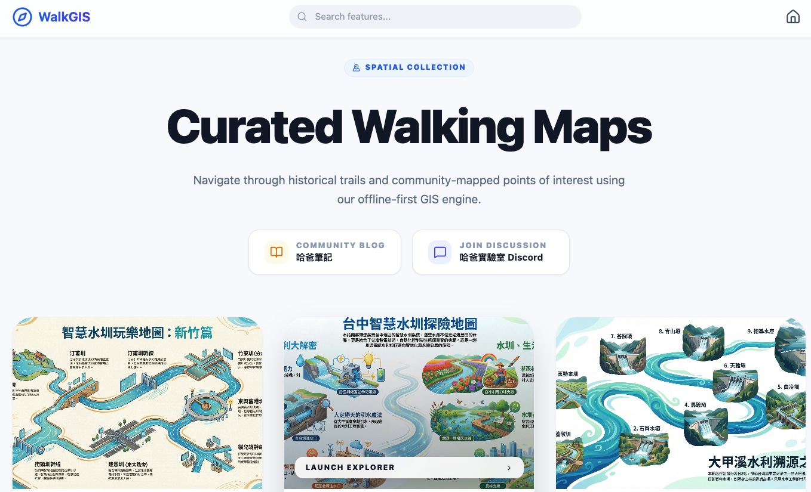

[WalkGIS App](https://walkgis-544663807110.us-west1.run.app/)

在 [WalkGIS 專案資料庫](/wuulong-notes-blog/posts/20251230_walkgis_automation_task/) 建置完成後，下一步就是如何將這些豐富的資料（地圖、景點、故事）優雅地呈現給使用者。

傳統的 GIS 應用通常需要昂貴的後端伺服器（如 PostgreSQL/PostGIS）與複雜的 API 開發。但對於一個個人部落格專案來說，這樣的重裝備既花錢又難維護。

於是，WalkGIS App 採用了一個激進的 **「全靜態 (Static-Only)」** 架構：**Database in the Browser**。

## 🏛 架構設計 (The Architecture)

這個 App 的核心理念是：**將運算算力下放給使用者，將資料儲存託管給 GitHub。**

### 1. 資料層 (Storage Layer)
所有的資料都以靜態檔案的形式存放在 GitHub 上 (`static/walkgis_prj/`)，任何人都可以公開存取：
*   **關聯式資料 (`walkgis.db`)**: 使用 SQLite 儲存地圖列表、景點座標 (WKT)、以及它們之間的關聯結構。這是 Single Source of Truth。
*   **內容資料 (`*.md`)**: 每個景點的詳細介紹、歷史故事都寫在獨立的 Markdown 檔案中。這讓內容維護變得像寫筆記一樣簡單。

### 2. 運算層 (Compute Layer)
我們沒有後端 API Server。
當使用者打開網頁時，瀏覽器會：
1.  下載輕量的 `walkgis.db` 檔案。
2.  啟動 **`sql.js` (SQLite WebAssembly)** 引擎。
3.  所有的 SQL 查詢（如「找出所有屬於新竹地圖的景點並按順序排列」）都在瀏覽器內瞬間完成。

### 3. 動態內容加載 (Lazy Loading)
為了不讓初次載入變慢，我們不會把所有 Markdown 文字塞進 DB。當使用者點擊某個景點時，App 才會即時去 fetch 對應的 Markdown 檔案並渲染出來。

這種 **「DB 索引 + 檔案內容」** 的混合模式，完美平衡了效能與豐富度。

## ✨ 核心功能 (Key Features)

透過這個架構，我們實現了許多強大的功能：

### 1. 互動式地圖瀏覽
基於 **Leaflet** 的地圖介面，使用者可以流暢地瀏覽地圖、點擊 POI 查看詳情。

### 2. 高效能全域搜尋
利用 SQL 的強大查詢能力，我們實現了毫秒級的全域搜尋。想找「水圳」？SQL `LIKE` 查詢瞬間幫你撈出所有相關景點，完全不需要依賴第三方搜尋服務。

### 3. 魔術生成器 (Magic Generators)
這是我最喜歡的功能。因為所有資料都在前端，我們可以即時生成各種格式：
*   **NotebookLM Context**: 一鍵把整張地圖的所有景點介紹打包成文字檔，餵給 AI 做深度分析。
*   **KML Export**: 想要在 Google Earth 看？一鍵匯出 KML。
*   **Google Nav**: 一鍵生成這條路線的 Google Maps 多點導航連結。

## 💡 為什麼選擇這個架構？

對於個人開發者或知識管理者來說，這個方案有巨大的優勢：

1.  **零成本 (Zero Cost)**: 託管在 GitHub Pages，完全免費。只要流量不把 GitHub 撐爆，你不需要付一毛錢。
2.  **極易部署 (Easy Deployment)**: 後端維護只需 `git push` 更新 DB 檔，前端就會自動讀取到最新資料。無需管理 Docker、無需擔心資料庫連線數。
3.  **執行期無 GenAI 依賴**: 雖然內容可能有 AI 輔助生成，但 App 運行時完全不依賴昂貴的 LLM API，純粹是 SQL 與 JS 的邏輯運算，穩定且快速。

## 📖 使用者手冊 (User Manual)

WalkGIS App 的介面設計直覺，主要分為以下幾個區域：

### 1. 首頁：地圖探索
進入首頁後，您會看到所有可用的主題地圖以**卡片 (Cards)** 形式排列。
*   每張卡片顯示地圖的**封面照片**、**名稱**以及**地區**。
*   上方 Header 設有 **全域搜尋列 (Search features...)**，如果您記得某個景點的名字（例如「三叉埤」）但忘了在哪張地圖，直接搜尋即可瞬間跳轉。

### 2. 地圖詳情頁 (Map Explorer)
點擊任一張卡片進入詳情頁，這裡是 WalkGIS 的核心工作台：

*   **互動地圖**: 中央的大地圖顯示所有景點位置，支援縮放與平移。
*   **景點清單**: 側邊欄列出了該路線的所有景點，點擊可快速定位。
*   **景點詳情**: 點擊地圖上的標記或清單項目，會彈出詳細資訊面板。這裡不只有座標，還會即時載入該景點的**歷史故事**、**生態特色**等豐富圖文內容（Markdown 格式）。

### 3. 魔術工具箱 (Magic Generators)
在地圖標題下方，您會看到一排功能強大的按鈕，這是專為進階使用者設計的：

*   📊 **NotebookLM Context**: 
    一鍵將整張地圖的所有景點介紹打包並複製到剪貼簿。您可以直接貼到 Google NotebookLM，讓 AI 成為您的專屬導遊。
*   🗺️ **Export KML**: 
    下載標準 KML 檔案，方便匯入 Google Earth 或其他 GIS 軟體進行專業分析。
*   🚗 **Google Maps Navigation**: 
    想直接出發？點擊此按鈕，App 會自動將所有景點串聯成一條 Google Maps 導航路線，直接在您的手機地圖 App 開啟。

## 💡 技術總結：為什麼這個架構很酷？

在使用這個網站時，您可能沒有意識到一個驚人的事實：**這個網站完全沒有後端伺服器 (Serverless)**。

1.  **資料自主**: 所有的地圖資料都以 `sqlite3` 資料庫檔與 `Markdown` 文件的形式，公開儲存在 GitHub Repo 中。
2.  **前端運算**: 您的瀏覽器就是伺服器！App 使用 `sql.js` (WebAssembly) 技術，將資料庫下載到您的瀏覽器中運行。所有的搜尋、排序、KML 生成，都是由**您的電腦/手機**即時運算完成的。
3.  **零成本、高韌性**: 因為沒有後端 API，所以沒有伺服器維護成本，也不會因為資料庫連線數爆掉或是 AI API 額度用完而掛點。只要 GitHub 活著，這個網站就活著。
4.  **隱私安全**: 由於是純靜態網站，我們不會（也無法）蒐集您的任何個人資料或位置軌跡。

這是一個展示 **"Local-First"** 與 **"Static Web App"** 潛力的絕佳案例。

---
### 🤖 AI 協作宣告
*   **本文內容**: 由人類作者規劃，Antigravity 協助撰寫。
*   **架構設計**: 本文描述的 Static SQLite 架構由 AI 建議並協助實作前端邏輯。
