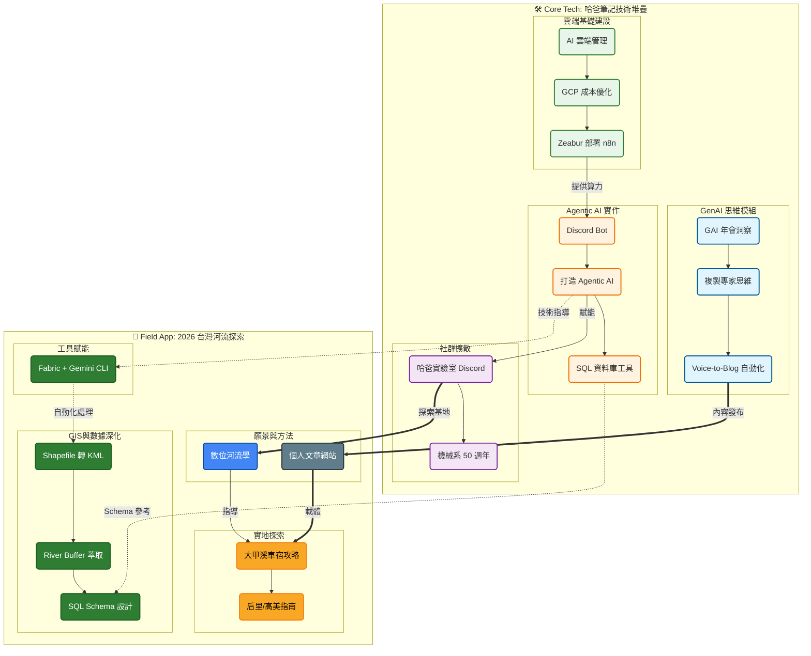

# 哈爸實驗室：技術與應用生態全景圖

這張圖展示了「哈爸筆記」作為核心技術引擎，如何支撐並孵化出「2026 台灣河流探索」這個實踐場域。

```mermaid
graph TD
    %% === 定義可視化樣式 (Styles) ===
    %% 核心技術區 (Core) - 藍/綠色系
    classDef C_Mind fill:#e1f5fe,stroke:#01579b,stroke-width:2px;
    classDef C_Infra fill:#e8f5e9,stroke:#2e7d32,stroke-width:2px;
    classDef C_AI fill:#fff3e0,stroke:#ef6c00,stroke-width:2px;
    classDef C_Comm fill:#f3e5f5,stroke:#7b1fa2,stroke-width:2px;

    %% 應用場景區 (River) - 大地色/深色系
    classDef R_Vision fill:#4285F4,stroke:#0d47a1,stroke-width:2px,color:white;
    classDef R_Content fill:#F9A825,stroke:#f57f17,stroke-width:2px,color:black;
    classDef R_Tech fill:#2E7D32,stroke:#1b5e20,stroke-width:2px,color:white;
    classDef R_Meta fill:#607D8B,stroke:#263238,stroke-width:2px,color:white;

    %% === Core Domain: 哈爸筆記技術堆疊 ===
    subgraph CoreDomain [🛠️ Core Tech: 哈爸筆記技術堆疊]
        direction TB
        
        subgraph C_Phase1 [GenAI 思維模組]
            Expert(複製專家思維):::C_Mind
            V2B(Voice-to-Blog 自動化):::C_Mind
            Insight(GAI 年會洞察):::C_Mind
            Insight --> Expert --> V2B
        end

        subgraph C_Phase2 [雲端基礎建設]
            GCP(GCP 成本優化):::C_Infra
            Zeabur(Zeabur 部署 n8n):::C_Infra
            CloudAI(AI 雲端管理):::C_Infra
            CloudAI --> GCP --> Zeabur
        end

        subgraph C_Phase3 [Agentic AI 實作]
            BotDebug(Discord Bot):::C_AI
            Agent(打造 Agentic AI):::C_AI
            Tool_SQL(SQL 資料庫工具):::C_AI
            Zeabur --> |提供算力| BotDebug --> Agent --> Tool_SQL
        end
        
        subgraph C_Phase4 [社群擴散]
            HabaLab(哈爸實驗室 Discord):::C_Comm
            Event(機械系 50 週年):::C_Comm
            Agent --> |賦能| HabaLab
            HabaLab --> Event
        end
    end

    %% === Application Domain: 河流探索計畫 ===
    subgraph AppDomain [🌊 Field App: 2026 台灣河流探索]
        direction TB
        
        subgraph R_Phase1 [願景與方法]
            Method1(數位河流學):::R_Vision
            Infra(個人文章網站):::R_Meta
        end

        subgraph R_Phase3 [實地探索]
            Trip1(大甲溪車宿攻略):::R_Content
            Trip2(后里/高美指南):::R_Content
            Trip1 --> Trip2
        end

        subgraph R_Phase4 [GIS與數據深化]
            Data1(Shapefile 轉 KML):::R_Tech
            Data2(River Buffer 萃取):::R_Tech
            Schema(SQL Schema 設計):::R_Tech
            Data1 --> Data2 --> Schema
        end
        
        subgraph R_Phase5 [工具賦能]
             Tool_Fab(Fabric + Gemini CLI):::R_Tech
        end
    end

    %% === 跨域整合連接 (The Merger) ===
    
    %% 1. 基礎設施共用
    V2B ==> |內容發布| Infra
    Infra ==> |載體| Trip1

    %% 2. 技術賦能 (Agentic AI -> GIS Tech)
    Agent -.-> |技術指導| Tool_Fab
    Tool_Fab -.-> |自動化處理| Data1

    %% 3. 社群匯流
    HabaLab ==> |探索基地| Method1
    Method1 --> |指導| Trip1
    
    %% 4. 資料庫整合
    Tool_SQL -.-> |Schema 參考| Schema
```
