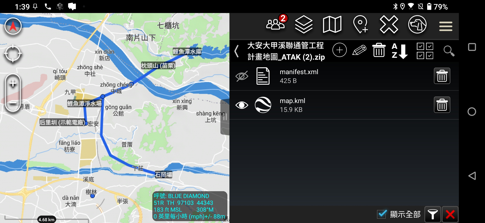
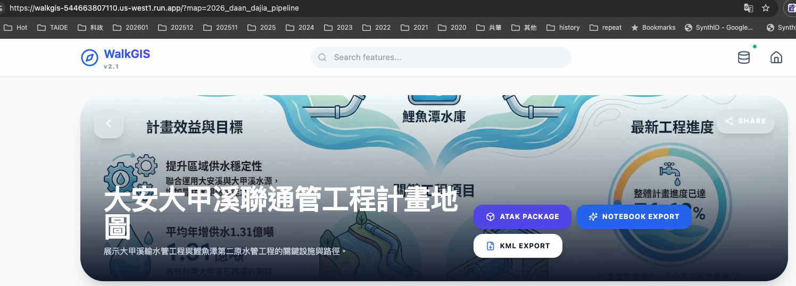

這兩天在整理「大安大甲溪聯通管工程」的 WalkGIS 專案資料時，我思考了一個問題：**網頁版的 GIS 雖然方便瀏覽，但如果我要去現場勘查，或者需要跟團隊進行離線協作，最專業的工具其實是 ATAK (Android Team Awareness Kit)。**

但是，要將 WalkGIS (基於 Markdown 和 KML) 的資料轉移到 ATAK，並不是單純把 KML 丟進去就好。為了最好的使用者體驗，我們需要製作成 **Data Package (Mission Package)**，這樣才能包含版本資訊、圖示設定，甚至自動載入地圖。

如果是以前，我可能需要花幾個小時去翻 ATAK 的技術文件，搞懂 `MANIFEST.xml` spec，這是最枯燥的部分。

但這次，我嘗試了 **Agentic Workflow**，讓 AI 來擔任我的「技術研究員」兼「資深工程師」。

## 1. 任務指派：從模糊到清晰

我一開始甚至不確定 ATAK 的具體格式細節，所以我只問了 Agent：
> 「你知道 ATAK data package 的格式嗎？」

Agent 不僅幫我搜尋了格式規範，還直接總結出重點：
- 它是個 Zip 檔。
- 核心是 `MANIFEST/manifest.xml`。
- 需要 UUID 來管理版本。
- 支援 KML/KMZ 和影像。

## 2. 實作：一句話生成工具腳本

知道原理後，我並沒有自己寫程式碼，而是直接把專案路徑和需求丟給 Agent：
> 「我想要將 大安大甲溪聯通管工程計畫 中的所有點位，打包成 data package」

Agent 做了以下幾件事：
1.  **掃描我的專案結構**：自動找到 `static/walkgis_prj/features` 下的所有 `.md` 檔案。
2.  **理解資料欄位**：解析 Frontmatter 中的 `coordinate`、`title`、`color`。
3.  **撰寫 Script**：生成了一個 `create_2026_daan_dajia_pipeline_atak_pkg.py`，完整處理了 KML 生成、XML Manifest 建立、UUID 產生，最後壓縮成 Zip。

整個過程不用 3 分鐘，我就得到了一個可以動的 Python 腳本。

## 3. 成果驗證與整合

我將生成的 `.zip` 丟進手機的 ATAK，一次成功！所有點位精準顯示，路線顏色正確，甚至因為是標準 Package，安裝即用的體驗非常流暢。

於是，我順勢在 WalkGIS 的地圖頁面中加入了一個新功能：**「匯出 ATAK Data Package」**。

現在，任何一個 WalkGIS 的主題地圖，只要跑一下腳本，就能生成一個軍規等級的離線地圖包。

### 為什麼這很重要？

這就是 **Agentic Coding** 的威力。它不僅僅是「寫 Code」，而是幫我跨越了「知識獲取 (Research)」到「落地實作 (Implementation)」的鴻溝。我不需要成為 ATAK 格式專家，也能開發出專業的 ATAK 整合功能。

這讓我可以專注在內容（河流探索、工程研究），而將繁瑣的異質系統整合交給 AI 處理。

---

*相關資源：*
- [大安大甲溪聯通管工程計畫地圖](../maps/2026_daan_dajia_pipeline.md) (內含 ATAK 包下載)
