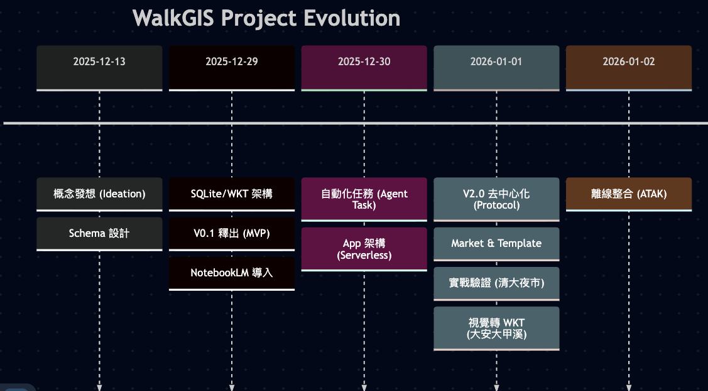
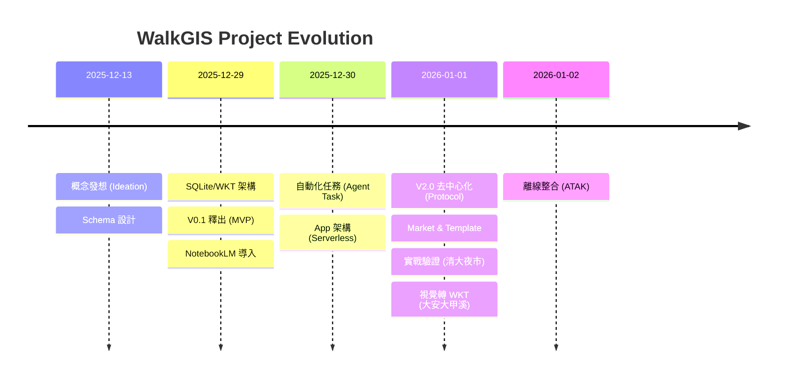

這 20 天(其實是四天)是一場極高密度的開發旅程。WalkGIS 從一個「想記錄散步軌跡」的簡單念頭，在 AI Agent (Antigravity) 的深度協作下，迅速演化成一個具備去中心化架構、自動化工作流與軍規整合能力的完整 GIS 生態系。

為了記錄這段瘋狂的迭代過程，我整理了這份發展歷程表。

## 📈 演進歷程 (Evolution Timeline)

- [mermaid.live url](https://mermaid.live/edit#pako:eNptkd1qE0EUx19lmAvZQhJ3ZrObZO-CipQ20pLQguzNmB3TNbs7YTMpashNS0lCpHhhK1XxQmpaC9HiZ0iUvkxns3kLZ1stVvYwDHNm_ud3PqYNq8ym0ITc8ajr-NTygTTucJeCdeLW7y6WwUrAHtEqB3c2mdviDvMvRVjFehrhNNKACcLhljj7Njv4GW5_AcqiTUksXLhU_mMmKFc3qEdAdDyKjnvXSbgQv68uO5zeXF-qgPDt9_BokMBYUzMIzLsD0Z0ApbS2kpTnHuP0AWP15RIQp7ti5_31XJoqNVH3RAz2xLP98-lUDA6AUqxRn4MKadaTkMVG409NQCnTYJMGLm02F67ARlpFcsUF4owKxO70fDwSZ9syAVDkFDmrMjcJXCJBnXJwA1So13AJpwka8WkY9k7nH15Goz5QwvGOODwSh2_EeCuJGA33o-Ek-tUH8SCVWPuxL_fZi8_h5OT_krGMmL9-N_vxKtz7Kp735CAqxSWpsnyYgrXAsaHJgxZNQY8GHold2I4ZFuTyN6kFTXm0ZRcWtPyOjGkQ_z5j3t-wgLVqG9B8SNym9FoNW_Z42yG1gHhXtwH1bRrcYi2fQxPj_AUEmm34GJpphDJ5LZ9DGtIKBUNHhp6CT6CpGRmMjJyB9RzOFoxsoZOCTy_yooyqYU03VKzl8vmsjlHnNzVx_EI)

## 🗓️ 詳細里程碑紀錄 (Milestone Log)

| 歷程階段 | 日期 | 相關網誌 / 事件 | Why (為什麼做這個？) | Highlight (亮點/成果) |
| :--- | :--- | :--- | :--- | :--- |
| **Phase 0: 概念與基礎** | 2025/12/13 | [散步地圖的概念與應用](/posts/20251213_walking_map_concept/) | 想要記錄在地的移動紋理，而不只是導航。 | 確立「以人為本」的 GIS 敘事角度。 |
| | 2025/12/13 | [社區 GIS 圖層分類學](/posts/20251213_community_gis_layer_types/) | 需要一套通用的分類標準，以免地圖資料雜亂無章。 | 提出 PoI 的結構化分類架構。 |
| | 2025/12/14 | [SQLite Schema 設計](/posts/20251214_walking_map_schema_design/)| 需要一個輕量、可攜且 AI 友善的資料儲存格式。 | 選擇 SQLite + WKT，奠定 Serverless 基礎。 |
| **Phase 1: V0.1 MVP** | 2025/12/29 | [打造 AI-First GIS 系統](/posts/20251229_walkgis_v0_1_dev_log/) | 開發過程的技術筆記，記錄架構選擇。 | 確立 SpatiaLite 到 WKT 的技術轉型。 |
| | 2025/12/29 | [WalkGIS V0.1 釋出](/posts/20251229_walkgis_v0_1_release/) | 驗證「地圖即故事書」的概念是否可行。 | 首個版本上線，結合 Markdown 與地圖展示。 |
| | 2025/12/29 | [NotebookLM 自動化產製](/posts/20251229_walkgis_notebooklm_workflow/) | 解決地圖內容貧乏的問題，讓 AI 當導覽員。 | 建立 DB -> Context -> NotebookLM 的流水線。 |
| | 2025/12/29 | [WalkGIS 實戰：雙主題地圖](/posts/20251229_walkgis_case_study/) | 第一個真正的應用案例測試。 | 完成「大甲溪溯源」與「智慧水圳」地圖。 |
| **Phase 2: 自動化與 App** | 2025/12/30 | [地圖生成代理人與實戰](/posts/20251230_walkgis_automation_task/) | 手工製作地圖太慢，需要標準化 SOP。 | 透過 BMad Task 定義，讓 AI 自動搜尋並生成地圖。 |
| | 2025/12/30 | [WalkGIS App 架構解密](/posts/20251230_walkgis_app_architecture/) | 解釋如何不用後端也能跑起複雜的 GIS App。 | 展示 sql.js (WASM) 在瀏覽器端的強大能力。 |
| **Phase 3: V2.0 協議化** | 2026/01/01 | [WalkGIS 2.0 願景：去中心化](/posts/20260101_walkgis_2_0_vision/) | 解決單一 Repo 難以擴展與共創的問題。 | 提出「Viewer 與 Data 分離」架構。 |
| | 2026/01/01 | [V2 技術開發日誌](/posts/20260101_walkgis_v2_dev_log/) | 實作 V2 架構的技術細節。 | 引入 Market 機制與 Data Template。 |
| | 2026/01/01 | [WalkGIS Sample 實戰紀錄](/posts/20260101_walkgis_sample_dev_log/) | 親自驗證 V2 Template 是否好用 (Dogfooding)。 | 產出「清大夜市散步地圖」，修正 GPS 流程。 |
| **Phase 4: 進階整合** | 2026/01/01 | [AI 看圖轉 WKT 實戰](/posts/20260101_ai_image_to_wkt/) | 解決官方工程圖只有 JPG 沒有 KML 的痛點。 | Agent 視覺判斷與錨點推估，自動生成路徑。 |
| | 2026/01/02 | [Agentic 實戰：ATAK 打包](/posts/20260102_agentic_atak_packaging/) | 為了現場勘查需求，需要離線且軍規級的地圖工具。 | AI 自動撰寫打包 Script，一鍵匯出 Mission Package。 |

## Aha Moment （全人工手寫心得）

- 以前在做流域的時候，從源兵衛川的故事中，那時的理解是推動流域復興，情報地圖（散步地圖）能起到關鍵作用，但苦於收集資料的困難，建立 GIS 圖資的技術障礙，製作地圖的耗費功夫，所以很難進行。但似乎在 Agentic AI 時代，這些都會簡單很多，所以起心動念在這裡。想實踐一下，是不是真的像想像中簡單，結果是的。
- 軟工的素養還是有用的，知道先從資料開始建構，其他自然水到渠成。資料的起始源自以前有些其他實驗的經驗， 「LLM 很會建構與維護 DB」，「Agentic 會去搜尋資料，建立表格與 markdown」，「自動化 task 的迭代」
- 資料有點樣子，就自然會想有前端呈現，反正 vibe coding 很容易，AI studio 部署也很輕鬆。關鍵在是在於，從使用者需求，透過工程手段，循序漸進的生出產品來解決。
- 特別的是在全流程，從發想設計->實驗測試->整理分享，一氣呵成，這中間雜事太多，全都是 Agentic 可以加速的
- WalkGISApp v2.0, 其實只是聊天產出的一個 idea, 給了一個模糊的 prompt ，就產出了一篇許願文。基本上一個點，很快就可以轉出一個線，然後就是一個面。連這一篇也是從整理發文的材料繼續展開的。
- Agentic 驅動 GIS 工具的 CLI時，原來以前那麼難下的命令，AI 下得很好。所以以前透過 QGIS 手動轉換的時代過去了
- 地圖 JPG 上面的幾條線，竟然能查出 GPS 位置，轉成 WKT，變成圖資
- 全來有圖資，產出 ATAK 資料包，那麼容易 

## 🚀 總結與展望

從這份歷程表可以看出，WalkGIS 已經不再只是一個小程式，而是一套完整的 **Agentic GIS Workflow**：
1.  **Input**: 從模糊的想法、清單，甚至是 JPG 圖片。
2.  **Process**: 透過 AI Agent (Automated Task) 進行搜尋、定位、轉碼。
3.  **Storage**: 儲存在標準化的 SQLite + Markdown 結構中。
4.  **Output**: 可以是 Web App (WalkGIS Viewer)、Podcast (NotebookLM)、或是軍規離線地圖 (ATAK)。

接下來，我們將持續探索更多 AI 賦能 GIS 的可能性，包括更聰明的地理空間分析與即時協作功能。

想看 notebooklm 做的投影片：[請點選](WalkGIS_From_Walk_to_War-Grade_Integration.pdf)

---
### 🤖 AI 協作宣告
*   **本文內容**: 由人類作者提供歷程觀點與需求，Antigravity 負責資料盤點與圖表製作。
*   **資料來源**: 自動掃描並彙整自 `wuulong-notes-blog` 內的所有 WalkGIS 系列文章。
