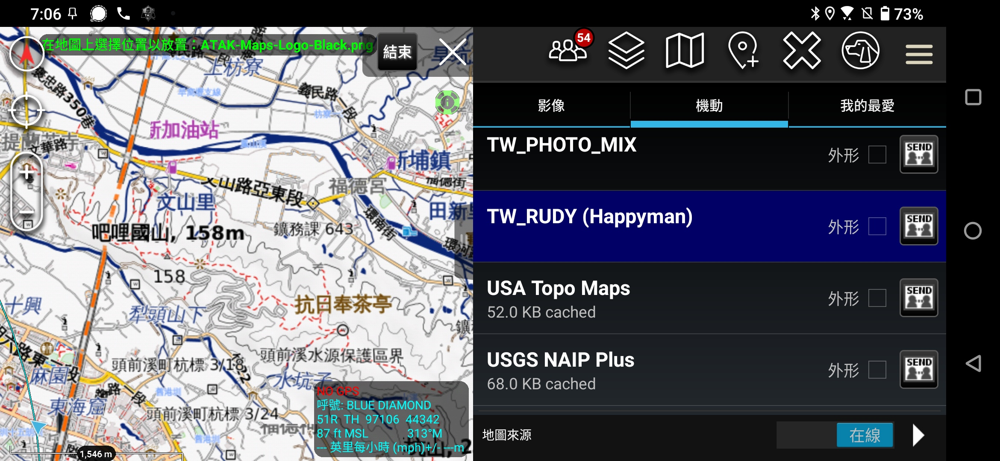

最近在整理舊檔案時，翻出了一個好幾年前製作的 ATAK 地圖擴充包 (`ATAK-Maps-LASS.zip`)。這個懶人包當年整合了 Google、Bing、以及最重要的**台灣通用電子地圖**與**魯地圖**，為了讓團隊能快速在 ATAK 建立共同的圖資環境。

沒想到興沖沖地匯入新版 ATAK 後，卻發現無法讀取，甚至連最關鍵的魯地圖都無法顯示。

於是我請了 AI 助手協助除錯，沒想到短短幾分鐘內就找出了結構性問題與連結失效的原因，並協助重新打包修復。這篇文章簡單紀錄一下這次的協作修復過程，並分享這個「復活版」的地圖包給大家。



## 修復過程：AI 如何解決問題？

### 1. 修正 ZIP 結構問題

一開始匯入失敗的原因，是資料夾結構多了一層。

*   **原本結構**：`ATAK-Maps-LASS.zip` -> `ATAK-Maps-Map/` -> `Taiwan_map/` ...
*   **正確結構**：ATAK 要求資料包的內容（XML 設定檔）必須直接位於壓縮檔的**根目錄**。
*   **解決**：AI 自動協助將目錄攤平並重新打包。

### 2. 魯地圖 (Rudy Map) 網址失效

這是最棘手的部分。原本的設定檔使用的是 `http://rudy.tile.basecamp.tw`，但發現：

1.  **HTTPS 限制**：現代 Android 系統與新版 ATAK 預設阻擋明文 HTTP 連線。
2.  **DNS 解析失敗**：該網址目前似乎無法穩定連線。
3.  **解決**：經過 AI 搜尋與測試，找到了由 **Happyman** 維護的穩定鏡像站，並支援 HTTPS 加密連線。我們將設定檔更新為：

    ```xml
    <url>https://tile.happyman.idv.tw/map/moi_osm/{$z}/{$x}/{$y}.png</url>
    ```

## 地圖包內容與特色

這個修復後的 Data Package 包含了多種實用的線上圖資來源，適合登山、搜救或戶外活動使用：

### 🇹🇼 台灣在地圖資 (Taiwan_map)

這是此包的精華，針對台灣使用者最佳化：
*   **TW_RUDY (魯地圖)**：登山界必備神圖，包含詳盡的等高線、地形渲染與登山路徑（已更新為 Happyman Mirror）。
*   **TW_EMAP (臺灣通用電子地圖)**：內政部國土測繪中心官方圖資，準確度最高，林道與地標資訊豐富。
*   **TW_PHOTO (正射影像)**：高解析度的台灣航照圖。
*   **TW_B5000 (1/5000 基本地形圖)**：適合需要精密地形判讀的場景。

### 🌍 全球主流圖資

*   **Google Maps**：
    *   **Hybrid / Satellite**：衛星影像與混合圖（含路名）。
    *   **Terrain**：帶有陰影的地形圖。
    *   **Roadmap**：標準街道圖。
*   **Bing Maps**：微軟的衛星與街道圖，有時在山區的雲層遮蔽狀況比 Google 好。
*   **ESRI**：
    *   **World Topo**：ArcGIS 的地形圖，風格精美。
    *   **Nat Geo**：國家地理雜誌風格地圖。
*   **OSM (OpenStreetMap)**：
    *   **Standard**：標準開源地圖。
    *   **CycleOSM**：強調自行車路徑的版本。
    *   **OpenTopoMap**：基於 OSM 的等高線地形圖。

## 下載

*   **[下載 ATAK-Maps-LASS_Fixed.zip](https://drive.google.com/file/d/1biHJ5gALTtJ0JvWLg41XTOe2cSIC_OYB/view?usp=drive_link)** 

---
*註：本資料包僅包含 XML 連線設定檔，需在有網路的環境下瀏覽（ATAK 會自動快取瀏覽過的圖磚供離線使用）。*

---

### AI 協作宣告 (AI Collaboration Disclosure)

>  
> 
>
> **本文內容由 AI 協作生成**：
> 1.  **AI 角色**：技術除錯助手與共同作者。
> 2.  **AI 工具**：診斷 Data Package 結構問題、搜尋可用圖資鏡像站、撰寫文章草稿。
> 3.  **人工審核**：由哈爸本人驗證修復後的圖資包在 ATAK 中可正常載入與顯示。
