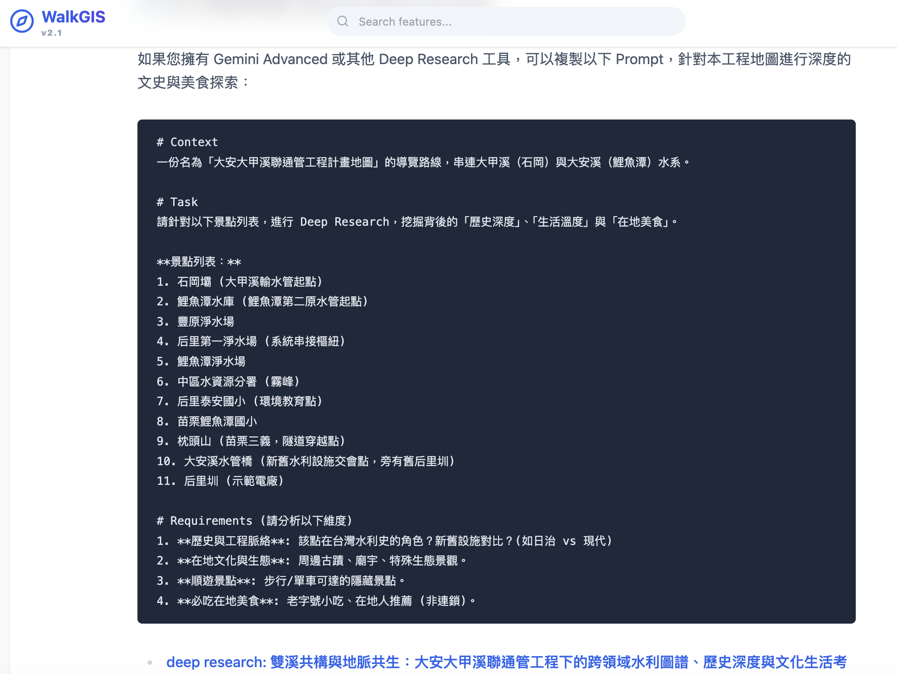

在整理 WalkGIS 地圖資料的過程中，我常感到一種「資訊焦慮」。

舉例來說，當我畫出一條「大安大甲溪聯通管」的路線時，地圖上標示了「石岡壩」、「鯉魚潭水庫」、「后里圳」。技術上，地圖完成了它的任務：它告訴你位置在哪裡。

但當我真的要背起背包去走訪時，我需要的遠不止是座標。
*   石岡壩在 921 地震時發生了什麼事？斷層在哪裡？
*   后里圳旁邊有沒有在地人才知道的老麵店？
*   這條水管橋在新舊水利工程上有什麼傳承意義？

以前，我得打開 Google，把地圖上的十幾個點，一個一個複製去搜尋。搜歷史、搜美食、搜遊記，然後自己拼湊成一份筆記。這個過程**極其繁瑣**，且容易因為關鍵字下得不對而錯過精彩故事。

## 💡 頓悟：地圖本身就是最好的 Prompt

我突然意識到，WalkGIS 的 Markdown 地圖檔裡，其實已經具備了做深度研究最關鍵的素材——**結構化的興趣點 (POI) 清單**。

如果我能直接把這份清單，加上一段精心設計的 Context 與指令，打包成一段 Prompt 附在地圖裡。那麼使用者只需要**「一鍵複製」**，丟給現在最強大的 AI 研究工具（如 Gemini Advanced Deep Research），就能瞬間獲得一份比市面上任何旅遊書都還深入的導覽報告。

於是，我開始在 WalkGIS 的每份地圖文件中，加入一個新的區塊：**🗺️ AI 深度探索 (Deep Research)**。

### 實際案例：大甲溪水利地圖

我在 [大甲溪水利溯源之旅](../maps/2025_dajia_river_tour.md) 中加入了這樣的 Prompt：

```markdown
# Context
一份名為「大甲溪水利溯源之旅」的導覽路線...

# Task
針對以下景點列表，進行多維度的文史與生態分析...

**景點列表：**
1. 葫蘆墩圳
2. 石岡水壩
...

# Requirements
1. **水電與開發史**: 中橫公路開拓與水壩建設的關係？
2. **必吃山城美食**: 白冷肉包、谷關鱘龍魚...
```

使用者不需要知道怎麼寫 Prompt，也不用自己去整理那些景點名稱。他只要複製這一段，AI 就會變成他的專屬導遊。


## 🚀 從「資訊檢索」到「知識賦能」

這個小小的改動，改變了 WalkGIS 的產品定位：

1.  **地圖是索引 (Index)**：地圖不再是資訊的終點，而是知識的入口。
2.  **賦能使用者 (Empowerment)**：我們不再試圖把所有資訊塞進地圖裡（那會讓地圖變得很亂），而是給使用者一把「挖掘知識的鏟子」。
3.  **動態更新**：地圖是靜態的，但 AI 搜尋到的資訊是動態的。透過 Prompt，使用者永遠能查到最新的展覽或季節性美食。

這就是 **Map as a Prompt** 的概念。在這個 AI Agent 的時代，最好的產品設計，也許不是給予最完美的答案，而是提供最完美的「提問」。

---
### 🤖 AI 協作宣告
*   **本文內容**: 由人類作者提出核心洞察與需求，Antigravity 協助架構文章與潤飾。
*   **技術實作**: 全站地圖 Prompt 的生成與注入，皆由 AI Agent 自動化批次處理完成。
