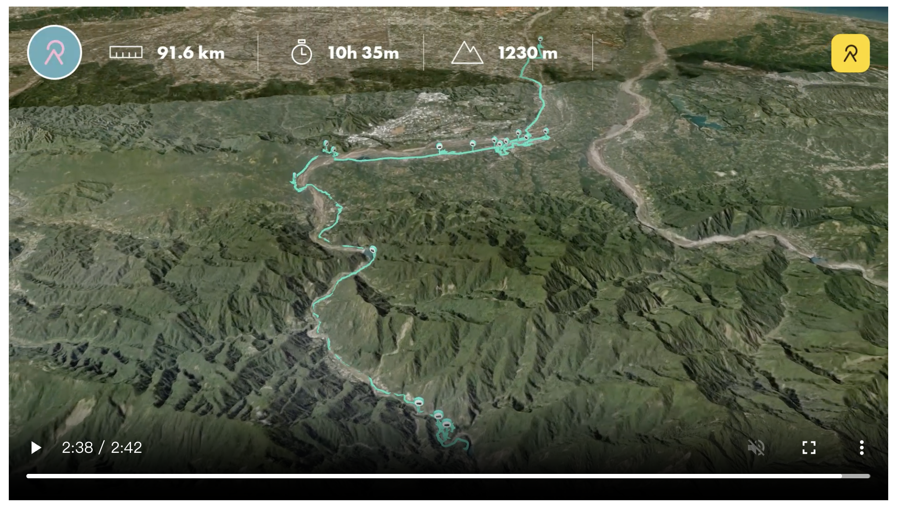
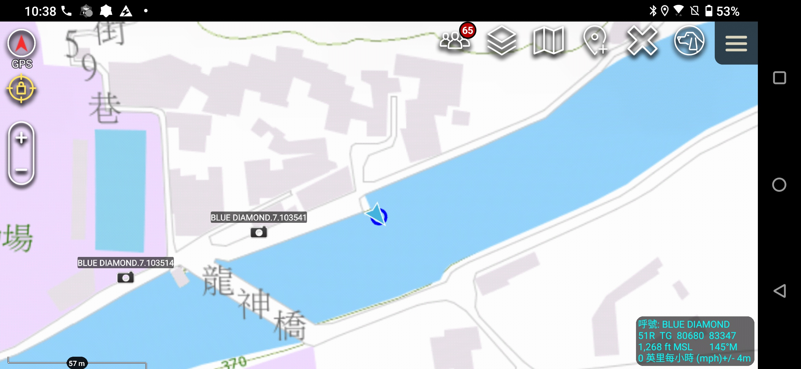
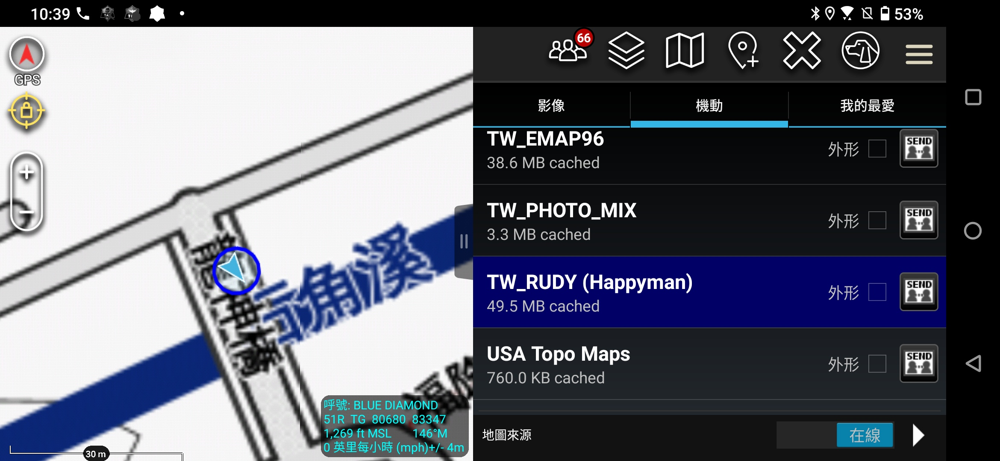
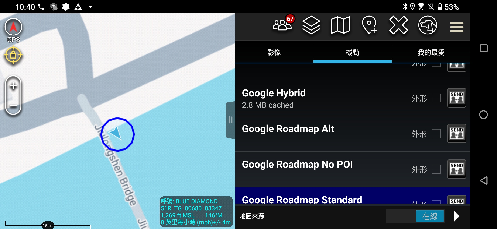

今天的行程很長，從后里平原一路往上游挺進，穿過東勢客家山城，最後抵達群山環繞的谷關。這不僅是海拔的爬升，也是一場對於「地圖準確度」的實戰測試。

同時，我也進行了一場關於 **ATAK (Android Team Awareness Kit)** 軟體的實戰實驗：到底把資料「打成一包 (Data Package)」對於旅行紀錄有什麼幫助？

旅程就看影片：
[🎥 2026 大甲溪河流探索 Day 3 Relive](https://www.relive.com/zh-TW/view/v7O9gzw5PQq)

## 🗺️ 行程流水帳 (AI 軌跡還原版)

這份行程是透過我從 ATAK 匯出的 GPX 軌跡檔，再請 AI Agent 進行時間與空間分析後還原的結果。有趣的是，因為我只匯出了其中一段軌跡，所以 AI 很誠實地告訴我：「其他行程並沒有在軌跡裡」。

**主要步行與活動時段：**
*   **09:38** | 📍 **老祖早餐灌蛋餅**：這蛋餅形狀真的特別，是用灌的，做為本日的起點。「應該是 9:01-9:27（以前）」
*   **09:48** | 📍 **東勢客家文化園區**：舊車站改建，適合散步。
*   **10:46** | 📍 **龍神橋 (東勢區)**：跨越深邃溪谷的重要橋樑，新舊並存。
*   **10:54** | 📍 **東勢林業文化園區**：見證大雪山林業的伐木歲月，腹地廣大。
*   **11:40** | 📍 **東勢本圳**：尋找水利源頭，位置稍微偏離一點，可能是在水圳旁移動。「走去月恆門」
*   **11:48** | 📍 **月恆門**：非常精確的經過此點，也在此遇見了在地的洗衣文化。
*   **12:43** | 📍 **白冷圳紀念公園**：向工程師磯田謙雄致敬，偉大的倒虹吸管水利工程。

**未在軌跡中的行程（包含開車）：**
*   **后里環保公園**：一早醒來的地方，有點冷，幾無花海。
*   **馬鞍壩、天輪壩**：大甲溪中游的兩大壩體。
*   **谷關**：本日終點，在此挑戰捎來步道並在路邊車宿。

## 🧪 技術筆記：ATAK Data Package 實驗

這次旅程我也嘗試了 ATAK 的「Data Package」功能，想說能不能像打包行李一樣，把這次旅行的所有照片、標記點、軌跡通通包成一個檔案分享或備份。結果遇到了一些有趣的技術細節：

### 1. KMZ 裡的「消失軌跡」之謎
我原本以為用 ATAK 匯出成 KMZ 格式的 Data Package 後，裡面就會包含我勾選的所有「軌跡 (Tracks)」。
*   **結果**：打開 KMZ 只看得到照片 (Attachments) 和標記點 (Waypoints)，**沒有軌跡**。
*   **分析**：即使在 ATAK 介面上選取了，似乎在轉存 KMZ 時並沒有把動態軌跡資訊 (Time-stamped path) 寫入，或者是被當作靜態物件處理掉了。這點還需要再研究 ATAK 的文件。

### 2. KML vs. GPX：軌跡分析的關鍵差異
既然打包失敗，我就嘗試單獨匯出軌跡。
*   **KML 格式**：可以成功匯出，也可以順利匯入 **Google My Maps** 觀看。但問題是它只是一條「線 (LineString)」，只包含了空間座標 (經緯度)，**丟失了時間資訊**。
*   **GPX 格式**：這是正解。GPX 完整保留了 `Lat`, `Lon`, `Ele`, 以及最重要的 `Time`。

### 3. AI Agent 的軌跡分析能力
拿到 GPX 後，我請 AI Agent 幫我分析這段旅程。這真的展現了 Agent 的價值：
*   它能讀取 GPX 內的時間戳記，計算出兩點之間的**移動速度**。
*   透過速度差異，它能自動分辨出 **「走路 (Walking)」** 與 **「開車 (Driving)」** 的區段。
*   最後，它將這些時空資訊與我提供的景點名稱進行比對 (Reverse Geocoding & Matching)，還原出上面的「行程流水帳」。

這比我自己看著地圖回想「幾點幾分我在哪裡」要精準且快速太多了。

---

## 🧐 觀察一：水圳探勘沒有想像中容易

這次看了東勢本圳等幾個點，才發現探訪水利設施真的需要做足功課。

如果你只靠 Google Map 導航，很多時候連「圳路在哪裡」都找不到。Google 地圖上，許多水圳是沒有圖資的，或者因為被加蓋變成道路而被忽略。

好在我這次運氣不錯，手機裡的 **ATAK** 軟體預先灌入了：
1.  **國土測繪地圖 (NLSC)**：官方圖資，通常比較準，但在微小的細節有時也會漏。
2.  **魯地圖 (RudyMap)**：登山界神器，通常非常精細，但小圳路尤其是被加蓋過的，可能是沒有。

**實戰交叉比對：龍神橋**
這就是一個經典案例。龍神橋那邊明明是兩座橋在一起（新橋與舊橋），但在地圖上的表現截然不同：
*   **Google Map**：只畫了一條線，以為是一座橋。
*   **國土測繪圖**：也只畫了一座。
*   **魯地圖**：精準畫出了兩座橋。

結果就是，我在 ATAK 上看我的 GPS 定位，顯示我「在河中間」，其實我是站在舊橋上。

## 🧺 觀察二：巷弄裡的洗衣文化

雖然出發前知道東勢本圳附近有「洗衣文化」，但網路上很難找到確切的座標，Google 也不知道「洗衣場」在哪。

這次真的是運氣好。我想去找一座叫做「金門橋」的糯米橋，Google 雖然也查不到橋，但查到了一個地標叫 **「月恆門」**。導航深入小巷弄後，正當我以為走錯路時，赫然發現月恆門旁邊，真的有人正在水圳邊洗衣服！

問了在地阿伯才知道，旁邊那座不起眼的小橋，就是傳說中的金門橋。
這告訴我：如果混，那要多靠點運氣。 而這種巷弄裡的驚喜，正是旅行最迷人的地方。

---
### 🤖 AI 協作宣告
*   **本文內容**: 由人類作者提供行程與深度觀察，Antigravity 協助將筆記整理成文，並突顯地圖圖資比對的技術細節。
*   **技術支援**: 協助建立部落格文章結構，並使用 Python 腳本對 GPX 軌跡進行時空分析與行程還原。
