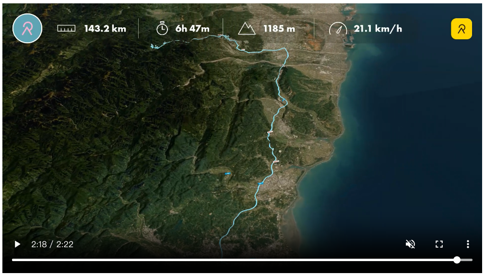

旅程來到第四天，今天的關鍵字是：**森林**與**菌菇**。

從谷關的晨光中醒來，先在全家便利商店處理一下昨天的遊記與今日的計劃。不得不說，台灣的便利商店真是車泊族的救星，有桌子、還有飲料，比窩在車子裡舒服多了。

## 🌲 重返八仙山：山莊裡的茶香

第一站來到 **台灣第一泉取水處**，據 AI 說這裡的水質極佳，也是當年八仙山林場開發時的重要水源。 之後前往 **八仙山森林遊樂區** 先在在 **八仙山莊** 裡點了一杯茶，處理一些事情。一直以來就是喜歡在山林間，打打電腦。就覺得特別寫意。還記得以前來的時候，因為時間的關係，只能在入口處晃晃，這次時間充足，終於能深入園區。走著走著，看到一群學生，在量測樹木的寬度，說分成四組，每一組都要量完整片山林，方法是找一顆基準樹，量測寬度與高度。其他每一顆量測寬度之後再推測出高度，主要是數量，並不紀錄精確位置。覺得他們好年輕，原來是某個苗栗高職，森林科的高中生。

## 🍃 松鶴部落：五葉松的滋味

離開八仙山，順路探訪了鄰近的 **松鶴部落**。
這裡的氣氛非常悠閒，平日的街道上沒什麼遊客。看到雜貨店有在賣 **五葉松汁**，雖然聽起來有點「草味」，但實際喝下去意外地清爽好喝！

部落裡有很多露營區，看來是假日熱門點，但平日大多沒營業，反而還給了部落原本的寧靜。

## 🍄 新社台地：香菇的一百種吃法

下午跨越大甲溪，爬上新社台地。這裡是大甲溪水源（白冷圳）滋養出的重要農業區，也是全台最大的香菇產地。

既然來了，當然要來一場香菇饗宴：
*   **香菇香腸**：很濃的香菇味，難得一見。
*   **杏鮑菇香腸**：口感更Q彈。
*   **炸綜合香菇**：各種不知名的香菇總匯。
*   **香菇冰淇淋**：這最特別，倒是沒有體驗過的口感。

還順道參觀了 **菇寮**，看著那一包包太空包整齊排列，了解我們餐桌上的美味是怎麼長出來的。
大多是放在地上，但有些是掛在架子上，不是很知道差別在哪。

## 💧 圓堀：水利旅程的句點

在新社閒晃時，無意間遇到了一個圓形的蓄水池——**白冷圳圓堀 (分水池)**。

看到解說牌才恍然大悟，這裡是白冷圳圳路的**終點**。這幾天我們看過倒虹吸管、看過入水口（雖然之前沒找到源頭），現在終於看到了終點的分水池。大甲溪的水，就是經過這幾十公里的跋涉，最後在這裡分流灌溉整個新社台地。

看著圓堀裡平靜的水面，這趟大甲溪探索之旅也在這裡劃下了一個圓滿的句點。

隨後驅車北上，回到新竹溫暖的家。

懶得配圖，附上影片：[Relive Day4](https://www.relive.com/zh-TW/view/vevYzGozmyO)

## 🎙️ 旅程回顧：AI 幫我畫重點

高速公路回程時，我用錄音紀錄了這四天旅程的一點心得回顧。回家後直接丟給 NotebookLM，它就幫我摘要出了這張重點圖（車泊旅行必備技巧指南）。有了這張圖，我好像就省了一篇落落長的回顧文了 😂。

---
### 🤖 AI 協作宣告
*   **本文內容**: 由人類作者提供行程與心得，Antigravity 協助整理成文，並強化了「水利終點」與「森林探索」的敘事連結。
*   **技術支援**: 協助建立部落格文章結構。
