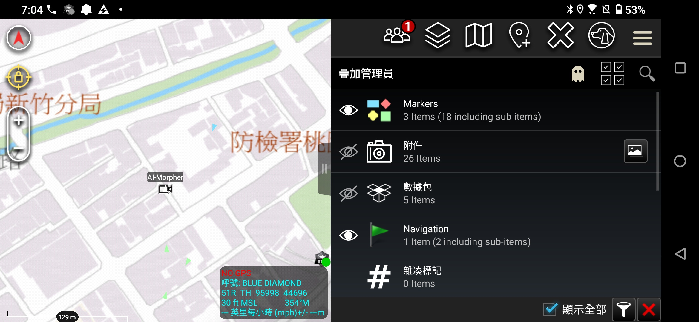

在開發 **AI Field Scout (AI 偵查員)** 系統的過程中，我們的一個核心需求是：**讓 AI Agent 能即時把發現的資訊（例如：附近的便利商店、危險地形、或是沿著路徑移動的隊友）投放到使用者的 ATAK 地圖上。**



ATAK (Android Team Awareness Kit) 是一個非常強大的戰術地圖軟體，它使用 **CoT (Cursor on Target)** 這種 XML 格式來交換訊息。網路上大部分的教學都推薦使用 UDP Multicast，但在實際的開發環境（特別是 Mac 電腦連接 iPhone 熱點，或是複雜的內網環境）中，UDP 經常因為路由、防火牆或廣播限制而撞牆。

經過了一番「通訊地獄」的除錯後，我們總結出了一套**最穩定的解決方案：使用 TCP 直連**。

這篇筆記將分享如何用 Python 建立一個穩定的 CoT 發送器，讓你的程式碼能直接控制 ATAK 地圖上的標記。

---

## 為什麼選擇 TCP 而不是 UDP？

雖然 CoT 的原生設計大量依賴 UDP Multicast 來達到「即插即用」的群組廣播效果，但在點對點（Point-to-Point）的開發測試中，UDP 有幾個痛點：

1.  **網路不可靠**：在手機熱點或某些 Wi-Fi 設定下，Multicast 封包常被丟棄或過濾。
2.  **除錯困難**：UDP 是「射後不理 (Fire and Forget)」，程式碼送出去了，你完全不知道對方收到了沒。
3.  **路由黑洞**：作業系統（特別是 macOS）在多重網路介面下，UDP 出站路由容易走錯路（No route to host）。

相對的，**TCP (Transmission Control Protocol)** 提供了一個非常明確的機制：
*   **連線確認**：連上了就是連上了，沒連上會報錯 (Connection Refused)。
*   **ATAK 支援**：ATAK 預設開啟 **Port 4242** 作為 TCP 監聽埠，無需額外設定。

## 關鍵技術點

要讓 ATAK 乖乖顯示我們送過去的點，有幾個魔鬼細節需要注意：

### 1. 使用 Minimal CoT (最小化 XML)
不要塞太多複雜的屬性。ATAK 對於 XML 格式很敏感。一個標準、乾淨的 CoT 封包應該長這樣：

```xml
<event version="2.0" uid="AI-Scout-01" type="a-u-G" time="..." start="..." stale="..." how="m-g">
    <point lat="24.8" lon="120.9" hae="0.0" ce="9999999" le="9999999"/>
    <detail>
        <contact callsign="My-AI-Agent"/>
        <remarks>Hello ATAK</remarks>
    </detail>
</event>
```

### 2. 資料流處理：短連線 (Short-Lived Connection)
這是我們卡關最久的地方。因為 TCP 是串流 (Stream) 協定，如果你建立一個長連線然後不斷塞 XML 進去，ATAK 有時會因為 Buffer 沒滿或沒收到結束符號，而一直「扣住」資料不處理。

最穩定的作法是採用 **Connect -> Send -> Close** 模式：
1.  建立連線。
2.  發送單一 XML。
3.  **立即斷開連線**。

斷開連線的動作會強制 ATAK 處理剛剛收到的資料緩衝區，讓地圖上的點瞬間更新。

### 3. 小心換行符號
我們發現，如果 XML 字串末端多加了 `\n` (換行)，在某些情況下會導致 ATAK 解析錯誤或忽略該封包。保持 Payload 是一個純淨的 XML 字串是最保險的。

---

## Python 程式碼實作

這是一個完整的 Python 腳本，它會模擬一個名為 `AI-Morpher` 的單位，在固定位置附近隨機移動，並且每 5 秒隨機變換圖示（步兵、坦克、飛機）。

```python
import socket
import datetime
import uuid
import random
import time

# === 設定 ===
# 你的手機 IP (在 ATAK Settings -> Network Info 查看)
TARGET_IP = '172.20.10.12' 
# ATAK 預設 TCP Port
PORT = 4242 
# 基準座標 (例如：新竹市)
base_lat = 24.8075
base_lon = 120.9766

# CoT 類型列表 (用於測試圖示變換)
# a=Atom, f/h/n=陣營(藍/紅/綠), G/A=地面/空中
COT_TYPES = [
    "a-f-G-U-C", # 藍軍戰鬥單位 (藍色實心方塊)
    "a-h-G-U-C", # 紅軍戰鬥單位 (紅色菱形)
    "a-n-G-U-C", # 中立戰鬥單位 (綠色正方形)
    "a-f-A-M-F", # 藍軍戰鬥機 (飛機圖示)
    "a-u-G",     # 未知地面單位 (黃色草花/問號)
]

def get_iso_time(offset_seconds=0):
    """產生 CoT 需要的 ISO 8601 時間格式"""
    now = datetime.datetime.now(datetime.timezone.utc) + datetime.timedelta(seconds=offset_seconds)
    # ATAK 對時間格式很嚴格，需為 YYYY-MM-DDTHH:MM:SS.mmmZ
    return now.strftime('%Y-%m-%dT%H:%M:%S.%f')[:-3] + 'Z'

def generate_cot_xml(seq_num):
    # 固定 UID：這一點非常重要！
    # 只要 UID 相同，ATAK 就會認為是「同一個物件」在移動或更新狀態。
    uid = "AI-Scout-Demo-01"
    
    t_now = get_iso_time()
    t_stale = get_iso_time(120) # 2分鐘後過期
    
    # 隨機挑選一個圖示類型
    cot_type = random.choice(COT_TYPES)
    
    # 隨機產生微小位移 (約 100m 範圍)
    offset_lat = random.uniform(-0.001, 0.001)
    offset_lon = random.uniform(-0.001, 0.001)
    
    current_lat = base_lat + offset_lat
    current_lon = base_lon + offset_lon
    
    # 建構 XML (注意：結尾不要加 \n)
    xml = f'''<event version="2.0" uid="{uid}" type="{cot_type}" time="{t_now}" start="{t_now}" stale="{t_stale}" how="m-g">
    <point lat="{current_lat}" lon="{current_lon}" hae="0.0" ce="9999999" le="9999999"/>
    <detail>
        <contact callsign="AI-Morpher"/>
        <remarks>Type: {cot_type} | Seq: {seq_num}</remarks>
    </detail>
</event>'''
    return xml.encode('utf-8')

def send_tcp_packet(seq):
    print(f"[{seq}] Connecting to {TARGET_IP}:{PORT}...")
    sock = socket.socket(socket.AF_INET, socket.SOCK_STREAM)
    sock.settimeout(3.0) # 設定連線超時
    
    try:
        sock.connect((TARGET_IP, PORT))
        print(f"   >> Connected!")
        
        xml_data = generate_cot_xml(seq)
        sock.sendall(xml_data)
        print(f"   >> Sent: {len(xml_data)} bytes")
        
        # 關鍵：發送完馬上關閉，強制對方處理
        sock.close() 
        print(f"   >> Closed")
        
    except ConnectionRefusedError:
        print("!! Connection Refused: 請確認 ATAK 是否開啟，且手機IP正確。")
    except Exception as e:
        print(f"!! Error: {e}")

if __name__ == '__main__':
    seq = 1
    print("開始發送動態 CoT 訊號... (按 Ctrl+C 停止)")
    while True:
        send_tcp_packet(seq)
        seq += 1
        # 每 3 秒更新一次位置
        time.sleep(3)
```

## 成果與應用

執行上述腳本後，你應該會在 ATAK 地圖上看到一個點：
1.  **位置跳動**：證明 AI 可以控制實體的移動。
2.  **圖示變換**：證明 AI 可以改變實體的屬性（例如從「未知」變成「敵軍」）。
3.  **Callsign**：點擊圖示可以看到我們設定的 `AI-Morpher`。

這為我們的「WalkGIS AI 探路者」奠定了通訊基礎。接下來，我們只要將「隨機座標」替換成「Google Places API 查到的真實座標」，就能實現 **「嘿 Siri，幫我標記附近的廁所」** 這樣強大的戰術功能了。

---

> **AI 協作聲明**：
> 本文內容由筆者與 AI 助手 Antigravity 共同撰寫。從最初的 UDP 撞牆期，到最後歸納出 TCP 短連線的最佳實踐，AI 協助進行了大量的協議分析與除錯建議。程式碼範例經過實機驗證。
