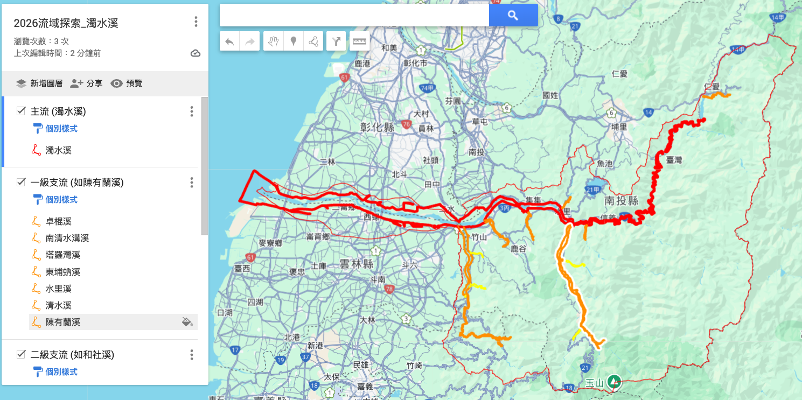

最近在研究 LASS 社群維護的 「[流域情報開放地圖](https://github.com/LinkItONEDevGroup/BasinStoryMap)」 QGIS 專案，這是一個集結了政府開放資料與民間調適計畫成果的龐大資料庫。

資料雖豐富，但若只想專注於特定流域（例如：濁水溪），要從全台的圖資中「萃取」並「整理」出有結構的資料，手動操作相當繁瑣。這次我嘗試透過 AI 助理 Antigravity 來協助處理，發現這是一個非常高效的工作流，特別是針對舊式 Shapefile 資料結構的梳理。

以下分享這次的實作筆記，以及一個關鍵的發現：河川代碼 CSV 的重要性。

## 1. 任務目標

從全台的 GIS 圖資中，提取出 **濁水溪流域** 的完整資料，並轉換成 Google Earth 可用的 KMZ 格式。需求包含：

*   **流域範圍**：濁水溪集水區的面資料 (Polygon)。
*   **河道水系**：包含主流與所有支流的線資料 (Line)。
*   **層級結構**：需區分主流、一級支流（如陳有蘭溪）、二級支流（如和社溪），並以不同顏色與資料夾呈現。

## 2. 關鍵資料解析

在專案目錄中，主要的幾何資料位於 `1-流域水文地理環境` 下的 `RIVERL.shp`（全台中央管河川）。原本以為只要用 SQL 篩選 `BASIN_NAME = '濁水溪'` 即可，但 AI 分析後發現了一個隱藏的寶藏檔案：

📂 **檔案位置**：`working/河川整理資料 - 河川代碼主從.csv`

[河川整理資料 - 河川代碼主從](https://docs.google.com/spreadsheets/d/1RoTRS69o6zXpWHQ5nvqEzTEdP6dbcs4ugoGuYkeS6QQ/edit?usp=sharing)

這份 CSV 檔案是解析河川「拓撲關係（Topology）」的關鍵，沒有它，GIS 圖資就只是一堆沒有從屬關係的線條。

### 為什麼這份 CSV 很重要？

Shapefile 本身雖然有 `RV_NO` (河川代碼)，但要從代碼反推「誰是誰的上游」需要複雜的解碼邏輯。而這份 CSV 直接建立了樹狀結構：

| 欄位 | 說明 | 範例 (陳有蘭溪) |
| :--- | :--- | :--- |
| `river_id` | 河川唯一碼 | `151010` |
| `river_name` | 中文名稱 | 陳有蘭溪 |
| `in_id` | 注入的河川 ID (Parent) | `151000` (注入濁水溪) |
| `river_link` | **全路徑字串** | `0@151000@151010` |

### AI 應用的邏輯技巧

透過 Antigravity，我們利用 `river_link` 欄位快速算出了河川的「層級 (Stream Order)」，邏輯出奇簡單：

> **計算 `river_link` 被 `@` 切割後的數量，再減去 2，就是該河川的層級。**

*   **濁水溪** (`0@151000`)：2 - 2 = **Level 0 (主流)**
*   **陳有蘭溪** (`0@151000@151010`)：3 - 2 = **Level 1 (一級支流)**
*   **和社溪** (`0@151000@151010@151011`)：4 - 2 = **Level 2 (二級支流)**

這讓程式可以自動將數百條支流分類上色，完全不需要人工判斷。

## 3. 自動化處理流程 (Python + GDAL)

有了邏輯後，我請 AI 撰寫了一個 Python 腳本 (`export_zhuoshui_full_kmz.py`)，執行了以下自動化步驟：

1.  **屬性篩選**：從 `RIVERL.shp` 中撈出所有 `BASIN_NAME` 為「濁水溪」的圖徵。
2.  **幾何合併 (Merge)**：
    *   原始 Shapefile 中的河川通常是被切成很多小段的 (LineString)。
    *   腳本將相同 `RV_NAME` 的幾何物件全部合併成單一的 `MultiLineString`。這解決了在 Google Earth 點選河川時「只會亮一小段」的困擾。
3.  **層級賦予**：讀取 CSV，判斷每條河川是 Level 0, 1 還是 2。
4.  **KML 樣式生成**：
    *   🔴 **Level 0 (主流)**：紅色粗線
    *   🟠 **Level 1 (一級)**：橙色中線
    *   🟡 **Level 2 (二級)**：黃色細線
5.  **封裝 KMZ**：最後將流域面 (Baisn Polygon) 與河道線 (River Lines) 打包成單一 KMZ 檔。

## 4. 成果與心得

最終產出的 `濁水溪流域完整地圖.kmz` 結構非常乾淨。在 Google Earth 左側目錄中，不再是幾千條雜亂的線段，而是清楚分類的：

*   📂 流域範圍
*   📂 主流 (濁水溪)
*   📂 一級支流 (如陳有蘭溪)
*   📂 二級支流 (如和社溪)

這次經驗顯示，在處理傳統 GIS 資料時，「**資料表 (Table/CSV)**」往往比「**圖形 (Geometry)**」更關鍵。透過 AI 快速理解資料表中的關聯邏輯，能大幅減少 GIS 手工編輯的時間，將數小時的工作縮短為幾分鐘的腳本執行。

- [Google My Map:2026流域探索-濁水溪](https://www.google.com/maps/d/edit?mid=1oYWUq5VCjSYCl6SZuHefHbsu7e6RPVs&usp=sharing)

## 下載
- [濁水溪流域完整地圖.kmz](濁水溪流域完整地圖.kmz)
- [濁水溪流域範圍](濁水溪流域範圍.kmz)

---
**備註**：本專案使用之圖資來源為 [流域情報開放地圖](https://github.com/LASS/RiverLog)，感謝社群貢獻。

> **AI 協作聲明**：
> 本文內容由筆者與 AI 助手 Antigravity 共同撰寫。AI 在本專案中協助分析了複雜的 Shapefile 與 CSV 資料結構，找出了關鍵的 `river_link` 拓撲邏輯，並撰寫了 Python 自動化腳本以完成大規模的 GIS 資料清洗與轉換。
