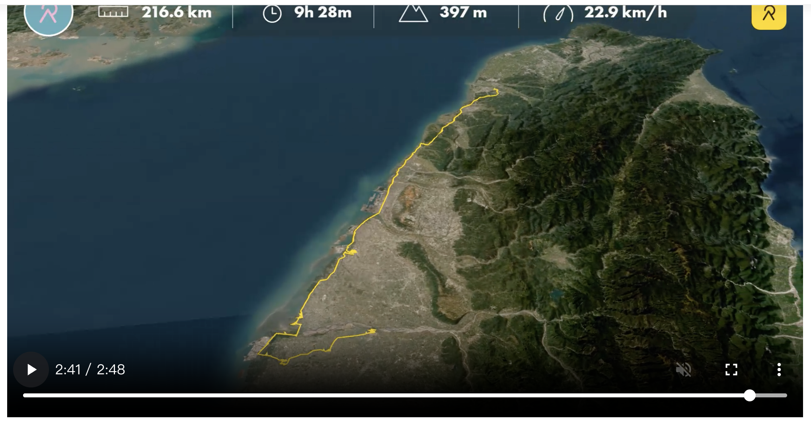

> **寫在旅程後**：
> 計畫總趕不上變化，這才是旅行的醍醐味。原訂的「海口溯源」因為一時興起，前半段變成了「老街美食巡禮」。雖然錯過了一些點，但也意外收穫了鹿港的好滋味。

- [relive video](https://www.relive.com/zh-TW/view/vXOnzd8JMBO)

## 今日足跡：從鹿港到西螺

今天的實際路線比預期更蜿蜒，我們在跨越濁水溪前，先在彰化的老街裡迷了路（舌尖上的迷路）。

*   **日期**：2026/01/13 (二)
*   **天氣**：晴朗
*   **實際路線**：北港/鹿港老街巡禮 -> 濁水溪北岸 (大城) -> 麥寮 (南岸) -> 西螺。

## 1. 意外的起點：老街與懷舊時光
原本預計直衝海口，但大家似乎對老街更有興趣。我們花了不少時間在廟宇與巷弄間穿梭。

*   **走訪景點**：
    *   **鹿港老街區**：桂花巷藝術村的悠閒氛圍與鹿港時代柑仔店的懷舊小物，讓人不小心就逛太久。
    *   **北港天后宮**：(註：若有造訪北港，這是南岸的重要信仰中心，與鹿港一北一南相映成趣)。
    *   **美食戰績**：
        *   **彥仲麵茶**：香濃的古早味，暖胃首選。
        *   **阿舍茶樓杏仁茶**：滑順濃郁，不愛杏仁味的人也能接受。
        *   **伴手禮**：鄭玉珍的鳳眼糕與牛舌餅，經典中的經典。

## 2. 消失的景點與海口風情
*   **鷺鷥生態景觀公園 (找不到)**：這就是 GIS 資料與現場的落差。導航到了大城鄉海邊，卻找不到入口或標示，只能望著茫茫的濁水溪北岸興嘆。這也提醒了 WalkGIS 資料庫需要進行「實地驗證」。
*   **麥寮港**：跨過西濱大橋來到南岸，看到了壯闊的工業港設施，感受六輕的巨大尺度。

## 3. 麥寮午茶：媽祖庇佑下的美食
來到麥寮拱範宮，這部份終於按表操課！
*   **志明當歸鵝麵線**：湯頭清甜，鵝肉軟嫩，不負期待。
*   **鱷魚餐包 (花生酥餃)**：終於買到了！外型奇特，一口咬下滿滿的花生香，是今日最佳驚喜。
*   **古早味烤玉米**：走過聞起來實在香，忍不不還是買了，全手工碳烤、甜甜辣辣的，實在好吃。

## 4. 崙背與西螺：閉門羹與滿足的晚餐
*   **詔安客家文化園區 (已休息)**：抵達崙背時似乎太晚，園區已休息，無緣一睹開口獅的風采，留待下次補考。
*   **西螺晚餐**：
    *   還有水煎包賣，口感扎實飽滿。
    *   雖然沒吃到三角大水餃，但與**火力雞嘉義火雞肉飯**的油香，依然完美撫慰了旅人的胃。
*   **車宿**：今晚落腳西螺，在紅色大橋的陪伴下入眠。

## 5. 善用便利商店來盤整
- 雖然車上也能打打電腦，做一下每日的盤整與明日的規劃，但上一次的旅程學到，有舒服的便利商店為何不善用，於是睡前與起床的時間，就待在便利商店，打打電腦。

## 導航路徑 (實際版)
雖然行程大改，但美食點位依然值得紀錄。
[🗺️ Day 1 實際美食足跡](https://www.google.com/maps/dir/%E5%BD%A5%E4%BB%B2%E9%BA%B5%E8%8C%B6/%E9%84%AD%E7%8E%89%E7%8F%8D%E9%A4%85%E8%88%96/%E5%BF%97%E6%98%8E%E7%95%B6%E6%AD%B8%E9%B5%9D%E8%82%89%E9%BA%B5%E7%B7%9A/%E6%98%8E%E6%98%9F%E7%8F%8D%E9%A4%85%E8%88%96)

---

> **AI 協作聲明**：
> 本文由筆者與 AI 助手 Antigravity 共同規劃行程草案。AI 負責彙整 WalkGIS 資料庫景點、推薦適合的車宿與美食點位，並生成導航路徑，筆者負責體驗與紀錄。
