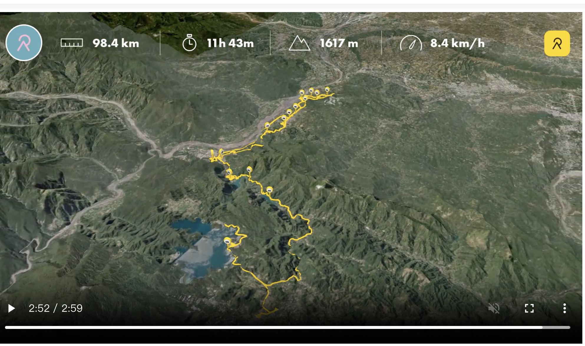

> **寫在出發後**：
> 昨晚在集集的車宿非常安靜，早晨被陽光喚醒。
> 第三天的行程比預期更加豐富，除了原定的水利設施巡禮，還意外深入了集集的生態保育基地。這是一趟從「農業用水」的攔河堰，轉向「水力發電」的日月潭系統，中間穿插著各式在地美食與深度生態體驗的充實旅程。

今日 [濁水溪 day3 relive](https://www.relive.com/view/vXvLEmxYy7O)

## 今日目標：生態、水利與電力

告別了二水的八堡圳，今天我們進入濁水溪的中游核心區。這裡不僅有控制河水生殺大權的攔河堰，更是台灣特有生物的研究重鎮與水力發電的心臟。

*   **日期**：2026/01/15 (四)
*   **行進路線**：集集 (生態與觀光) -> 水里 (美食補給) -> 車埕 (林業遺跡) -> 日月潭 (高山湖泊)。
*   **關鍵字**：生物多樣性研究所、集集攔河堰、水里肉圓(四弟)、抽蓄發電。

## 實際行程 (Actual Itinerary)

### 1. 漫遊集集：從綠色隧道到生態基地
我租了電動腳踏車，以最愜意的方式探索這座小鎮。
*   **早餐**：**集集煎包**。
    *   平日早起的好處，不用排隊，剛出爐的煎包皮酥餡香，配上特製醬料，是喚醒味蕾的最佳選擇。
*   **綠色隧道**：騎著電輔車穿梭在樟樹隧道中，光影灑落，微風徐徐，非常舒服。
*   **水利樞紐**：**集集攔河堰管理中心**。
    *   **觀察**：這裡不僅介紹水利知識，更擁有俯瞰濁水溪與堰體全貌的**最佳觀景平台**，視野極佳。
*   **軍史公園**：曾是軍事迷的熱點，展示了退役的戰車與飛機。
*   **深度亮點**：**生物多樣性研究所 (保育教育館、生態教育園區)**。
    *   **保育教育館**：門票 60 元，展覽內容非常豐富且深入，解說了台灣獨特的生態體系與保育工作，**非常值得一遊**。
    *   **生態教育園區**：免費參觀，園區內種植了許多台灣原生種植物，是一個可以慢慢逛、細細觀察的生態寶庫。
*   **在地小吃與娛樂**：
    *   品嚐了**炸香蕉、炸香蕉皮、香蕉蛋捲**，感受集集身為「香蕉王國」的特色。
    *   途經**小型賽車場**，體驗速度感。
    *   最後造訪**集元果香蕉觀光果園**，深入了解香蕉產業。

### 2. 水里補給：肉圓與冰品的協奏曲
離開集集，沿著濁水溪上行來到「小台北」水里。
*   **午餐**：**董家肉圓 (四弟的店)**。
    *   這次選擇了四弟的店，同樣維持著董家肉圓的優良傳統，皮Q肉鮮。
    *   路邊加碼：**古早味烤玉米**，炭火香氣十足。
*   **甜點**：**二坪冰店**。
    *   這裡的古早味冰棒用料實在，價格親民，吃得到單純的美味。

### 3. 三潭印月：電力溯源之旅
從水里往車埕與日月潭方向，進入了台灣水力發電的心臟地帶。
*   **車埕**：漫步**貯木池**畔與**老街**，感受昔日木業繁華留下的靜謐氛圍。
*   **水力發電巡禮**：
    *   沿途經過**明潭水庫**與**大觀發電廠門口**，再到**明湖水庫**。
    *   親眼見證了利用日月潭與水里溪落差進行「抽蓄水力發電」的宏偉工程，這幾座水庫串聯起了台灣的綠色能源命脈。
*   **終點**：抵達**日月潭 (魚池)**，結束今日充實的溯源之旅。

## 景點深度解析

### 1. 不容錯過的生態寶庫：生物多樣性研究所
這是今日最讓我驚豔的景點。
*   **保育教育館**：雖然要收門票，但展出的內容深度與廣度絕對值回票價。它不是走馬看花的觀光點，而是認真推廣生態保育知識的基地。
*   **生態教育園區**：這裡像是一座活的植物博物館，收集了眾多台灣原生種植物。如果你喜歡自然觀察，這裡其實相當花時間，建議預留足夠停留時間。

### 2. 濁水溪的守門員：集集攔河堰
這座橫跨濁水溪的巨大水利工程，是台灣最大的攔河堰。
*   **觀景平台**：管理中心3樓的觀景台視野極佳，可以將長達 350 多公尺的堰體與寬闊的濁水溪河床盡收眼底，強烈建議上樓看看。

### 3. 一圓兩吃：水里肉圓 (董家四弟)
水里肉圓著名的「董家三兄弟」已開枝散葉，四弟的店同樣人氣很旺。
*   **吃法**：記得在地標準吃法「先吃皮，留內餡」。

## 導航路徑 (Google Maps)
[🗺️ Day 3 生態與水利溯源實遊路線](https://www.google.com/maps/dir/%E9%9B%86%E9%9B%86%E7%85%8E%E5%8C%85%E5%B0%88%E8%B3%A3%E5%BA%97/%E7%89%B9%E6%9C%89%E7%94%9F%E7%89%A9%E7%A0%94%E7%A9%B6%E4%BF%9D%E8%82%B2%E4%B8%AD%E5%BF%83/%E9%9B%86%E9%9B%86%E6%94%94%E6%B2%B3%E5%A0%B0%E7%AE%A1%E7%90%86%E4%B8%AD%E5%BF%83/%E8%BB%8D%E5%8F%B2%E5%85%AC%E5%9C%92/jijibanana%E9%9B%86%E5%85%83%E6%9E%9C%E8%A7%80%E5%85%89%E5%B7%A5%E5%BB%A0/%E8%91%A3%E5%AE%B6%E8%82%89%E5%9C%93%E5%9B%9B%E5%BC%9F%E7%9A%84%E5%BA%97/%E4%BA%8C%E5%9D%AA%E5%86%B0%E5%BA%97/%E8%BB%8A%E5%9F%95%E8%B2%AF%E6%9C%A8%E6%B1%A0/%E6%98%8E%E6%BD%AD%E6%B0%B4%E5%BA%AB/%E5%A4%A7%E8%A7%80%E7%99%BC%E9%9B%BB%E5%BB%A0/%E9%AD%9A%E6%B1%A0)

---

> **AI 協作聲明**：
> 本文由筆者與 AI 助手 Antigravity 共同整理。AI 協助將筆者實際的旅行軌跡與觀察筆記（如生物多樣性研究所的深度體驗、董家四弟肉圓的選擇）轉化為結構化的遊記，並生成對應的導航連結。
