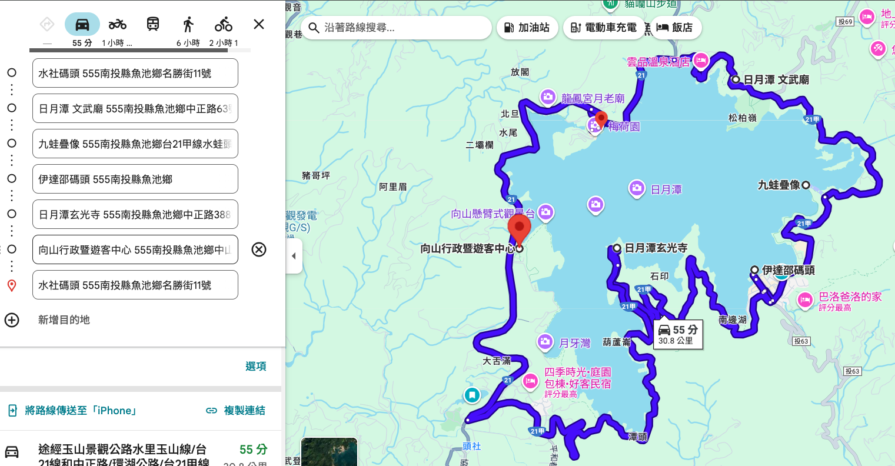

> **寫在終章後**：
> 旅程的最後一天，以此行最輕鬆愜意的方式——騎乘電輔車環日月潭一圈，畫下完美的句點。
> 雖然因時間關係取消了鳥嘴潭行程，但深度體驗了日月潭的湖光山色、廟宇建築與熱鬧碼頭，讓這趟濁水溪溯源之旅在滿滿的回憶中結束。
[濁水溪_day4_relive](https://www.relive.com/view/vAOZmNxDVov)

## 今日目標：環湖騎行與遊船體驗

*   **日期**：2026/01/16 (五)
*   **行進路線**：水社碼頭 (電輔車環湖) -> 各大碼頭 (遊船與美食) -> 賦歸。
*   **關鍵字**：捷安特電輔車、順時針環湖、九蛙疊像、伊達邵美食。

## 實際行程 (Actual Itinerary)

### 1. 捷安特電輔車：神一般的騎乘體驗
早上在水社碼頭租了捷安特的**電動輔助自行車**，這絕對是今日最正確的決定。
*   **騎乘體驗**：
    *   **隱形神力**：不同於有油門的電動車，電輔車是「偷偷地」幫你加力。踩踏時感覺自己體力好得驚人，上坡如履平地。
    *   **真實 vs. 虛幻**：我在小上坡試著關掉輔助，瞬間感受到沉重的地心引力，才驚覺科技的力量有多大。
*   **意外收穫**：邊騎邊玩《Pikmin Bloom》（皮克敏），沿途種花成果非常突出，整條環湖公路都開滿了花。

### 2. 順時針環湖：擁抱湖景
選擇**順時針方向**騎行（水社 -> 文武廟  -> 伊達邵 -> 玄光寺 -> 向山 -> 水社）。
*   **右側優勢**：在台灣靠右行駛的規則下，順時針騎剛好可以**整路都靠在湖邊**，視野無遮蔽，景色絕美。
*   **深度漫遊**：本來 時間非常充裕，再加上有電輔車的神助攻，原本可能匆匆路過的景點都能停下來好好欣賞。

### 3. 文化與生態觀察
*   **廟宇巡禮**：沿途造訪了文武廟、玄光寺等。這些廟宇在 921 大地震後重建，不僅依然雄偉，細節處更顯細膩，展現了台灣民間豐沛的生命力與財力。
*   **水情指標**：特地去看了著名的**九蛙疊像**，看到了**六隻**青蛙，顯示水庫容量約還有 90%，水情相當不錯，湖景也因此更加飽滿美麗。

### 4. 碼頭遊船與美食饗宴
騎完車後，換乘遊船往返幾個主要碼頭，體驗不同的視角。
*   **伊達邵碼頭**：在這裡大快朵頤，品嚐了昨天 AI 推薦的特色小吃（如東東刈包 (豆干扣肉夾)、總統魚酥捲、麓司岸 飯飯雞翅、等），口味確實都很不錯，另外紅茶冰淇淋也有特色。
*   **經典滋味**：當然也不能錯過著名的阿婆茶葉蛋，在湖畔吃起來特別有味。

### 5. 變更與賦歸
*   **行程調整**：因為在日月潭玩得太盡興（騎車+遊船），時間比預期晚，因此取消了原訂回程順路造訪的**鳥嘴潭人工湖**，留待下次再訪。
*   **賦歸**：帶著滿滿的電量（與皮克敏花朵），心滿意足地踏上歸途。

## 導航路徑 (Google Maps)
[🗺️ Day 4 日月潭深度環湖路線](https://www.google.com/maps/dir/%E6%B0%B4%E7%A4%BE%E7%A2%BC%E9%A0%AD/%E6%97%A5%E6%9C%88%E6%BD%AD+%E6%96%87%E6%AD%A6%E5%BB%9F/%E4%B9%9D%E8%9B%99%E7%96%8A%E5%83%8F/%E4%BC%8A%E9%81%94%E9%82%B5%E7%A2%BC%E9%A0%AD/%E6%97%A5%E6%9C%88%E6%BD%AD%E7%8E%84%E5%85%89%E5%AF%BA/%E5%90%91%E5%B1%B1%E8%A1%8C%E6%94%BF%E6%9A%A8%E9%81%8A%E5%AE%A2%E4%B8%AD%E5%BF%83/555%E5%8D%97%E6%8A%95%E7%B8%A3%E9%AD%9A%E6%B1%A0%E9%84%89%E5%90%8D%E5%8B%9D%E8%A1%9711%E8%99%9F%E6%B0%B4%E7%A4%BE%E7%A2%BC%E9%A0%AD/@23.8512518,120.8996381,14z/data=!4m44!4m43!1m5!1m1!1s0x3468d60e69b75dbb:0x85d0af32b950269a!2m2!1d120.9117702!2d23.8645269!1m5!1m1!1s0x3468d668e2f4582b:0xfd1f9cd4796180f0!2m2!1d120.9274693!2d23.8700786!1m5!1m1!1s0x3468d67b7b8c8bf3:0x50e5aca6e0d91e9a!2m2!1d120.9356872!2d23.8588078!1m5!1m1!1s0x3468d5d8258e9079:0xe86b0affb90fd618!2m2!1d120.92967!2d23.84974!1m5!1m1!1s0x3468d5e19d06d819:0xb60dd4a05fb9455d!2m2!1d120.9136026!2d23.8520961!1m5!1m1!1s0x3468d60e10a9492b:0x174e279d13834c98!2m2!1d120.9022521!2d23.8520298!1m5!1m1!1s0x3468d60e69b75dbb:0x85d0af32b950269a!2m2!1d120.9117702!2d23.8645269!3e0?entry=ttu&g_ep=EgoyMDI2MDExMy4wIKXMDSoASAFQAw%3D%3D)

## 濁水溪旅程心得小結
- 回程高速公路上，用錄音的方式，隨喜記錄了一些關於濁水溪坦索的一些心得，附上 notebooklm 給的摘要圖

---

> **AI 協作聲明**：
> 本文由筆者與 AI 助手 Antigravity 共同整理。AI 協助將筆者的實際騎行體驗（電輔車的奧妙、順時針環湖的優點）與觀察（九蛙水情、廟宇重建）轉化為文字紀錄，並修正了行程表。
