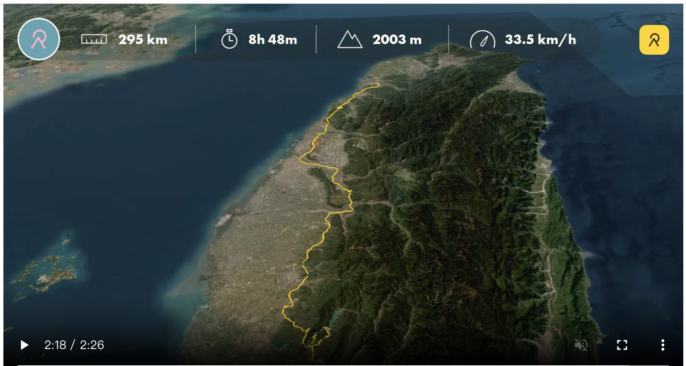
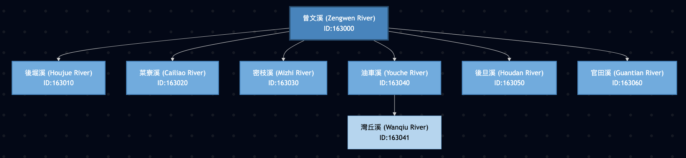

> **寫在旅程開始**：
> 曾文溪的探索之旅，我們選擇了一條特別的「逆行」路徑。不同於原本規劃的順流而下，我們決定從北南下，直奔流域的最上游，先探訪曾文溪的源頭與蓄水心臟，再隨著水流慢慢往海邊移動。這是一趟公路移動與身心放鬆的序曲。


- [今日 relive](https://www.relive.com/view/v1OwkPEV8XO)

## 今日目標：長途移動、水庫壯景與溫泉夜市

第一天的旅程是從城市向深山的過渡。我們沿著國道三號南下，跨越濁水溪與嘉南平原，最終抵達曾文溪上游的楠西與玉井，在溫泉與夜市中洗去舟車勞頓。

*   **日期**：2026/01/28 (三)
*   **行進路線**：西湖休息區 -> 南投休息區 -> 曾文水庫 -> 楠西舊地磅香腸攤 -> 龜丹溫泉 -> 玉井夜市
*   **關鍵字**：公路休息站、曾文水庫、楠西、龜丹溫泉、玉井。

## 💧 水利探訪重點 (Hydraulic Focus)
雖然今天是移動日，但 **曾文水庫** 本身就是曾文溪流域控制的核心。我們能親眼目睹這個全台最大水庫如何攔截並調節來自阿里山脈的水源，這是理解整個曾文溪「控水」邏輯的起點。

## 實際行程 (Actual Itinerary)

### 1. 公路中繼站：西湖與南投休息區
*   **西湖休息區**：以前只是匆匆路過，這次意外發現這裡**很方便充電，甚至還有淋浴間**，對長途旅客非常友善。
*   **南投休息區**：除了知名的「LAMUNGAN」招牌，來碗熱騰騰的**南投意麵**，是休息站的經典儀式。

### 2. 流域之心：曾文水庫
*   **壯麗山水**：曾文水庫是真的大，其實我們今天只有經過其中一個角落，就已經被其規模震撼。這裡的水域遼闊如湖，群山環繞。
*   **湖畔下午茶**：在觀景樓享用了**冬瓜茶與Pizza**，看著平靜的湖面，是長途車程後最奢侈的享受。
*   **水資源樞紐**：親臨壩頂或觀景台，感受這座調控著嘉南平原命脈的巨大工程。每一滴這裡的水，都將流經我們接下來兩天要探索的河道。

> **💧 水利工程小知識 (Engineering Highlights)**
>
> 這次來到現場，特別查了一些關於這座巨型水庫的「黑科技」：
>
> 1.  **看不見的珍珠串：曾文南化聯通管計畫**
>     這項進行中的重大工程，被稱為水利署的「珍珠串計畫」。它將曾文水庫、南化水庫與高屏溪攔河堰串聯起來。就像打通任督二脈，讓高屏溪多餘的水能存進南化水庫；而當南化水庫缺水時，也能從曾文水庫調水支援。這條地底下的「水高速公路」，是穩定南部供水的關鍵備援系統。
>     *   [🔗 經濟部水利署：曾文南化聯通管計畫介紹](https://www.wra.gov.tw/wrasb/cp.aspx?n=31327)
>
> 2.  **全球首創「象鼻鋼管」：防淤隧道**
>     曾文水庫最大的敵人是淤積。為了延長水庫壽命，這裡建造了全球首座採用「象鼻鋼管工法」的防淤隧道。這根巨大的鋼管能深入庫底，像吸塵器一樣把底層高濃度的泥沙吸出並排出，不需耗費額外電力。這項工程突破了傳統水利極限，是台灣工程界的驕傲。
>     *   [🔗 曾文水庫防淤隧道工程介紹 (Wikipedia)](https://zh.wikipedia.org/wiki/%E6%9B%BE%E6%96%87%E6%B0%B4%E5%BA%AB%E9%98%B2%E6%B7%A4%E9%9A%A7%E9%81%93)
>
> 3.  **曾文之眼與永續利用館**
>     如果想深入了解這些工程細節，別錯過外型像眼睛的「曾文之眼」遊客中心，或是由舊員工餐廳改建的「水庫永續利用館」，裡面有豐富的模型與解說展覽。
>
> 4.  **水庫與流域關係小補帖** (Reservoir & Basin Scale)
>     除了曾文水庫，附近的幾座水庫也與這片土地息息相關，但它們的身世各不相同喔：
>     *   **南化水庫**：位於**曾文溪流域**（支流後堀溪），但同時也接受高屏溪（旗山溪）的越域引水。它是台南與高雄的重要水缸。
>     *   **烏山頭水庫**：位於**曾文溪流域**（支流官田溪），但主要水源是從曾文水庫「借」過來的（透過烏山嶺隧道）。它是嘉南大圳的心臟。
>     *   **白河水庫**：位於**急水溪流域**（支流白水溪），*不屬於*曾文溪流域。它雖然地理位置相近，但屬於獨立的急水溪水系，負責灌溉白河、東山一帶。



```
graph TD
    %% 定義樣式
    classDef mainRiver fill:#2E86C1,stroke:#1B4F72,stroke-width:3px,color:white;
    classDef subRiver fill:#5DADE2,stroke:#2E86C1,stroke-width:2px,color:white;
    classDef subSubRiver fill:#AED6F1,stroke:#5DADE2,stroke-width:1px,color:black;
    %% 主河道
    R_163000["曾文溪 (Zengwen River)<br>ID:163000"]:::mainRiver
    %% 一級支流
    R_163010["後堀溪 (Houjue River)<br>ID:163010"]:::subRiver
    R_163020["菜寮溪 (Cailiao River)<br>ID:163020"]:::subRiver
    R_163030["密枝溪 (Mizhi River)<br>ID:163030"]:::subRiver
    R_163040["油車溪 (Youche River)<br>ID:163040"]:::subRiver
    R_163050["後旦溪 (Houdan River)<br>ID:163050"]:::subRiver
    R_163060["官田溪 (Guantian River)<br>ID:163060"]:::subRiver
    %% 二級支流
    R_163041["灣丘溪 (Wanqiu River)<br>ID:163041"]:::subSubRiver
    %% 拓樸關係
    R_163000 --> R_163010
    R_163000 --> R_163020
    R_163000 --> R_163030
    R_163000 --> R_163040
    R_163000 --> R_163050
    R_163000 --> R_163060
    %% 二級關係
    R_163040 --> R_163041
```

### 3. 在地風味：楠西舊地磅香腸攤
*   **直覺的美味**：路過時一直遲疑要不要停，乍看之下不知道在賣什麼，但直覺告訴我「該去吃」。
*   **隱藏美食**：事實證明直覺是準的！這攤位於楠西區的人氣小吃，炭烤香腸的香氣是長途跋涉後最好的慰藉。

### 4. 療癒之水：龜丹溫泉 (六二溫泉山房)
*   **美人湯**：我們造訪了**六二溫泉山房**。不同於關子嶺的泥漿溫泉，龜丹溫泉以弱鹼性碳酸氫鈉泉聞名，水質清澈無味。
*   **奇特體驗**：嘗試了**水中電療**，感覺真是奇特。有趣的是發現腳底感覺似乎對電療比較遲頓，可能是走太多路皮太厚了？
*   **甜蜜收尾**：泡完湯來支**哈密瓜冰淇淋**，清涼爽口，完美ending。

### 5. 鄉鎮之夜：玉井夜市
*   **芒果之鄉的夜晚**：玉井不僅有芒果，晚上的夜市更是熱鬧。
*   **在地體驗**：晚餐選擇了**炒羊肉跟杏仁茶**，感受南部鄉鎮的熱情與活力，為第一天的旅程畫下滿足的句點。

## 導航路徑 (Google Maps)
[🗺️ Day 1 逆流而上導航連結](https://www.google.com/maps/dir/西湖服務區/南投服務區/曾文水庫/楠西舊地磅+古早味大腸香腸/龜丹溫泉體驗池/玉井夜市)
(註：連結為示意，實際導航請依當下路況調整)

---

> **AI 協作聲明**：
> 本文紀錄了 2026/01/28 的實際旅程。AI 助手 Antigravity 協助將遊記大綱根據使用者的實際動線進行重組與潤飾，捕捉了這次「逆流而上」獨特玩法的精隨。
