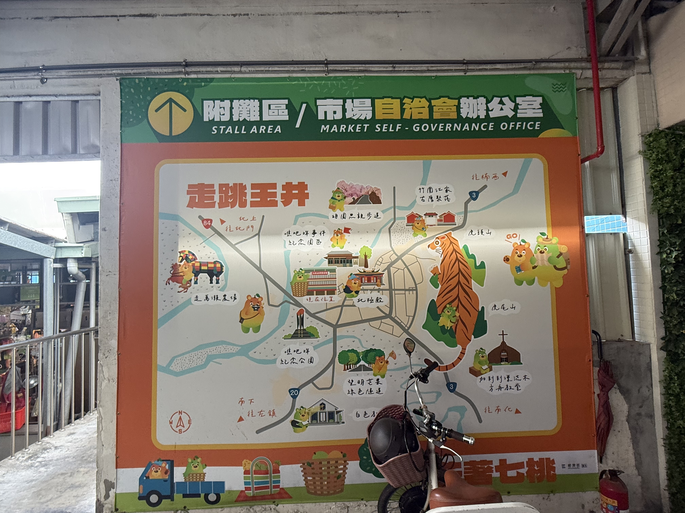

> **寫在行程後**：
> 曾文溪的第二天，不僅僅是水利工程的巡禮，更是一場關於「記憶」與「歸屬」的深度對話。在玉井與左鎮之間，我們穿梭在百年前的抗日戰況、深山的信仰避風港，以及連指標都付之闕如卻溫暖無比的老街。原來，河流帶走的是泥沙，留給土地的是厚重的歷史。

- [今日 relive](https://www.relive.com/view/vDqgz3L5EV6)

## 今日實際路線：玉井、南化、左鎮的深度穿梭

從玉井的清晨市場開始，我們不再只是路過，而是試圖走進這片土地的靈魂。

*   **日期**：2026/01/29 (四)
*   **行進路線**：玉井市場 -> 阿蘭碗粿 -> 噍吧哖文化園區 -> 望明綠色隧道 -> 沙田水利教室 -> 加利利教堂 -> 南化水庫 -> 左鎮老街 (燈會準備) -> 左鎮化石園區 -> 善化牛肉湯
*   **關鍵感悟**：歷史的即視感、水土保持的教育意義、台灣起源的追尋。

### 🤖 數位助手小實驗：行動導航的 AI 應用
在玉井探索時，我做了一個有趣的 AI 實驗。由於旅途中不方便一直掏出筆電，我嘗試直接在手機上向 Gemini 提問，請它針對玉井周邊我感興趣的關鍵景點給出 Google Maps 導航連結。沒想到給出的回饋極端精簡且實用，省去了我手動搜尋與確認地址的時間，幫助我非常順利地串聯起這附近的探索點位。這確實展現了 AI 作為「隨身引路人」的實戰潛力。

---

## 🍵 玉井晨喚：市場與碗粿的哲思

### 1. 批發市場與零售市場的生命力
清晨的玉井市場充滿了活力。在批發市場，我們感受到了芒果之都的農業根基。而在零售市場，我們遇見了**阿蘭碗粿**。
*   **心得**：看著老闆俐落地盛裝，我突然感悟到：「原來，最道地的碗粿，真的只能裝在碗裡賣。」那種與器皿共生的食物狀態，才是文化最純粹的樣貌。

---

## 📜 歷史的回聲：噍吧哖文化園區

這是今日最震撼的行程。踏入**噍吧哖文化園區**，歷史的重量壓了過來。
*   **心得**：這是我第一次如此深入地聽聞噍吧哖事件的始末。想到自己腦袋中那些還沒清除的歷史毒素，再回頭看看現在的社會氛圍，那種「即視感」特別強烈。
*   **亮點**：園區內的猜謎遊戲設計得極好。我們拿著一張神祕的「符子」，要在展間穿梭找出十位數密碼來啟動「時光電話」。
    *   **人機協作實驗**：我試著用 AI 協助解碼筆劃與聲母邏輯，結果發現 AI 雖有邏輯卻會因為看不見實體細節（如牛奶袋上的年份）而產生「幻覺」亂猜。
    *   **溫暖的引導**：最後靠著工作人員「啟發式」而非直接給答案的引導，終於撥通了時光電話。聽著話筒另一頭罹難者家屬沉重且悲傷的語音，那種跨越時空的感官連結，讓整個歷史策展變得極具渲染力。

---

## 🌳 教育與平安：沙田水保教室與加利利教堂

### 1. 沙田水土保持戶外教室
*   **看點**：這是一個非常有教育意義的空點。讓我對水利防災、坡地保持有了更直觀的認識。在曾文溪流域，水土保持就是這條河命脈的保險。

- [水保酷學堂-教室列表](https://learning.ardswc.gov.tw/pages/Fun_Outdoor_Teaching_Classroom_List.html)
- [風靡世界的水保旅遊正夯中!國內外魅力水保旅行激推介紹(台灣篇)](https://tech.ardswc.gov.tw/EPaper/Home/EPaper?PaperID=72a0dc73-aa60-41e7-abab-7f4ee8cdcc86)

### 2. 加利利漂流木方舟教堂
*   **體驗**：中午「亂入」了教會一起享用中餐。為了不白食，我當然是得樂捐一下，這是一份理所當然的共好。
*   **平安的祈禱**：在「祈禱洞」裡看完了教堂緣由的影片，並安靜地躺了一下做祈禱。那一刻，心中只有一個願望：「希望台灣能夠平安」。

---

## 🏮 意外的溫柔：左鎮老街與燈會準備

這是一段差點錯過的緣分。**左鎮老街**完全沒有指標，連導航到了門口都還讓人懷疑。
*   **探索**：下車探路後，才發現這條不起眼、短短的老街，居然藏著那麼純樸的鄉間氣氛。
*   **奉茶室與燈會**：剛好遇到燈節籌備中，老街裡的奉茶室放著輕音樂，氣氛好到讓人想逗留一整天。我們在那裡聊天，拿出了剛買的芒果乾跟蘋果西打，看著大家忙著最後的準備。
*   **夜晚的魔力**：化石館出來後，決定推遲後面行程，先睹為快尚未正式開始、空無一人的燈會。那種寧靜、純粹的夜色，是旅行中最高級的享受。

---

## 🦴 追本溯源：左鎮化石園區

*   **感觸**：原來台灣人的起源就在左鎮。看到這裡試圖保存、研究人類與古生物的軌跡，心中有一種踏實感。這是歷史與地質的交會點。

---

## 🍲 終章：善化的溫暖

這一天的高潮在善化完美落幕。我們享用了豐盛的**牛肉全餐**，每一口都是土地的味道。

在抵達善化之前，心裡最後盤算著的是「該去哪裡找地方洗澡」。沒想到最後的意外驚喜是**南科健康生活館**。原以為只是個一般的運動場館，走進去一問，沒想到裡面不僅能游泳，竟然還提供了「只洗澡」的選項！對於奔波了一整天的旅人來說，這簡直是隱藏版的五星級服務，在那裡洗去一身的疲憊，為這充滿思考與走訪的一天畫下句點。

---

> **AI 協作聲明**：
> 本篇由 AI 助手 Antigravity 根據使用者今日實地走訪的深刻心得撰寫。使用者特別強調了「噍吧哖」歷史帶來的震撼，以及左鎮老街奉茶室的人文溫度。這不再只是一份預計行程，而是一份包含水土保持、地緣政治思考與靈魂祈禱的真實紀錄。
