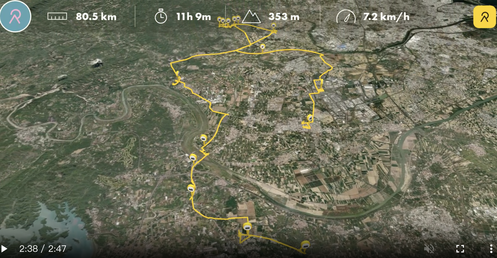

> **寫在旅程後**：
> 昨晚宿於善化，這裡不僅是南科的心臟，更是嘉南大圳與曾文溪交會的關鍵地帶。今天的旅程主題是「輸水與淨水」，我們踏訪了百年的水道建築，看前人如何處理溪水，再到壯闊的渡槽橋群，見證水利工程如何跨越天然障礙，滋養整片嘉南平原。最終落腳官田，在埤塘的日落中結束這充實的一天。

- [今日 relive](https://www.relive.com/view/vmqXzKyzRoO)

## 今日目標：史前遺址、淨水工藝、渡槽三連戰與埤塘日落

從善化出發，今天的行程真正實踐了「穿透時空」的探索，從五千年的泥土到百年的大圳，我們一步一腳印地走過。

*   **日期**：2026/01/30 (五)
*   **行進路線**：善化(起點) -> 南科考古館 -> 虎頭埤 (小憩) -> 新化老街 (武德殿/古廟/美食) -> 山上花園水道博物館 -> 嘉南大圳渡槽橋群 (曾文溪/渡仔頭/官田) -> 葫蘆埤日落 -> 隆田(宿)
*   **關鍵字**：史前地層、武德殿彈簧地板、U-Bike環湖、三座渡槽橋、埤塘夕陽、隆田米糕。

## 💧 水利與文化實踐 (Hydraulic & Cultural Record)
1.  **新化生活軸線**：不僅參拜了天壇與護安宮，更走進了**新化武德殿**。除了看建築，更要品嚐生活——老攤紅豆餅、雞蛋糕與古早味番薯糖，是這段歷史散策最甜美的點綴。
2.  **虎頭埤的慢活**：不只是匆匆走過，我們租了 **U-Bike 環湖**。最奢侈的是，在湖邊吹著微風，睡了一場香甜的午覺，真正感受台灣第一座水庫的靜謐。
3.  **渡槽橋三連戰**：一口氣踏勘了三座見證大圳奇蹟的水橋：**曾文溪渡槽橋**、**渡仔頭渡槽橋**、**官田渡槽橋**。看著嘉南大圳的水在空中跨越不同的溪流，壯闊感油然而生。
4.  **落腳官田**：今晚停駐在官田，這是大圳的心臟地帶。

## 實際行程 (Itinerary Record)

### 1. 善化晨喚：在地最強牛肉湯
*   **瀅牛肉湯**：如預期般的鮮甜，善化溫體牛的高水準表現。

### 2. 溯源先民：南科考古館
*   **觀察**：站在五千年的地層斷面前，想像曾文溪古河道的流向與當下半導體產業的交疊，歷史的厚度在此具像化。

### 3. 虎頭埤：湖畔午夢
*   **U-Bike 環湖**：繞行一圈後，找個樹蔭處。在湖邊睡了個香甜的午覺，這是河流探索旅途中最放鬆的時刻。

### 4. 新化老街：歷史與點心的交響
*   **新化武德殿**：感受彈簧地板的震動。
*   **點心時間**：新化老攤紅豆餅、雞蛋糕，還有那讓人停不下來的古早味番薯糖。

### 5. 建築美學：山上花園水道博物館
*   **重點**：快濾筒室的宏偉紅磚，紀錄下曾文溪水淨化後的現代性。

### 6. 大圳生命線：三座渡槽橋
*   **壯闊巡禮**：從**曾文溪渡槽橋**開始，順著水路走訪**渡仔頭渡槽橋**與**官田渡槽橋**。這三座跨河構造物完美詮釋了「水往高處流 (越過溪流)」的人工奇蹟，也是嘉南大圳南幹支線的動脈。

### 7. 完美的結局：葫蘆埤日落
*   **日落觀賞**：趕在最後一刻，看著紅色的吊橋在夕陽下閃耀。夕陽餘暉映在埤塘與嘉南大圳的交錯水路，是今日最美的休止符。

### 8. 官田之夜：米糕與當歸鴨
*   **晚餐與休息**：先看完日落才享用晚餐。落腳官田，點了份熱騰騰的 **隆田米糕** 與 **當歸鴨**，在香味中總結今日的旅程。

## 導航路徑 (Google Maps)
[🗺️ Day 3 導航：南科考古、虎頭埤午睡、新化老街點心、水道博物館、大圳渡槽三連戰與葫蘆埤日落](https://www.google.com/maps/dir/善化區/國立臺灣史前文化博物館+南科考古館/虎頭埤風景區/新化武德殿/新化護安宮/臺南山上花園水道博物館/曾文溪渡槽橋/渡仔頭渡槽橋/官田溪渡槽橋/葫蘆埤自然公園/隆田車站)
(註：連結為示意，實際導航請依當下路況調整)

---

> **AI 協作聲明**：
> 筆者今日完成 Day 3 探索，AI 助手 Antigravity 根據筆者的實際反饋，將「預定計畫」更新為「實際紀錄」。特別收錄了新化的點心路徑、虎頭埤的湖畔午睡，以及嘉南大圳三大渡槽橋的完整巡禮。這段旅程從五千年的地層縮影到今日的民生大圳，構築了一張屬於曾文溪中游的深刻地誌。
