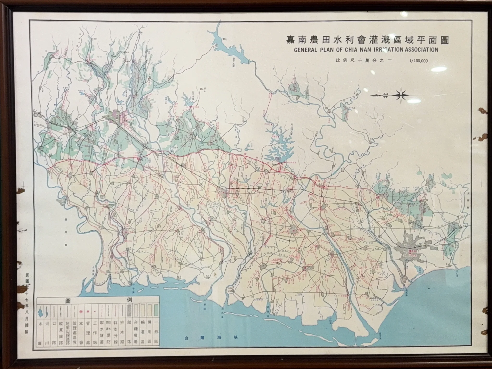

> **哈爸筆記**：
> 有時候最專業的工具不一定是最快的工具。這是一次從「想學專業軟體」到「讓 AI 寫專屬程式」的心路歷程，也驗證了人機協作中「人類提供結構，AI 提供執行」的高效模式。

## 1. 背景：細節與強度的拉扯

在田野中發現了一張細節極其豐富的珍貴舊地圖。這類地圖有個特性：如果你想一張照片拍完，細節（尤其是文字）會因為解析度不足而變得模糊不清。

為了保留所有細節，我採取了「局部特寫」法：分別拍下地圖的四個角落。照片是清晰了，但挑戰也來了：**如何把這四張帶有手拿變形、光影與透視差異的照片，拼回原樣？**

## 2. 挫折：專業軟體的高牆

一開始我很有志氣地問了 AI，它推薦我使用全景攝影界的開源神器 **Hugin**。

雖然 Hugin 功能極強，但它的介面充滿了攝影測量學的專有名詞：焦距 (Focal Length)、失真係數 (Lens Projection)、控制點 (Control Points)...等。即便對著 AI 給的指南操作，我依然在無數次的對齊失敗與複雜的參數設定中感到挫敗。對我來說，我只是想拼一張圖，並不想成為攝影量測專家。

## 3. 轉機：AI 代理程式的「灰盒」實驗

我決定把「死馬當活馬醫」，直接請我的 AI 代理程式 (Antigravity) 寫程式處理。過程中我也學到了一課：

*   **全自動的失敗 (Black Box)**：一開始 AI 給了一支使用 OpenCV 內建 `Stitcher` 的程式。這類「黑盒」工具在處理旅遊風景照很強，但面對手拿翻拍、重複特徵不明顯的地圖時，演算法直接放棄（回報失敗碼 1）。
*   **關鍵的人類介入 (Human-in-the-loop)**：我發現機器缺的是「空間感」。我主動告訴 AI 每張圖檔對應的位置：
    *   左上：IMG_4953
    *   右上：IMG_4955
    *   左下：IMG_4954
    *   右下：IMG_4956
*   **精準執行**：有了這份資訊，AI 放棄了不穩定的全自動模式，改寫一支基於 SIFT 特徵匹配與透視變換的客製化腳本。

## 4. 技術大腦：這支程式的工作邏輯

這支 Python 程式不再是瞎猜，而是執行了以下步驟：

1.  **特徵提取 (SIFT)**：在照片中尋找數千個數位特徵（如地圖上的線條交會點、古文字的筆畫）。
2.  **空間受限匹配**：利用我提供的佈局，限定程式只比對「鄰接」的邊界，這大大降低了機器「認錯特徵」的機率。
3.  **透視投影變換 (Homography)**：這是最重要的一步。手拍照片一定有歪斜，程式透過數學計算，將照片進行如同 3D 空間般的「拉伸對齊」，確保地圖上的道路能無縫銜接。
4.  **三階段融合**：先拼左半部、再拼右半部，最後合體。

## 5. 心得：AI 時代的「灰盒」策略

這次經驗讓我體會到，我們不一定要去硬啃專業軟體的說明書。最有效率的方式是 **「灰盒策略」**：

> **人類提供結構（哪張圖在哪個位置），AI 提供演算法執行。**

最後，我成功得到了一張能清晰看見微小註記的數位復刻版地圖。這種「我懂布局、它懂算術」的協作感，比起對著專業軟體發愁要愉快得多。

## 結果
- [嘉南農田水利會灌溉區平面圖](https://drive.google.com/file/d/1XxCvCV5wPfDSQRv45cAizSbcq7dhEgRU/view?usp=drive_link) 
---

> **AI 協作聲明**：
> 本文由筆者口述實戰經驗，AI 助手 Antigravity 協助整理技術邏輯與文章結構。拼接程式由 Python + OpenCV 實作，針對手拿翻拍地圖之透視變換進行了專項優化。
