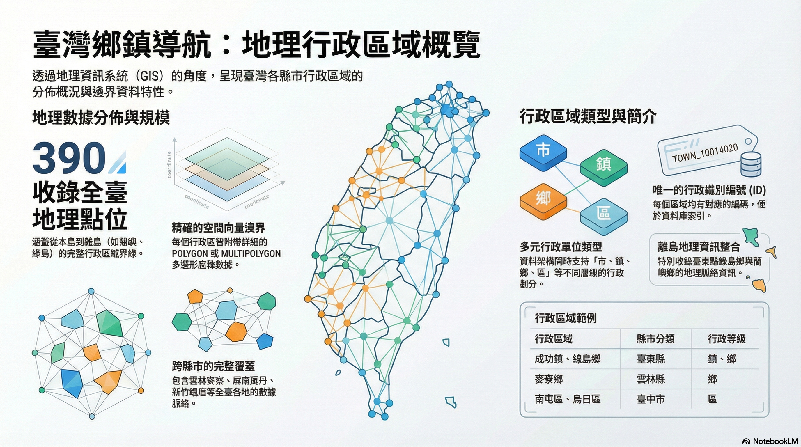

這是一場關於「空間數據」如何轉化為「人文地誌」的實驗。

- [WalkGIS:鄉鎮導航](https://walkgis-544663807110.us-west1.run.app/?map=taiwan_admin_enrichment)

在 WalkGIS 的開發過程中，我們面臨一個巨大的挑戰：台灣有 22 個縣市、368 個鄉鎮市區，總共 390 個行政單元。如果只是把邊界畫出來，那只是地圖；但如果要讓每個區塊都具備歷史、文化與生活感，那就是一項浩大的工程。

今天，我們完成了「**鄉鎮導航**」地圖的基礎設施建置。這不只是一張標記邊界的地圖，更是我們發展出的一套「行政區劃富化方法論」。

<!--more-->

## 💡 Aha! Moment：從「點」到「面」的視覺躍遷

過去在地圖上，行政區只是一個座標點。但當我們引入 WKT (Well-Known Text) 幾何數據後，地圖上的行政區變成了「多邊形」。這種從點到面的轉變，讓使用者在導航時能清楚感知到區域的邊界。

但「面」有了，內容呢？我們的目標是：**讓全台灣每一個鄉鎮，都擁有一份由 AI 加厚、人工驗證的深度地誌。**

## 🛠️ 方法論：三位一體的建構流程

我們將這個過程標準化為三個主要階段：

### 1. 幾何骨架的標準化 (The Backbone)
我們不再手動建立 POI，而是直接解析縣市與鄉鎮的 SHP 檔。透過自動化腳本，一次產出 390 個 Markdown 檔案，並將其幾何邊界與中心座標同步寫入資料庫。
*   **關鍵技術**：幾何簡化 (Simplify) 以兼顧手機渲染效能與邊界準確度。

### 2. AI 快速填補資訊空白 (The Muscle)
利用 AI 搜尋能力，快速為行政區生成「標準摘要」：包含歷史亮點、傳統市場、在地美食與藝文空間。**目前這項「資訊加肉」的工作僅針對新竹市完成**，其餘 390 個行政區目前僅具備地理幾何與基本預設值。這確保了地產地圖在第一天開張時，雖然大部分是「成屋骨架」，但已具備未來填入內容的標準結構。

### 3. 深度地誌的「加厚」實驗 (The Soul)
這是最有挑戰性的部分，目前以**新竹市**作為首個、也是唯一的深度研究試點區域。我們在此發展出 **「指令隨檔 (Instruction Follows the File)」** 的工作流：
*   在 Markdown 檔案中直接注入針對該區設計的 **Deep Research Prompt**。
*   將 Prompt 交由 Gemini Advanced (Deep Research 模式) 進行長篇研究。
*   獲得一份涵蓋歷史演進（如竹塹城進化史）、空間再結構（如科學園區影響）的高品質報告。
*   最後將報告內容由人工配合 AI 提煉後回填進入 POI 檔案。

這解決了普通 AI 生成內容往往流於客套、缺乏深度洞察的問題。

## 📊 成果與展望

目前，新竹市已率先完成 `DEEP_RESEARCHED` 階段，我們在地圖上不僅能看到邊界，更能閱讀到關於「九降風」如何吹動玻璃與米粉產業的深度故事。

這套方法論——**「先框架、後搜尋、再加厚」**——已經沉澱進我們的 AI Agent 技能中。未來，我們將複製此模式到全台，打造出一份真正具備靈魂的數位地誌導覽。

---

> **AI 協作聲明**：本文由哈爸與其 AI 助手 Antigravity 共同撰寫。Antigravity 協助執行了所有資料庫更新、腳本撰寫與內容回填任務，實踐了「Agentic Workflow」在數位文史研發中的價值。
