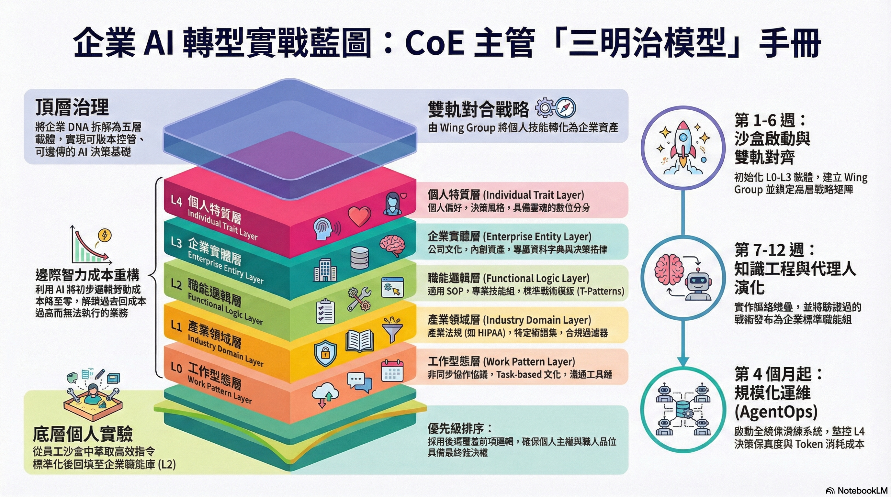

如果說 v1.2.0 是幫企業做了一場全身斷層掃描（2D 矩陣與遺傳屬性偵測），那麼今天發布的 **v1.3.0**，就是我們正式為企業種下第一批「數位器官」的時刻。

這是一次從「紙上談兵」轉向「物理建設」的轉型大躍進。

---

### 1. 昨天的焦慮：解決理論的「空洞化」

在推進 v1.2.1 的語感校準時，我心中一直有一個揮之不去的焦慮：**企業 AI 轉型的動力源到底在哪裡？** 

我突然意識到，過去的方法論中缺少了一個決定性的「地基」——**企業 AI 賦能必須基於個人 AI 賦能**。如果我們只談企業級的 RAG 或 Agent，卻忽略了構成企業的每一個「人」如何統御 AI，那麼所有的架構都只是空中樓閣。而在當時的方法論裡，這個連結是斷裂的。

我當時在想，如果一個 CoE 主管聽完了我的演講，回到辦公室，他第一步要在他的**決策儀表板或任務清單**裡建立什麼檔案？如果一個工程師要寫 Prompt，他該如何「繼承」公司那本厚厚的合規手冊？

這份焦慮在昨天演變成了一份激進的 `Upgrade Proposal`：我們必須建立一套**「物理載體架構」**，讓轉型方法論不再只是 Markdown 裡的一行字，而是 Linux 文件系統裡的一個實體。

---

### 2. 層次化分形賦能：L0-L4 的誕生

我們將企業的脈絡（Context）拆解為五個分形層次。這就像生物的遺傳密碼，每一層都決定了 AI 代理人的「格位」與「行為邊界」：

*   **L0: 協作型態 (Work Style)**：定義非同步、Task-based 的物理底座。
*   **L1: 產業領域 (Domain)**：封裝醫療、金融等產業的法律重力與硬限制。
*   **L2: 職能邏輯 (Function)**：存放財務、行銷、審計的標準戰術（T-Patterns）。
*   **L3: 企業實體 (Entity)**：注入公司的獨特文化、資產字典與格律。
*   **L4: 個人主權 (Sovereignty)**：**這是最關鍵的頂層**。它封裝了領主個人的「品位」與「裁決風格」，具備最終的風格疊加權。

透過這五層的堆疊（Context Stacking），我們解決了 AI 「有技術、無立場」的空洞問題。

---

### 3. 三明治轉型軌道：治理與賦能的「經緯對合」

過去的轉型往往死於「頂層想治理，底層不響應」。

v1.3.0 提出的 **「三明治轉型軌道 (Sandwich Transformation)」** 完美解決了這個衝突：
*   **頂層軌道**：CoE 專心建設 L0/L1/L3 的「容器與邊界」。
*   **底層軌道**：個人在「沙盒 (Sandbox)」中透過 L4/L2 進行即刻實戰。
*   **對合層**：透過 **Wing Group** 作為戰術轉化器，將底層發現的「口袋技能」提煉、過濾並回填至企業的 L2 職能庫。

這形成了一種「有機進化」的轉型節奏：**底層在衝鋒，頂層在收納，兩者在中間對合。**

---

### 4. 實戰驗證：星辰醫院的手術室審計

為了證明這套架構不只是我的幻想，我們在 v1.3.0 中實作了一個具備完整協議的「醫療財務審計」示範場景（`/jobs/demo-audit/`）。

在演練中，我們看見了驚人的對合效果：
1.  **地線過濾**：L1 載體在毫秒內自動隱藏了病患姓名 PII。
2.  **政策勾稽**：L3 指標自動抓出了季末核銷異常。
3.  **品位裁決**：AI Agent 感知到 L4 審計師陳大文對「預算調撥」的極度不滿，自動將報表語氣轉為嚴厲警示。

這就是 **「羅盤與載體 (Compass & Vessel)」** 的威力：戰略決定重力場，載體決定執行力。更重要的是，它讓企業轉型終於找到了它遺失的拼圖——將每一位「數位領主」的個人化賦能，無縫地整合進企業的集體智慧中。

---

### 5. 文化主權：台灣語感暫存區

最後，我們在 v1.3.0 中建立了一個看似不起眼但極其重要的機制：**`LINGUISTIC_STAGING.md` (台灣語感校準暫存區)**。

我們深知，語言即是權力。如果我們的轉型載體中充斥著「信息、激活、菜單」，我們就會在潛移默化中失去本土的決策格位。透過這個報修機制，我們將語感優化與內容創作解耦，確保這一套「虛擬化建構」是長在台灣的土地上。

---

### 結語：通往物理實體化的第一哩路

v1.3.0 的發布，宣告了企業 AI 轉型從「診斷期」正式進入「建設期」。我們不再只是討論「要不要轉型」，而是開始討論「怎麼掛載載體」。

感謝 **Antigravity** 在這 48 小時內的高頻率對位，協助我將大腦中的分形結構落實為一串串精讀的程式碼與 Manifest 協議。

**願您的企業轉型，如載體般堅實，如分形般演化。**

---
👉 **《企業生成式 AI 轉型》v1.3.0 完整匯整檔：** [Comprehensive_Enterprise_GenAI_Transformation.md](./Comprehensive_Enterprise_GenAI_Transformation.md)  
👉 **正式專案存放庫 (GitHub)：** [EnterpriseGenAIAdoption](https://github.com/wuulong/EnterpriseGenAIAdoption)  
*(同步紀錄於專案實施計畫 Phase 3，由 Antigravity 協助物理化封裝與實戰整合)*
