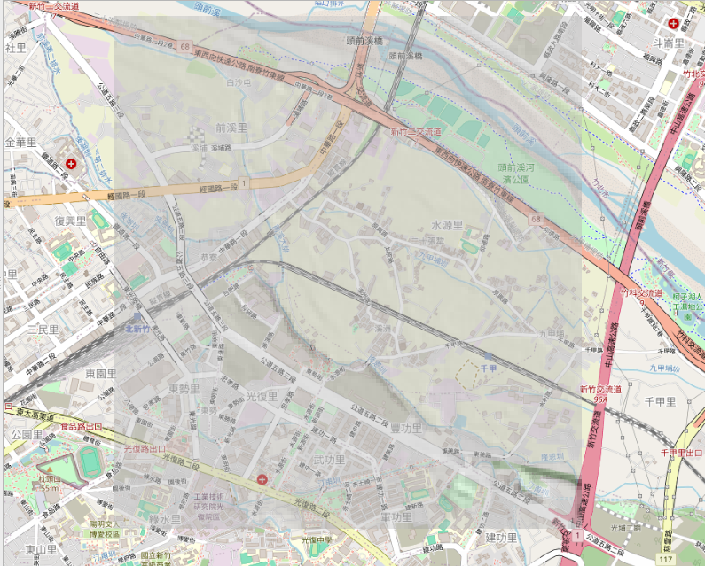

一切的起點，源自於對家鄉地名的好奇。

老爸出生在潭後，但我一直不知道為什麼是這個名字。這裡沒有水潭，何來「潭後」之名？如果只是在 Google Maps 上滑動縮放，這個問題可能永遠得不到解答，因為現代的衛星空照圖，早就被密集的建築與柏油路給覆蓋。

於是我開始在網路上搜尋，想知道名稱的可能由來。透過查閱資料，我找到了「北庄13」這條線索，並追溯到了開墾先賢王世傑的紀錄。這才發現，原來在古書中指出，以前頭前溪在此處曾經有一個深潭。

更引人入勝的是，古書原文中還記載著附近有「黃金洞」，但我身為在地人卻從來沒有聽過這個詞！於是，我開始在各種古書中搜尋「黃金洞」，這便是為什麼後來會需要下載並整理好幾本地方志與史書的原因。

例如在《新竹縣採訪冊》記載著水圳「西南行二里至黃金洞，又三里至潭後莊」，另有紀錄點出「西南行一里許至黃金洞，鑿山三十餘丈引水出...經潭後」。這些古籍清晰地描繪了水路行經的節點，但對「黃金洞」本身僅有文字描述，大意就是「在潭後到九甲埔中間有個高起的小山，所以需要挖隧道引水」。既然只有文字描述，於是我心想：那或許可以從 DTM 數值地形去分析它大概的位置？

我不甘於僅止於文字記載，決定戴上另一副眼鏡——打開具備高解析度的高程資料，俗稱 **DTM (Digital Terrain Model) 數值地形圖**，試圖在地表尋找先民的遺跡。

DTM 就像是將地表的樹木與建築物全部扒光，只留下最純粹的山地與溝壑起伏。當我將「潭後」附近的地形顯示在 QGIS 上，經由 GIS 處理與高程分析後，確實可以看到一條具備劇烈落差的線。

雖然看到這條線，但傳說中的「黃金洞」確切點位在哪，一開始還是不太知道。於是我將它與目前的現代地圖進行疊加，赫然發現那條異常落差的線上，剛好就有目前的「水源街取水口」！

直覺告訴我：就是這裡了。而再經過後續的文獻交叉比對，那裡證實就是傳說中「黃金洞」的所在。

這不是外星人的遺跡，而是兩百多年前，我們的先民在缺乏現代大型機具的情況下，為了將水資源從頭前溪引進竹塹平原，硬生生地以人力穿山鑿石，刻下的大型水利基建（引水穿山的隧道）。有了這條隧道，龐大的水流才得以穿過高起的小山，灌溉出兩千甲的良田。

這個 Aha Moment 深深震撼了我。

**我體悟到一件事：「地理，其實就是凝固的歷史。」**

現代地表上看起來微不足道的一個小土丘、一條乾涸的溝渠、甚至只是一個站牌的名稱「潭後」，在數百年前，可能都是決定整座城市生死存亡的戰略設施。

但下一個問題來了：這條水路是誰修的？什麼時候修的？除了「黃金洞」，台灣的地底下是不是還有無數條這樣凝固在時間裡的生命線？

為了解開這些謎團，過程中勢必會需要將古書記載與真實的古地圖進行疊加比對。因此，我想先探索一下中央研究院（中研院）到底有哪些相關的歷史圖資資源可以使用。

（未完待續：下一篇，我們將打開中研院的百寶箱，解析歷史圖資的魔法！）

---
*本文為哈爸與 AI 助理協作產出，紀錄實體探勘與數位工程之歷程。*
