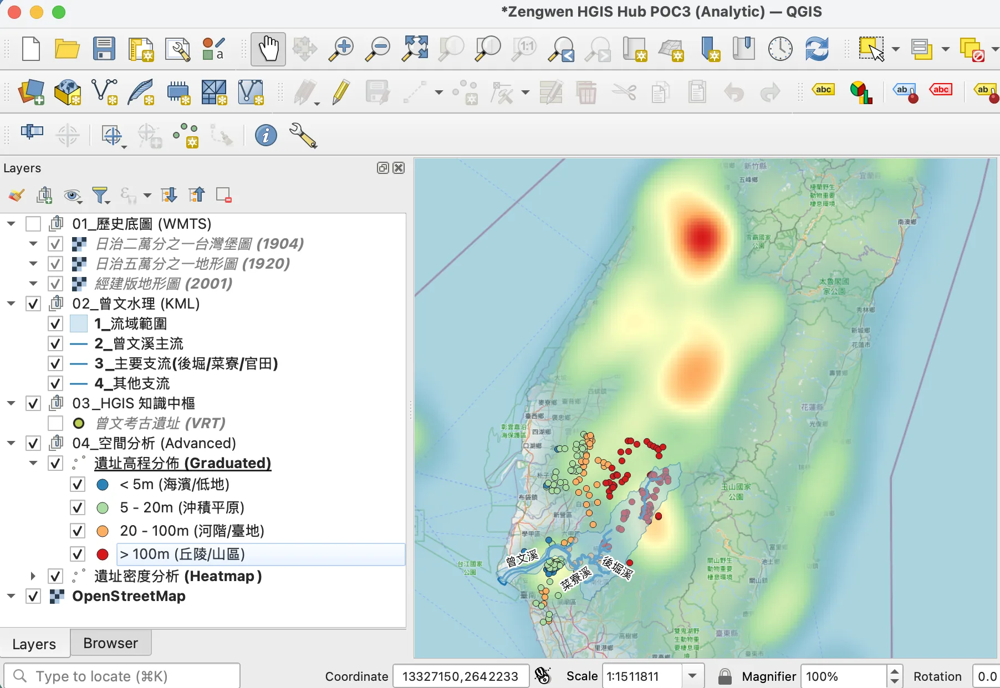

在實現 QGIS 專案「一鍵生成」的路上，我們不僅要讓圖層「開得出來」，更要讓它「具備研究價值」。

這篇文章記錄了我們從 **POC2 (樣式與標籤整合)** 進化到 **POC3 (空間分析與 SDM 紀律)** 的完整心路歷程。這兩個階段分別解決了製圖中的「美學溝通」與「科學建模」兩大核心問題。

---

## 🎨 POC2：視覺精煉與動態標籤 (Visualization & Labeling)
**目的：讓地圖「會說話」，透過自動化配置解決手動製圖中最繁瑣的排版工作。**

在 POC1 成功掛載圖層後，我們發現原始的點位與線條在混亂的歷史底圖（如台灣堡圖）上極難辨識。POC2 的核心目標即是透過腳本，賦予地圖專業的視覺外觀。

### 1. 幾何感知的自動標註 (Geometry-aware placement)
我們實現了腳本對圖層類型的自動識別與對應配置：
- **點位圖層 (遺址)**：自動採用 `Centroid` 配置，讓標籤精確落在遺址中心。
- **線段圖層 (河流)**：自動切換為 **`Around Line` (平行排列)**，並預設帶有 0.5mm 的偏移量。這讓河名能順著水流蜿蜒，展現專業製圖感。

### 2. 跨平台字型與視覺消隱 (The macOS Fix)
我們在 POC2 中遭遇了字型相容性的重擊。原本預設的字型在 Mac 上會毀掉專案解析。最終，我們強制切換為 **`PingFang TC` (萍方-繁)**，並自動啟用了 **0.7mm 白色光暈 (Text Buffer)**。這小小的光暈，是讓地圖文字從花綠底圖中「浮現」出來的關鍵。

---

## 🛡️ POC3：空間分析中樞與 SDM 紀律 (Advanced Analysis & SDM)
**目的：從「資料顯示」進化為「規律開發」，在不污染原始數據的前提下，自動生成分析模型。**

當地圖變漂亮後，下一步就是「看見模式」。POC3 挑戰的是自動產出具有研究深度的分析圖層（如海拔區間與熱點圖）。

### 1. 恪守 SDM 紀律：絕對不改動原始資料 (Data Hub Snapshot)
開發者常為了分析方便，在原始 SQLite 裡建 View。但對歷史數據來說，**原始碼應該是神聖的 (Holy Source)**。
我們實作了「局部資料中樞 (Local Data Hub)」：腳本在產出專案的一瞬間，自動建立一個 **`poc_data_hub.db` 快照**。所有的 JSON 萃取、高程分區計算都只存在於這份快照中。原始 HGIS 資料庫保持 100% 乾淨，專案檔則是「可打包、可重製、可拋棄」的。

### 2. 高程-生活圈分析 (Graduated Elevation)
我們自動生成了遺址的高程分佈圖。將遺址依海拔分為：
- **< 5m (藍色)**：海濱低地。
- **20-100m (橙色)**：河階平原與台地。
這讓研究者能瞬间看出曾文溪流域不同文化層與海拔高度的博弈規律。

---

## 🧪 攻克 Heatmap 的 XML 惡戰：POC3 的除錯經驗

最艱難的部分是自動生成 **「遺址密度熱點圖」**。我們在 XML 的標籤結構中卡關了五次，這留下了極具價值的技術筆記：

1. **命名規格陷阱**：QGIS 3 實際要求的標籤名稱是 **`type=\"heatmapRenderer\"`**。若少了 `Renderer` 字尾且 R 小寫，專案檔會被系統廢棄並降級回紅色小點點。
2. **結構過濾**：與普通圖層不同，熱點圖渲染器**不可包含 `<symbols>` 標籤**。它直接依賴 `<colorramp>`。
3. **單位尺度惡戰 (Degrees vs MM)**：這是最終勝出的關鍵。在 WGS84 座標系下，單位預設是「度 (Degrees)」。若 `Radius` 設為 8 度（半個地球），熱力雲會稀釋到完全看不見。
**核心對策**：強制將 `radius_unit` 設為 **`0` (Millimeters)**。現在不管比例尺如何縮放，熱力雲在螢幕上始終保持 10mm 半徑的紮實質感。

---

## 🖋️ 結語：從美學到科學的跨越

POC2 解決了地圖的「溝通力」，而 POC3 賦予了地圖「分析力」。當這兩者都實現自動化後，地圖就不再是一張畫，而是由 **「資料庫快照」 + 「物理單位感知」 + 「美學腳本」** 交織而成的科學儀表板。

我們正離「透過代碼解讀歷史空間」的願景，又邁進了一大步。

---
### 📥 資源下載與體驗
本次實驗的 QGIS 專案與分析數據已釋出至 GitHub：
- **[曾文溪 HGIS 進階分析範例 (GitHub)](https://github.com/wuulong/taiwan-history-atlas/blob/main/examples/zengwen_hgis_poc/README.md)**
（包含一鍵開啟的 .qgs 專案、熱點圖配置與考古遺址快照）

---
*本文與 AI 助理深度協作產製。技術細節請參考 [bmad-pa](https://github.com/wuulong/bmad-pa) 的 QGIS 自動化管線。*
