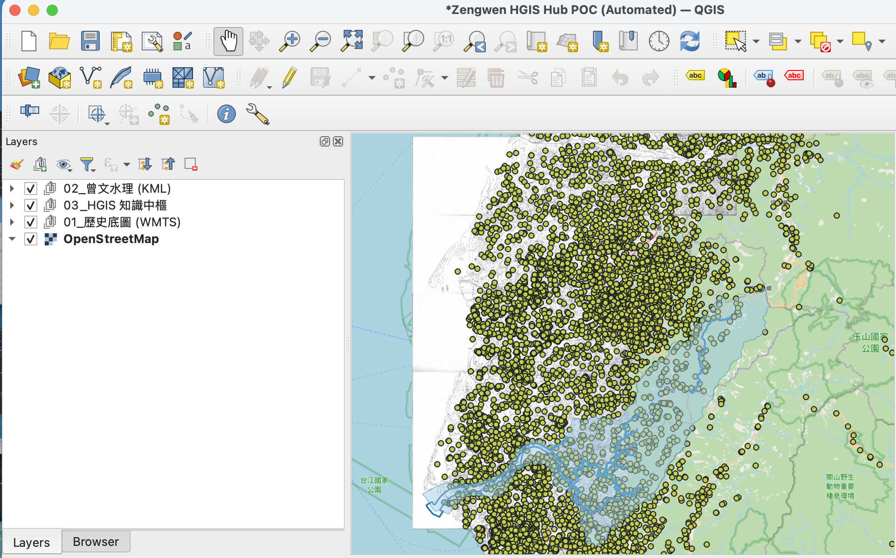

在進行 HGIS（歷史地理資訊系統）研究時，我發現最耗時的往往不是分析數據，而是「準備地圖」。每次要開啟一個新研究，總要重複掛載百年歷史底圖、設定 KML 座標、調整 SQLite 的 SQL 篩選器...。

為了打破這個瓶頸，我發起了一場實驗：**能不能像寫程式一樣，用「寫」的出一份 QGIS 專案？**

這就是我最近在推動的 **軟體定義地圖 (Software-Defined Maps, SDM)** 概念。

---

## 🏗️ 為什麼要自動化？

如果你手動配置過 QGIS，你一定遇過這些崩潰瞬間：
1. **URL 特殊字元破壞專案**：WMTS 的 URL 裡一堆 `&`，手動貼上 XML 常報錯。
2. **座標系統 (CRS) 位移**：明明設定了 WGS84，圖層卻飄到非洲西岸海面（座標 0,0）。
3. **重複定義的勞力**：每個專案都要重新分組（底圖、水理、點位），這應該交給機器人。

透過 **Python + Jinja2 模板**，我們可以把地圖專案變成可程式化的零件。

---

## 🛠️ 基本作法：Jinja2 零件化

核心思路是將 `.qgs` 專案檔（實質是 XML）拆解為模板。

我們建立了一個 `base_project.qgs.j2`，裡面預留了動態注入的內容：
- **層級化圖層樹**：自動生成的分組。
- **資料源設定**：SQL 篩選指令與檔案路徑。
- **空間參考系統**：自動注入對應的 AuthID、Proj4 與 SRID。

最關鍵的「零件庫」是 **`GIS_KNOWLEDGE.yaml`**。它充當了 GIS 資源的「DNS 伺服器」，記錄了所有中研院底圖、本機 KML 與資料庫的 Metadata。

---

## 🚀 第一階段 POC：曾文溪 HGIS 數位中樞

在這次的 POC 中，我們成功實現了 `Zengwen_HGIS_Hub.qgs` 的一鍵產出：

### 1. 跨域資料對合
- **底圖**：一鍵介接 1904 年日治二萬分之一台灣堡圖 (WMTS)。
- **水理**：自動掛載曾文溪主流、支流與全流域範圍 (KML)。
- **知識**：直接連結 `history_atlas.db`。為了處理沒有空間欄位的原始 SQLite Table，我們引入了 **OGR VRT 技術**，讓 QGIS 就像讀向量檔一樣，直接讀取資料庫裡的經緯度點位。

### 2. 座標系統的「精準打擊」
實驗過程中，我們踩到了 QGIS 3.x 對 CRS 解析的嚴謹要求。我們不在只是寫 `EPSG:4326`，而是注入完整的投影描述文字與畫布投影 (Canvas SRS)。目前的產出已能實現「開檔即對準 OSM 底圖」，不再位移。

---

## 🧪 技術坑洞與除錯經驗

這場 POC 留下的「戰傷紀錄」對後續開發極具價值：
- **XML 安全**：URL 必須經過轉義（Escaping），否則 `&` 會讓 XML 解析器直接罷工。
- **幾何渲染識別**：面圖層、線圖層與點圖層在 XML 裡的 Renderer 結構不同。我們在模板中加入了條件分支，確保河流開出來是線、流域是多邊形。
- **虛擬表技術**：使用 OGR VRT 是目前介接非空間數據最穩健的「銀彈」。

---

## 🖋️ 結語：讓地圖成為 AI 的輸出端

未來，我的 AI 助理接收到「比較曾文溪各時代遺址與現代河道的關係」時，它不再只是給我一段文字，而是可以直接產出一份 **「已經配置好所有過濾器與樣式」** 的 QGIS 專案。

**地圖，不再是靜態的檔案，而是數據流動的視覺化終端。**

---
*本文與 AI 助理協作產製。技術細節請參考 [bmad-pa](https://github.com/wuulong/bmad-pa) 的 QGIS 自動化管線。*
