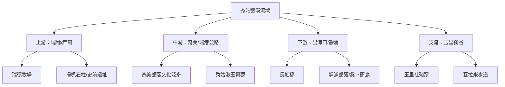

# 秀姑巒溪流域探索計劃

秀姑巒溪是台灣東部最大的河流，也是唯一一條切穿海岸山脈的河流，孕育了深厚的阿美族文化與壯麗的峽谷地景。本計劃將透過 4 日的深度行程，系統化地從上游牧場、中游峽谷部落，一直探索到太平洋的出海口。

## 🗺️ 空間資產與地圖 (GIS Assets)

- **流域地圖**: [開啟 WalkGIS 秀姑巒溪探索地圖](?map=20260316_xiuguluan_river)
- **Google My Maps**: [秀姑巒溪 My Maps 互動地圖](https://www.google.com/maps/d/edit?mid=17hhScs-HmTm50lLK25y941a4XAxHQ3U&usp=sharing)
- **KML 下載**: [秀姑巒溪整合資產包 (KML)](/walkgis_prj/data/2026台灣河流探索/秀姑巒溪/秀姑巒溪.kml)

---

## 🗓️ 行程規劃 (Itinerary)

### Day 1: 上游文史與牧場之旅 (瑞穗/舞鶴)
探訪河谷平原的畜牧產業與史前遺跡，並深入舞鶴台地的茶香文化。
- [🚗 今日導航連結](https://www.google.com/maps/dir/%E7%91%9E%E7%A9%97%E7%89%A7%E5%A0%B4/%E5%90%89%E8%92%蒸%E7%89%A7%E5%A0%B4/%E7%91%9E%E7%A9%97%E5%B8%82%E5%8D%80/%E8%88%9E%E9%B6%B4%E8%A7%80%E5%85%89%E8%8C%B6%E5%9C%92/%E6%8E%83%E5%8F%AD%E7%9F%B3%E6%9F%B1/%E6%8E%83%E5%8F%AD%E9%9A%A7%E9%81%93/%E7%91%9E%E7%A9%97%E6%BA%AB%E6%B3%89)
- **重要景點**: 瑞穗牧場、吉蒸牧場、掃叭石柱、瑞穗溫泉。

### Day 2: 橫切海岸山脈 - 峽谷與部落之旅 (奇美)
沿著秀姑巒溪切穿山脈的軌跡，體驗最古老的阿美族部落文化與峽谷奇石。
- [🚗 今日導航連結](https://www.google.com/maps/dir/%E7%91%9E%E7%A9%97%E6%B3%9泛%E8%88%9F%E6%9C%8D%E5%8B%99%E4%B8%AD%E5%BF%83/%E7%91%9E%E6%B8%AF%E5%85%AC%E8%B7%AF/%E5%A5%87%E7%BE%8E%E9%83%A8%E8%90%BD/%E7%A7%80%E5%A7%9B%E6%BC%B1%E7%8E%89/%E9%95%B7%E8%99%B9%E6%A9%8B)
- **重要景點**: 瑞穗泛舟服務中心、奇美部落 (Tatadok 體驗)、秀姑漱玉、長虹橋。

### Day 3: 出海口生態與海岸線 (靜浦/豐濱)
抵達河流與海洋的交會點，探索傳統漁獵智慧與壯麗的海蝕地景。
- [🚗 今日導航連結](https://www.google.com/maps/dir/%E9%9D%9C%E6%B5%A6%E6%9D%91/%E7%8D%85%E7%90%83%E5%B6%BC/%E7%9F%B3%E6%A2%AF%E5%9D%AA/%E6%9C%88%E6%B4%9E%E9%81%8A%E6%86%A9%E5%8D%80/%E6%96%B0%E7%A4%BE%E6%A2%AF%E7%94%B0)
- **重要景點**: 靜浦部落、奚卜蘭島、石梯坪、月洞奇觀、新社海梯田。

### Day 4: 縱谷稻香與支流探源 (玉里)
回到花東縱谷的核心，沿著支流拜訪稻米之鄉與日治時期的開拓足跡。
- [🚗 今日導航連結](https://www.google.com/maps/dir/%E7%8E%89%E9%87%8C%E7%81%AB%E8%BB%8A%E7%AB%99/%E7%8E%89%E9%87%8C%E7%A5%9E%E7%A4%BE%E9%81%BA%E5%9D%80/%E7%8E%89%E9%87%8C%E6%9D%BE%E6%B5%A6%E5%A4%A9%E5%A0%82%E8%B7%AF/%E7%93%A6%E6%8B%89%E7%B1%B3%E5%B1%B1%E5%B1%8B)
- **重要景點**: 玉里車站 (玉里麵)、玉里社殘蹟、松浦天堂路、瓦拉米步道口。

---

## 📜 歷史與證據補充 (Historical Evidence)

根據《台灣通史》及《撫墾志》記載，秀姑巒溪流域自古即為原漢交界與拓墾重鎮。

- **掃叭石柱**: 位於舞鶴台地，為新石器時代巨石文化之遺物，象徵早期人類對河谷高地的佔據。
- **瓦拉米步道**: 原為日治時期「八通關越嶺道」東段，沿著支流拉庫拉庫溪，見證了理蕃政策與山區開發。
- **奇美部落**: 為阿美族發展史中的重要發源地之一，其泛舟與河流互動的方式完整保留了生態智慧。

---
*數位紀錄：全台河流探索計畫 - 秀姑巒溪卷 (2026-03-16)*
