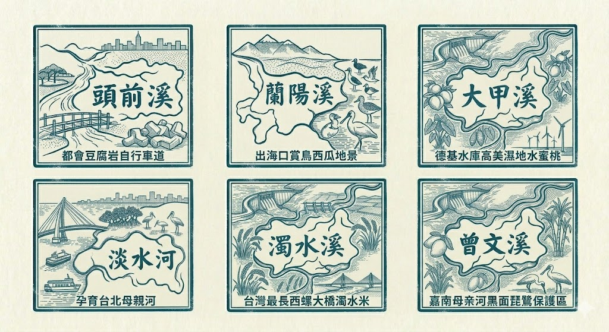
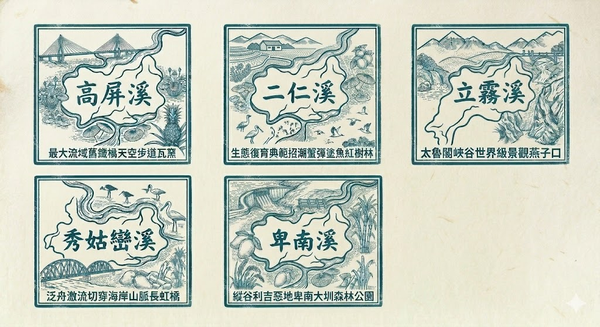

> **哈爸筆記**：
> 在與朋友閒聊間，我們突發奇想：如果每個流域都有專屬的印章，當我們抵達流域的關鍵景點時，若能將「流域圖章」與「景點實體章」重疊蓋出，那會是一副多麼動人的「齊縫章」？主要是 AI 做的圖章雖然漂亮，但畢竟不是真的印章，做印章太麻煩也無法證明到此一遊。所以結合實體景點的蓋章，用齊縫章的型態來證明，確實在流域裡面。

## 🎨 設計基因：復古版畫風

這次的設計任務交給了新出的 **nano banana 2** (Gemini 3)。經過一番溝通，我們定調了這套印章的「設計基因」：

1.  **統一外形**：矩形框體，呈現復古郵票或藝術藏書票的質感。
2.  **統一視角**：純平面的印章蓋印效果。
3.  **統一視覺**：深青色（Teal Blue）單色墨水，保留古樸的版畫雕刻紋理。
4.  **內容架構**：以流域寫實地圖形狀為主體，書法感流域名稱順流排列，背景點綴代表性的生態或地標。

## 🌊 穿越 11 個流域的設計旅程

雖然 nano banana 2 的品質與精細度令人驚豔，但過程並非一帆風順。它在生成過程中犯了不少「小錯誤」——像是流域名稱重複、漏掉某些河流，或是位置配置失靈。經過數輪「砍掉重練」與精確修正，最終補齊了 11 個流域。

### 第一張：核心與長流
1.  **淡水河**：都會核心，綴以夕陽與紅樹林意象。
2.  **蘭陽溪**：平原沃土，融入西瓜田與冬山河地景。
3.  **頭前溪**：新竹門戶，呈現豆腐岩與科技都會。
4.  **大甲溪**：水力資源，德基水庫與高美濕地的融合。
5.  **濁水溪**：台灣之長，西螺大橋與濁水米的象徵。
6.  **曾文溪**：嘉南之母，曾文水庫與黑面琵鷺的守護。

### 第二張：南疆與縱谷
7.  **高屏溪**：流域之冠，舊鐵橋與斜張橋的壯闊。
8.  **二仁溪**：復育典範，白砂崙濕地與招潮蟹的重生。
9.  **立霧溪**：世界峽谷，太魯閣與九曲洞的深邃。
10. **秀姑巒溪**：海岸瑰寶，泛舟激流與長虹橋的動感。
11. **卑南溪**：縱谷平原，利吉惡地與活水湖的自然。

## 🖨️ 從螢幕走進現實

目前這 11 個印章已經合併成兩頁 A4 大小並印出。拿在手上的質感，完全超乎了當初在對話框中看到的樣子。

這套印章接下來將跟著我們的河流走查行程，在台灣各個角落「落地生根」。當你看到我們在河畔蓋章時，那蓋下的不僅是墨水，更是我們對這片土地、這些流水的情感與紀錄。

PS: nano banana2 號稱改善的字糊糊的問題，似乎還不是那麼完美！

---

**準備好出發了嗎？下一個蓋章點，就在那條流動的溪畔。**
