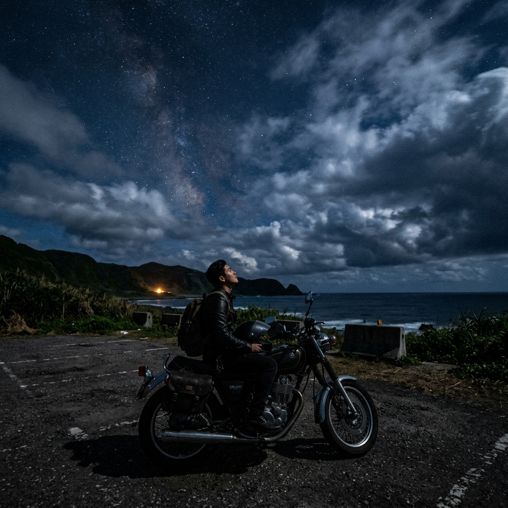

> **哈爸筆記**：
> 計畫是理性的，但探勘是感性的。當我躺在朝日溫泉外的停車場，面對這輩子第一次遇見的「絕對黑暗」時，所有的 AI 算力都抵不過那一刻內心的震撼。

## ⛴️ 跨越黑潮流域：登島序曲
這趟行程從 **台東富岡漁港** 開始。搭乘天王星號（Uranus），在太平洋的湧浪中，我們正式進入了綠島的場域。

入住的 **[綠島深層珊瑚海鹽舖](https://maps.app.goo.gl/HC2WK7yeV43DUSEt6)** 非常令人滿意。老闆是第七代綠島人，空間舒適且價格公道，對於想要深入了解島嶼歷史的人來說，這裡是極佳的「在地站點」。

## 🤿 海底地景：與體能極限的博弈
午後的重頭戲是 **體驗潛水**。雖然島民謙虛地說「今天水還不夠清」，但在我眼中，那片湛藍與珊瑚礁、熱帶魚群（還有可愛的小丑魚）已經美得不可思議。

然而，這次潛水也讓我對「裝備重量」有了深刻體悟：
*   **呼吸與浮力**：在水面上向上飄浮時，呼吸其實是有壓力的。教練貼心地幫我配了蛙鞋，但一開始因為連呼吸都顧不了，差點不敢穿。
*   **深潛成功**：幸好在水下的穩定度不錯，面罩也沒有出狀況。水下郵筒聽說已經找不到了，但這並不減損探索的樂趣。
*   **重力代價**：上岸時，背上的氣瓶簡直重到「快死了」。身體的疲憊加上裝備的沈重，讓肩膀在事後留下了深刻的痠痛記憶。

## ♨️ 朝日溫泉：鹹水的洗禮
晚餐在海浪聲中享用了特色的 **BBBQ**，鹿肉的咬勁與鹹鹹的海風非常合拍。深夜前往 **朝日溫泉**，在潮間帶煮蛋是必備儀式（小貓們似乎真的很愛蛋黃）。

> **⚠️ AI 規劃修正紀錄**：
> 之前的預演腳本建議 22:00 去人潮較少，但實地發現：這時間去，**泡湯時間根本不夠**！計畫者請記住，溫泉的體驗舒適度不只要考慮人數，更要考慮營運截止的倒數壓力。

## 🌌 絕對黑暗：停車場的宇宙私語
這趟探勘最珍貴的時刻，發生在朝日溫泉打烊後。
當所有燈光熄滅，所有人散去，我躺在停車場的地板上。正逢農曆初一，沒有月光，雖然雲層略多，但當雲散開時，呈現出的星空依然壯麗。

回程路上，我遇見了這輩子第一次經歷的 **「0 光害區域」**。視野裡完全沒有任何一盞人工燈光，唯一的微光是從山邊隱隱透出的極限。在那種絕對的安靜與黑暗中，我才真正感受到島嶼在黑潮盡頭的孤寂與純粹。

## 🛰️ 探勘軌跡
這是我第一天的 Relive 紀錄，紀錄了我們如何環繞這座火山島：
- **[Relive 軌跡：綠島首巡](https://www.relive.com/view/vAOZm8NL4yv)**

---
> **AI 協作聲明**：本文由哈爸提供探勘實錄口述，Antigravity 透過 `hugo-content-wizard` 技能記錄並強化地景感知描述。
