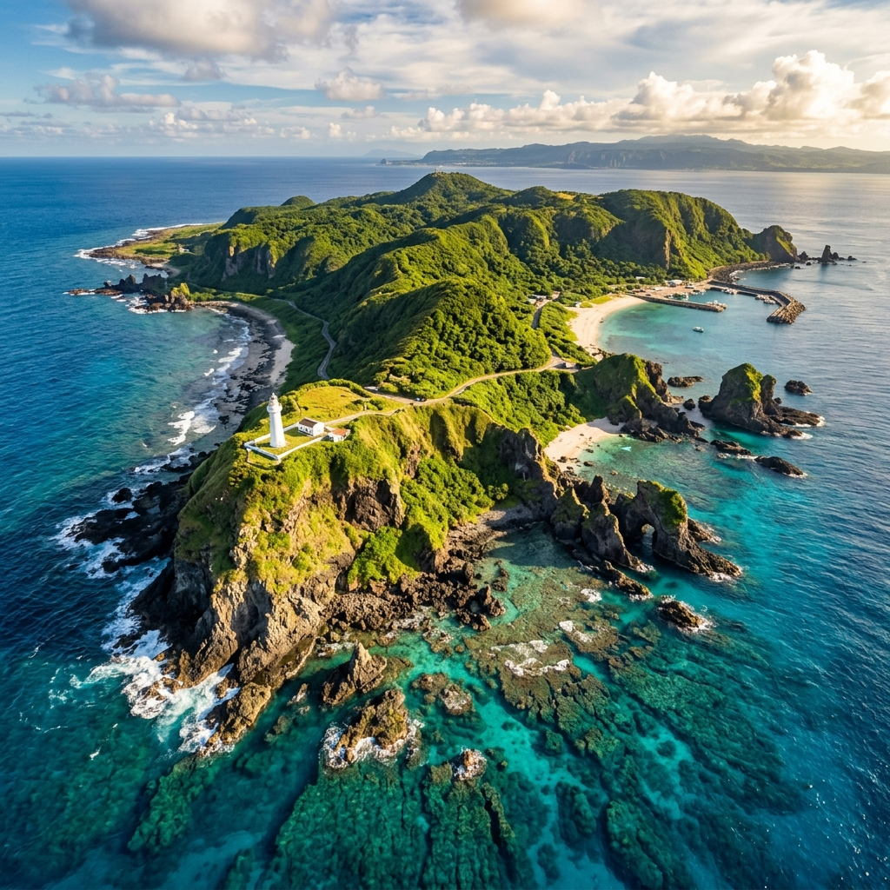

> **哈爸筆記**：
> 結束了南迴跨域的本島段，卑南溪探索的層次隨即向太平洋延伸。綠島，這座千萬年前由火山噴發而成、靜臥在黑潮之上的孤島，不僅是海洋與陸地的邊界，更是觀察「大水營力」塑造地球臉孔的最佳實驗場。

## 📍 為什麼要去綠島「探索流域」？
雖然綠島缺乏大型淡水河流，但在「廣義流域」的視角下，綠島提供了極佳的對照組：
1.  **地層對比**：海岸山脈的火山碎屑岩與綠島的安山岩有著共同的「火之序曲」。
2.  **海洋邊界**：卑南溪出海後的沙與水，最終會遇上這道黑潮高牆。在船程中觀察水的色澤變化，本身就是一種大尺度探勘。
3.  **生態微流域**：在水下珊瑚礁與潮間帶平台中，水流的動態決定了生物的定居邏輯。

## 🗓️ 兩天一夜：AI 賦能的動態調研
這次規劃採用了「極速 AI 調合」法，在出發前一小時，將航班、潮汐、開放時間與探索標記點快速縫合。

### **重點行程規劃：**
*   **深度解碼**：優先入訪 **白色恐怖紀念園區**。在沈重的歷史高牆與壯麗的火山岩景交疊間，體會地景與人權的雙重座標。
*   **深藍接觸**：於柴口進行 **浮潛探勘**。我們不只是看繽紛的魚群，更要觀察微孔珊瑚礁如何在地質年代中生長，並在海流導航下觀察水下地景。
*   **極境療癒**：夜晚與清晨的 **朝日溫泉**。那是地球內部熱能與海水交織的聲音，是地質與液態能結合的終極體驗。

---

## 🧭 地圖對合亮點
我已將 2D1N 的詳細計畫同步至專案資料夾。這不只是一份遊玩導航，而是一份「地景調研計畫」。

*   **牛頭山**：俯視崩塌地景與植被演替。
*   **哈巴狗與睡美人**：火成岩受海蝕營力切割出的殘留形態解碼。
*   **綠島燈塔**：感知太平洋門戶的數位座標中心。

---
**AI 協作聲明**：本文計畫由哈爸發起需求，Antigravity 透過 Gemini 2.0 模型進行實時路徑優化與地景知識厚化。
