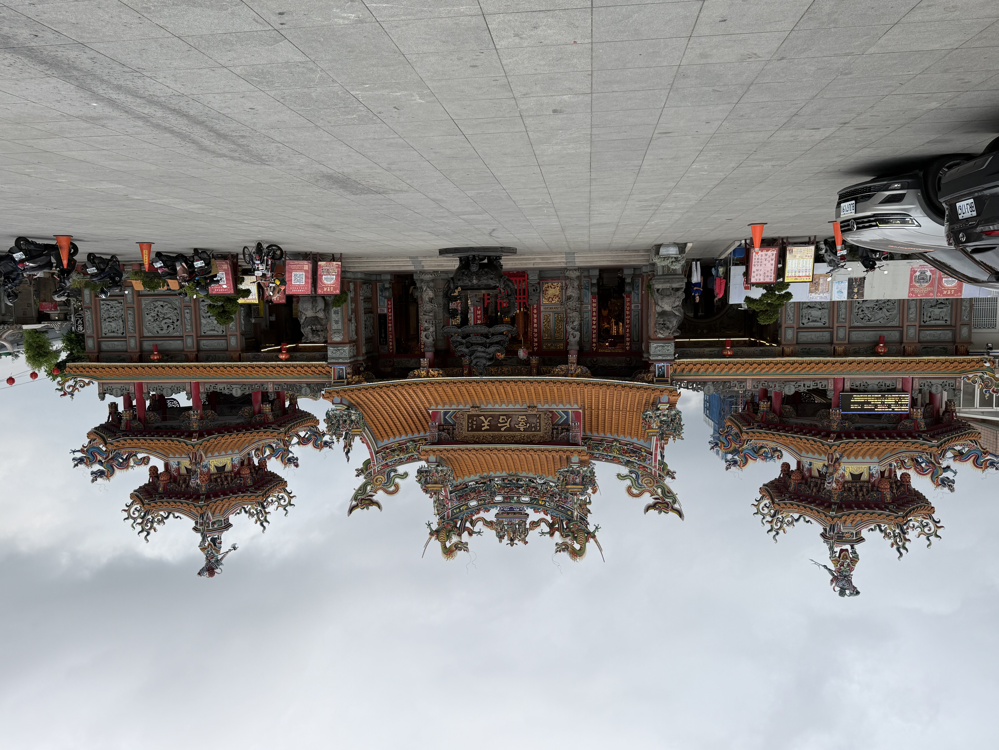

> **哈爸筆記**：
> 走進一座百年古廟，如果只是拜拜就太可惜了。真正的探索者會去讀牆上的碎裂石碑、抬頭看那些蒙塵的匾額。在那裡，你會發現官方歷史課本裡沒寫的「現場證言」。

這次參訪 **台東天后宮**，我特別針對現場幾處關鍵的碑文與匾額進行了「影像解碼」。透過 AI 的文字辨識與歷史對合，我們整理出了一幅跨越 130 年的後山生命圖譜。

## 📍 解謎一：消失的「昭格」？實物勝於雄辯
在許多官方導覽手冊中，都會提到光緒皇帝御賜的匾額名為**「靈昭昭格」**。但當你在現場抬頭仰望時，會發現那塊蓋有「光緒御筆之寶」御璽的匾額，寫的清清楚楚是：

> **「靈」、「昭」、「誠」、「佑」**

這是一個極其迷人的「歷史斷層」。可能是因為清代翰林院書寫時的作業差異，或是與其他天后宮匾額名的混淆，這塊 **〈靈昭誠佑〉** 匾額用實物告訴我們：現場探勘永遠具備修正歷史描述的力量。

## 📍 解謎二：大庄事件的血淚證言
在廟內牆上一組被水泥補丁修復的石碑群中，我們讀到了 **〈埤南天后宮碑記〉**。這不是一般的勸募清單，而是一份驚心動魄的戰爭實錄：

*   **光緒 14 年 (1888) 的「大庄事件」**：當時清軍在卑南被圍困、水源斷絕且敵方發起火攻。
*   **靈泉湧出**：碑文生動描述了副將萬國本向媽祖祈禱後，竟然「湧泉溢出」，解救了清軍的乾渴與危機。
*   **官廟地位**：這座廟是由當時清軍最高長官萬國本帶頭「捐俸」興建的。萬國本個人就捐了 **800 兩銀子**，這在當時是一筆驚人的政治與情感投資。

## 📍 解謎三：從「搬家」看台東地殼動態
石碑中也解開了天后宮位置變遷的謎團。現在位於中華路的建築，其實是 **1933 年 (民國 22 年)** 完工的。
原本的清代舊廟在 **1930 年的大地震** 中嚴重傾斜受損，這才促成了後來的遷移與重建。這說明了天后宮的地景演變，始終與台灣的地殼動態緊密結合。

## 📍 解謎四：跨越時空的「朋友圈」
匾額上掛著的不同落款，展示了這座廟強大的社會吸納力：
*   **清領時期**：萬國本的〈靈助北彈〉。
*   **日治時期**：能高團棒球推手 **林桂興** 敬獻的〈恩德齊天〉。
*   **現代連結**：北港朝天宮的〈東邑傳香〉到賴清德總統的〈后澤佑民〉。

---

## 🧭 探索者小結
台東天后宮不只是一座宗教建築，它是一份存放在石頭與木頭上的「台東履歷表」。從平定變亂的神蹟感念，到地震後的集體重建，再到現代政治領袖的致意，這座廟透過匾額與碑文，默默紀錄了這片土地每一次的轉折與重生。

下次經過這裡，別忘了抬頭多看一眼那塊「寫錯名字」的皇帝匾，那是歷史最真實的呼吸聲。

## 📸 現場實錄
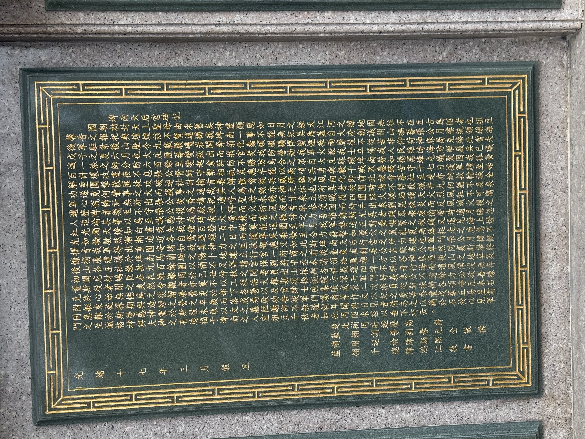
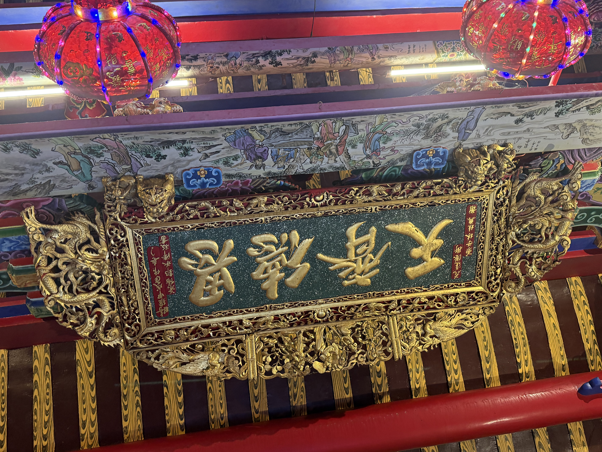
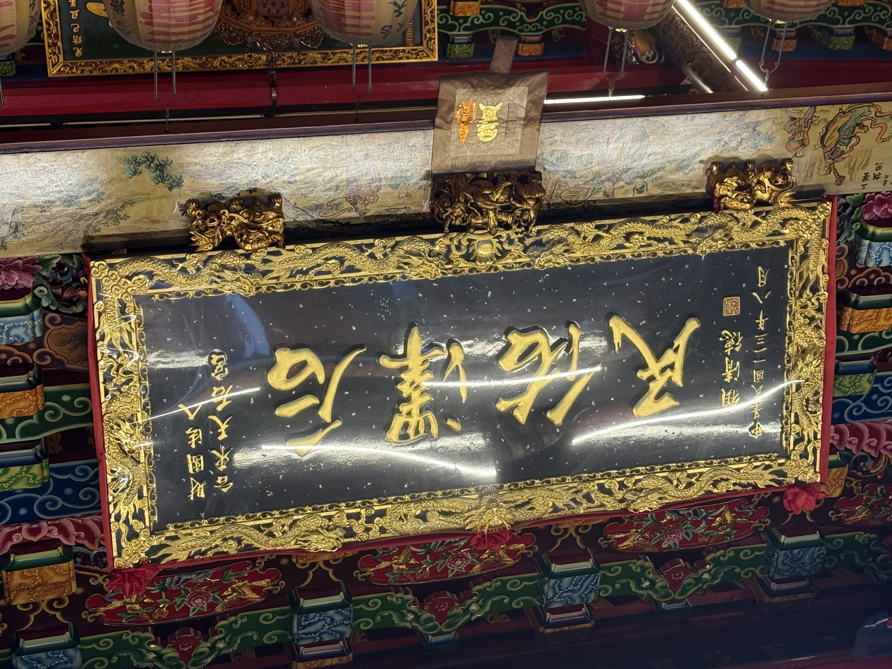
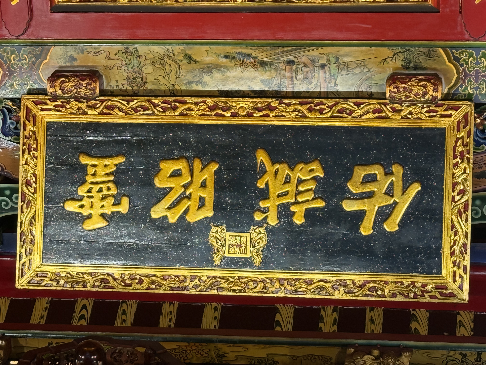
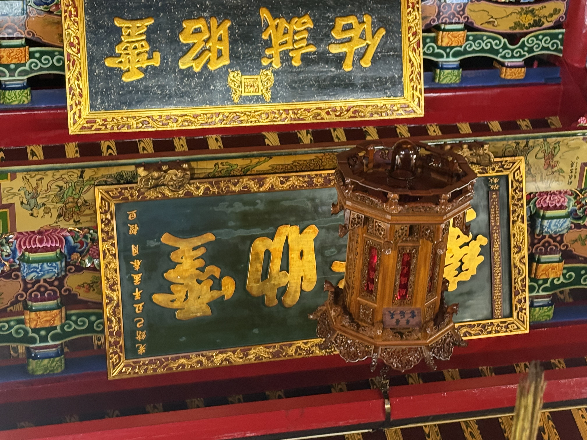
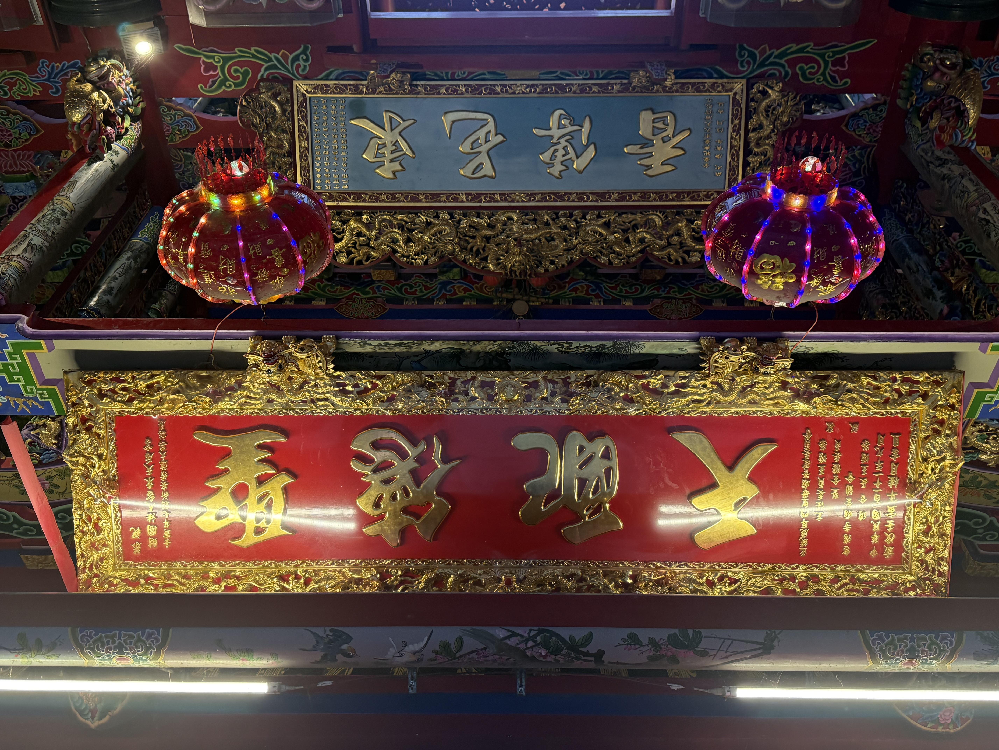
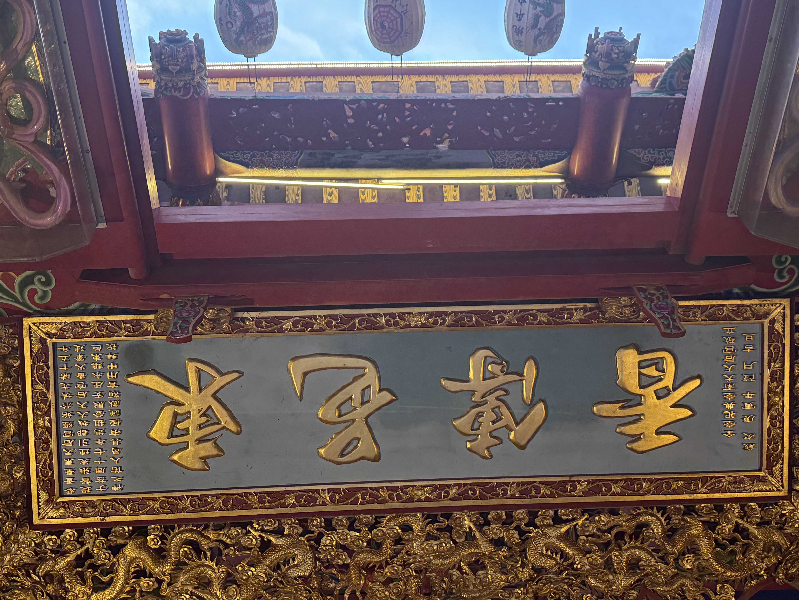
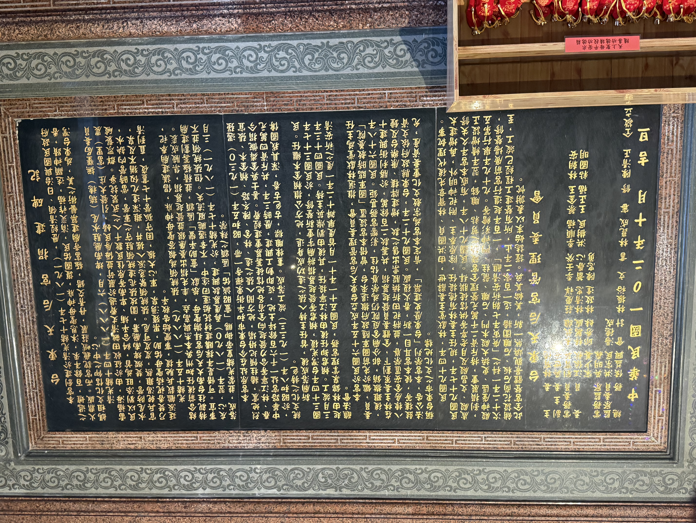
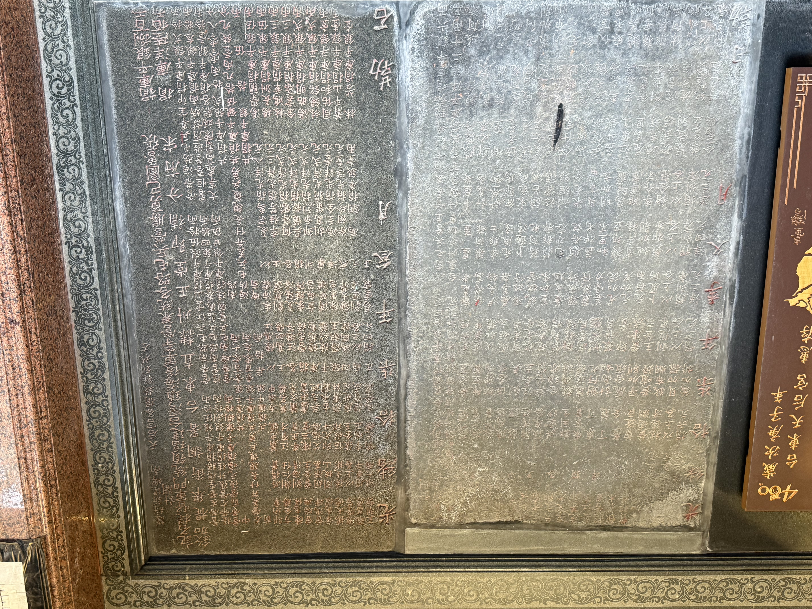
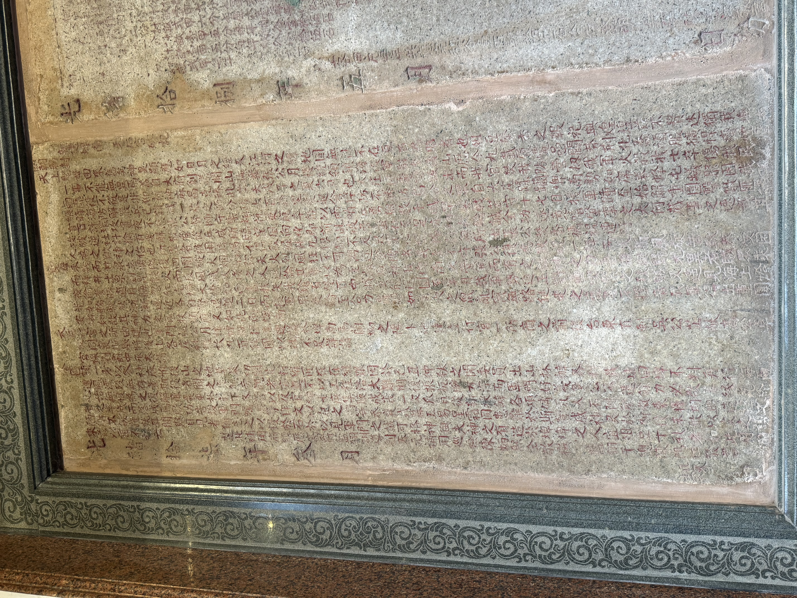
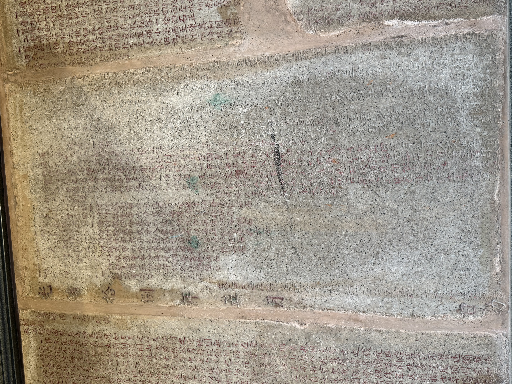
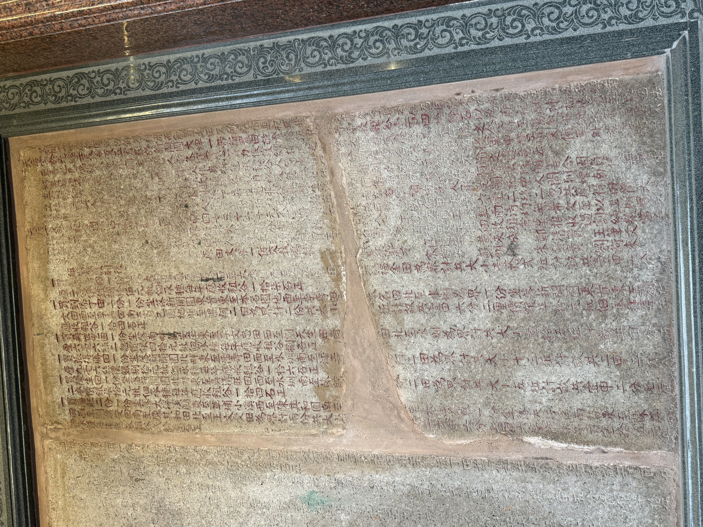

---
> **AI 協作聲明**：本文由哈爸現場採樣與分析引導，Antigravity 透過 `hugo-content-wizard` 技能將原始探勘紀錄轉化為結構化之歷史地景解碼專文。
