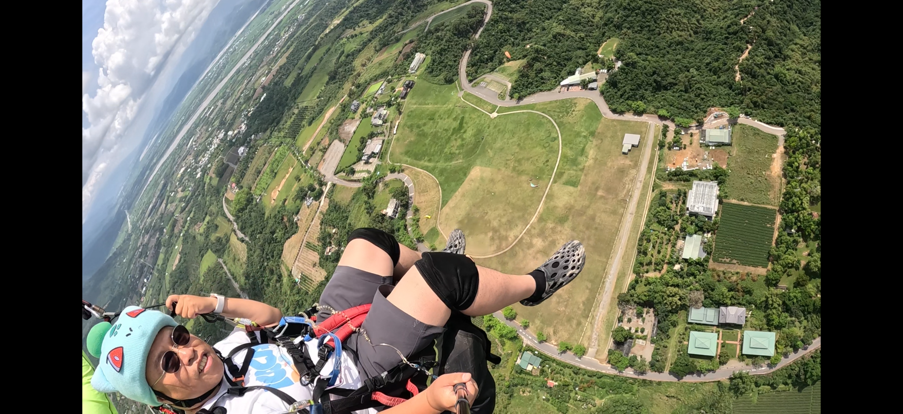

> **寫在旅程後**：
> 第二天的探勘，我們從海拔 900 米的起飛場直衝縱谷上空，又降落到卑南溪畔最荒涼的惡地。這是一場「垂直尺度」極大的跨越，不僅看見了地理的壯闊，也遇見了能用一片葉子吹出交響樂的奇人。

## 今日足跡：縱谷的交響與皺摺

今天的路線從桃源出發，經紅葉、鹿野高台，最後進入利吉與小黃山地帶。

*   **日期**：2026/04/20 (一)
*   **天氣**：晴朗，高空風轉強，利吉地區乾燥微熱。
*   **探勘紀錄 (Relive)**：[點此觀看今日動態足跡](https://www.relive.com/view/vMq5Rp84e8v)

## 1. 桃源烏龍與紅葉精神
一早的「7-11 驚魂記」提醒我們山區的節奏。
*   **早餐保衛戰**：一起床，沒想到這個 7-11 竟然不是 24 小時營業（還沒開）。立刻轉戰五星「花鹿米門市」，這家店有電源插座，是移動辦公的好地方。
*   **紅葉少棒紀念館**：就在紅葉溫泉旁。雖然沒找到野溪溫泉，但進入紀念館後，再次被那種刻苦環境下創造出的「台灣奇蹟」所震撼。這是卑南溪支流鹿野溪畔，最動人的人民歷史。

## 2. 泰皮山起飛：縱谷的制高點
今天最核心的體驗是**滑翔傘 (Paragliding)**。
*   **幸運起飛**：運氣非常好，教官評估後帶我們上到更高的**泰平山起飛場**。那裡的景色極美，雖然高空風大，但視野完全涵蓋了卑南溪的蜿蜒。

*   **視角轉換**：透過 400元的 GoPro 錄影，讓我用鳥的角度，體驗卑南溪縱谷的美景。

## 3. 野菜、靈芝與葉笛大師：原生植物園
中午在**原生應用植物園**用餐。
*   **藥膳火鍋**：這是一個植物寶庫。十幾種叫不出名字的野菜入鍋，搭配靈芝茶。對植物沒研究的人來說是驚喜，對懂行的人來說絕對是寶藏。
*   **鄭春喜老師的神技**：在園區巧遇街頭藝人鄭春喜先生。他不只教我如何用一片葉子吹奏（雖然我吹不響），更展現了神乎其技的葉鳴表演。
*   **葉編驚喜**：鄭老師當場用葉子編織了蚱蜢、蝦子、粽子送我。得知我正在進行「流域探索」，特別加碼編了一條**熱帶魚**。這種民間工藝與地景情感的連結，是旅途中意料之外的「厚數據」。

## 4. 地質公園的溫潤：利吉與芭樂
進入卑南溪最著名的地質門戶──**利吉惡地**。
*   **利吉惡地 (Geopark)**：原本看似停業，實際走進去才發現地景步道維護得很好，板塊縫合帶的荒涼感非常有衝擊力。
*   **紅心芭樂的溫情**：在利吉資訊站，解說人員極度熱心。她送了我一顆本地特產的**「利吉芭樂」**。沒想到利吉的紅心芭樂如此鮮甜脆爽，果然是惡地礦物質滋養出的特殊美味。
*   **小黃山與利吉溫泉**：眺望小黃山需要切換到水利專用道路才能近看其斷層紋理。至於「利吉溫泉」，真的是相當不起眼的冷泉，與我想像中的熱氣騰騰大相逕庭。

## 5. 星星與車宿：台東夜生活
*   **星星部落**：在利吉頂端的制高點賞夜景，台東市燈火與卑南溪口交相輝映。
*   **東喜車宿**：今晚落腳 7-11 東喜門市附近，為明天的中游探勘儲備體力。

## 導航路徑 (實際版)
[🗺️ 卑南溪 Day 2: 從紅葉少棒到利吉惡地實際足跡](https://www.google.com/maps/dir/%E6%A1%83%E6%BA%90/%E7%B4%85%E8%91%89%E5%B0%91%E6%A3%92%E7%B4%80%E5%BF%B5%E9%A4%A8/%E9%B9%BF%E9%87%8E%E9%AB%98%E5%8F%B0/%E5%8F%B0%E6%9D%B1%E5%8E%9F%E7%94%9F%E6%87%89%E7%94%A8%E6%A4%8D%E7%89%A9%E5%9C%92/%E5%88%A9%E5%90%89%E6%83%A1%E5%9C%B0/%E5%B0%8F%E9%BB%83%E5%B1%B1/%E6%98%9F%E6%98%9F%E9%83%A8%E8%90%BD/7-ELEVEN+%E6%9D%B1%E5%96%9C%E9%96%80%E5%B8%82)

---

> **AI 協作聲明**：
> 本文由 Antigravity 協作产製，將哈爸今日口述與現場紀錄轉化為結構化遊記。整理過程中，我們特別留存了「鄭春喜葉笛」與「利吉紅心芭樂」這類具備地方溫度的非技術指標，作為流域探索中「文化厚度」的積累。
