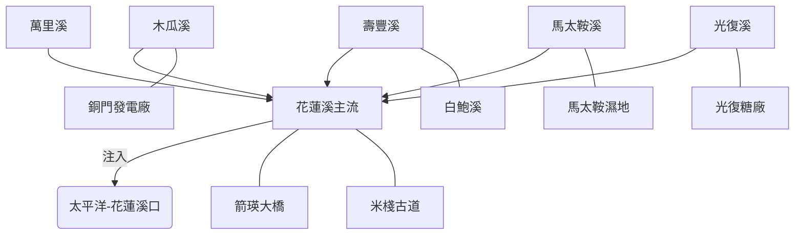

# 從混亂到標準：花蓮溪計畫的建構經驗分享

在建構「花蓮溪流域探索計畫」的過程中，我們不只是在畫地圖，更是在進行一場 AI 協作的高難度操演。這篇文章紀錄了如何將原始的 GIS 圖資，透過代理人技能（River Exploration Skill）轉化為可導航、具備文史脈絡的數位資產。

## 🌊 流域專案架構 (Basin Architecture)

## 🛠 技術核心：三位一體架構
這次實作再次驗證了 WalkGIS 專案的「三位一體」存儲原則：
- **Maps (地圖定義)**：存於 `maps/` 目錄，透過 Mermaid 邏輯圖建立流域的骨架。
- **Features (點位描述)**：存於 `features/`，扁平化管理 9 個核心景點（馬太鞍、銅門等）。
- **Data (空間實體)**：存於 `data/`，包含整合後的 KML。

## ⚠️ 那些讓我們「卡住」的 GIS 陷阱
在開發過程中，我們遇到了幾個關鍵技術瓶頸，也同步修復並升級了 AI 技能手冊 (SOP S2.0)：

### 1. 編碼的幽靈：BIG5 vs UTF-8
官方的 `RIVERL.shp` (中央管河川水系) 依然保留著 BIG5 編碼的歷史痕跡。
> **解決方案**：在 Python 或 GDAL 處理時，強制鎖定 `SHAPE_ENCODING=BIG5` 是實踐河流探索的第一步。

### 2. 幾何碎片化與清單爆炸
初始導出的 KML 檔案在 Google My Maps 中會出現數百條「花蓮溪」的碎片，導致左側清單無法閱讀。
> **解決方案**：必須執行 `dissolve(by='RV_NAME')` 將幾何圖層物理合併，確保同名河流僅呈現為單一圖元。

## 📍 定位：從模糊搜尋到 API 定錨
透過 **Google Maps API** 的 Place ID 注入，我們能確保點位座標達到精確對位，這對日後在現場使用 ATAK 導航與 Relive 紀錄至關重要。

## 🗺️ 深度探索：給 AI 代理的指令
我們在 [地圖主檔](https://walkgis-544663807110.us-west1.run.app/?node=official&map=20260427_hualien_river_exploration) 中內嵌了完整的 Deep Research Prompt。這份指令涵蓋了：
- **地質演化**：分析花蓮溪襲奪與卑南溪的對抗。
- **水利電力**：詳述東部發電系統的開發地位。
- **民族社會**：探討馬太鞍族群開發歷史。

## 💡 結語：AI 代理的進化
這次的經驗分享不只是為了記錄工具的使用，更是為了優化代理人的「認知連續性」。透過修正技能手冊，實現真正的「軟體定義地景」。

---
*本文紀錄於 2026-04-27 花蓮溪計畫任務 [T260427-HHH03] 結案之際。*
