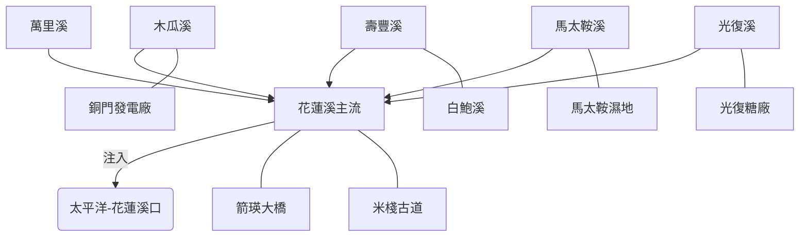

# 花蓮溪流域探索計畫

## 🌊 計畫概述
花蓮溪作為台灣東部最重要的中央管河川之一，其特殊的地質演化歷史（河川襲奪導致的斷頭河現象）與豐富的原住民遷徙史，使其成為「河流深度走讀」的絕佳場域。本計畫旨在透過數位圖資整備，重構花蓮溪的時空紋理。

## 🗺 空間邏輯與架構
本流域計畫採用 Open Data 與本地圖資進行動態重建，核心水文架構如下：

## 📍 核心探索點位 (Core POIs)
目前已完成第一階段定位與資產建立：
1. **花蓮溪口 (七七高地)**：觀察洄瀾壯麗景觀與濕地生態。
2. **馬太鞍濕地**：深入了解阿美族 Palakaw 生態捕魚智慧。
3. **箭瑛大橋**：感念鳳林在地精神的人文地標。
4. **木瓜溪電力系統**：探索日治時期東部電力的搖籃。

## 🛠 數位資產說明
- **KML 地圖**：`static/walkgis_prj/data/2026_hualien_river_full.kml`
- **互動地圖 (Google My Maps)**：[2026台灣河流探索-花蓮溪](https://www.google.com/maps/d/edit?mid=1FjTWECjGJk5U7GCOCfi2I5pb4AeeOxI&usp=sharing)
- **點位資料庫**：已產製 9 個符合 WalkGIS 規範之 Feature Markdown。

---
*本計畫由 BMAD-PA 代理系統自動化生成與持續更新。*
