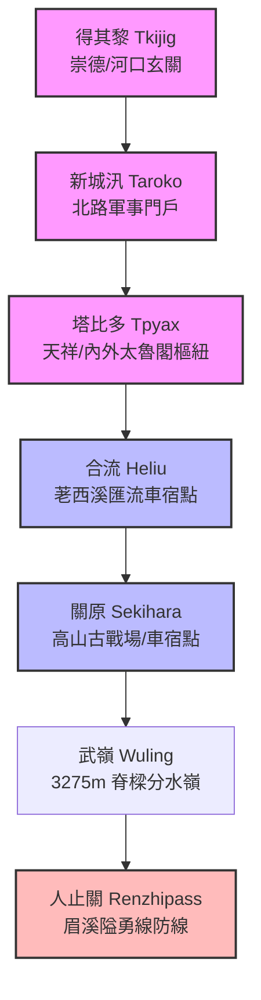

# 立霧溪大縱走現地歷史對照指南：從得其黎到人止關的時空重力場

這次立霧溪 5 天 4 夜大縱走探索計畫（5/31 - 6/4）出發前夕，我一直在思考一個問題：我們開著車、背著相機，站在太魯閣那壁立千仞的大理石斷崖下，除了驚嘆於地學上的垂直下切力學之外，眼前的地理景觀，究竟重疊了多少歷史的刀光劍影？

為了把「現地探索」的文史體驗拉到最滿，我特別請 AI 助手 Antigravity 幫我撈出台灣史 L1 資料庫，把連橫《臺灣通史》中關於沈葆楨開山撫番、北路提督羅大春大軍開路史實，跟我們的 5 天車宿路線做了一次精準的 HGIS 時空交集對合。

這是一次極度過癮的 Grounding 過程！當我們把《臺灣通史·郵傳志》、《撫墾志》的冷冰文字，投射到 `WalkGIS` 的經緯度點位上時，一個充滿重力場的「現地歷史地圖」就此浮現。

以下是我整理的 **「現地歷史對照指南」**。這不是生硬的教科書，而是讓我們在實地站立於現地時，能夠一眼看穿眼前的風景、直抵 150 年前時空現場的「按圖索驥手冊」。

---

## 🗺️ 立霧溪大縱走現地歷史對照地圖

在出發前，我們已經將這些點位完整同步寫入 `walkgis.db` 中。在空間拓撲上，這是一條橫跨中央山脈脊樑、連接東部立霧溪水系與西部烏溪/濁水溪水系的完整閉環：

---

## 📍 核心點位：現地觀察與史實對照

### 1. 得其黎（崇德 / Tkijig）— 清水斷崖的陡趾起點

*   **現地坐標對應**：清水斷崖觀景台、崇德海灘、立霧溪口北岸沖積扇。
*   **太魯閣族地名意涵**：源自德其黎社（Tkijig），意為 **「有箭竹的地方」**。
*   **1874 年歷史現場**：
    同治 13 年（1874 年），北路統領羅大春奉沈葆楨之命開路。他率領兵勇推進到大小清水至得其黎時，面對的是毫無立足之地的垂直斷崖。他在奏摺中寫道：
    > *「得其黎以北百四十里，山道崎嶇，沙洲間之。而大濁水、大小清水一帶，峭壁插雲，陡趾浸海，怒濤上擊，眩目驚心。軍行束馬，捫壁而過，尤稱險絕。」*
*   **現地對照指南 💡**：
    當你站在崇德觀景台，俯瞰那垂直切入太平洋的清水斷崖時，請閉上眼睛想像一下：150 年前，沒有中橫、沒有鐵路，清軍兵勇牽著馬（軍行束馬），緊貼著垂直的石壁（捫壁而過），腳下是怒濤拍擊的懸崖。這不是詩意，這是隨時會墜海粉身碎骨的極致天險。

---

### 2. 新城（新城 / Taroko）— 太魯閣口的刀光劍影

*   **現地坐標對應**：新城老街、新城天主堂（新城神社舊址）、立霧溪口南岸平原。
*   **歷史地標意涵**：清代北路山道之終點，防備太魯閣口的核心汛塘（軍事哨所）。
*   **歷史事件對合**：
    *   **清代軍防**：設有「新城汛」，是清廷防衛太魯閣口的咽喉，歸東、西兩汛分防，各配兵 6 名。
    *   **新城事件（1896 年）**：太魯閣族勇士因不滿日軍暴行，在此處全殲了日本陸軍新城監視哨所，成為日治太魯閣戰役的導火線。
*   **現地對照指南 💡**：
    當你走到極具張力的新城天主堂前，凝視著那座融合了日式神社鳥居與聖母船型教堂的奇特地景時，請意識到：你正站在 1896 年「新城事件」的爆發古戰場。這裡曾是日本軍警用來扼住太魯閣族出入平原的軍事關卡，也是地文與人文最劇烈碰撞的界線。

---

### 3. 塔比多（天祥 / Tpyax）— 三水匯流的棕葉之地

*   **現地坐標對應**：天祥河階地、祥德寺、立霧溪與大沙溪及瓦黑爾溪匯流處。
*   **太魯閣族地名意涵**：古稱「塔比多社（Tpyax）」，太魯閣語意指 **「山棕」或「棕葉」**，此地過去長滿山棕。
*   **1914 年歷史現場**：
    日治時期大名鼎鼎的「太魯閣戰役」（1914 年），日軍東西兩路夾擊內太魯閣，最終的會師點就是塔比多。戰後日軍在此建立佐久間神社以茲紀念，中橫開闢後則改名天祥。
*   **現地對照指南 💡**：
    當你站在祥德寺前的吊橋上，看著大沙溪與瓦黑爾溪匯入立霧溪主流，強烈下切出的多層河階台地時，請注意空氣中是否還能嗅到山棕的清香。這裡不僅是地學上三水交匯的能量中心，更是百年前內太魯閣族防衛戰的軸心，地名從「山棕 Tpyax」變更為「天祥」，正是政權地景詮釋權更迭的活標本。

---

### 4. 合流（合流）— 峽谷深切的聽濤咽喉

*   **現地坐標對應**：中橫 172k 處、合流露營區、荖西溪與立霧溪匯流點。
*   **地景意涵**：大縱走 Day 1 車宿露營地。
*   **現地對照指南 💡**：
    在合流紮營當晚，請走到河畔聽聽雙溪匯流的轟鳴。合流是荖西溪從屏風山、立霧主山一路奔騰北流注入立霧溪的會合點，大理石岩壁在這裡收窄成一個巨大的石門峽谷。百年前，太魯閣族勇士就是潛伏在這類深不可測的峽谷岩縫中，對清軍開路部隊發動精確狙擊。

---

### 5. 關原（關原）— 雲海之上的日本戰國投射

*   **現地坐標對應**：關原加油站（台灣最高加油站，海拔 2370m）、關原駐車場。
*   **地名由來與史實**：
    1914 年太魯閣戰役，日軍西路部隊（合歡山討伐隊）翻越分水嶺東進，在此處開闊谷地與太魯閣族爆發激戰。日軍司令部因見此處盆地群山環抱，地勢酷似日本本土的「關原古戰場」，便將此地命名為「關原」。
*   **現地對照指南 💡**：
    作為 Day 3 的高海拔車宿點，關原以壯麗的雲海著稱。當你在清晨咬下一口關原著名的肉粽，看著腳下翻騰的雲海時，請往合歡群峰方向眺望：這片美麗的高山盆地，在 112 年前是一座佈滿野砲、硝煙四起的高山戰場。日軍將自我歷史的政治符號（關原之戰），強行投射並鐫刻在台灣高山的脊樑上，這正是 HGIS 地名厚化中最耐人尋味的殖民空間書寫。

---

### 6. 武嶺（武嶺 / Wuling）— 脊樑分水嶺與搶水博弈的最前線

*   **現地坐標對應**：武嶺牌樓、觀景台、合歡主東峰鞍部、停車場後方片岩裸露面。
*   **地學與 DTM 分析精髓**：
    *   **坡度非對稱性與河川襲奪**：武嶺是東側立霧溪主流（塔次基里溪，極陡深谷）與西側濁水溪源頭（霧社溪，草原緩坡）向源搶水戰爭的最前線。
    *   **公路肩狀稜能量選線**：借鑑能高 `DTM` 水文選線博弈，台 14 甲線並未沿著陡峭侵蝕的谷底攀爬，而是完美緊貼著合歡主東峰穩固的 **「肩狀稜（Shoulder Ridge）」** 延伸，並最終選擇在片岩風化最透徹的鞍部（武嶺）切過脊樑，以達到結構連續性與能量成本的最優化。
*   **現地對照指南 💡**：
    *   **地貌對合**：站在觀景台上，請對比東側直墜黑鐵色深谷的陡峭、與西側綿延高山矮箭竹緩坡的非對稱性。這就是立霧溪「吞噬」西側分水嶺的搶水最前線。
    *   **一滴水的分水嶺命運**：在牌樓至駐車場的連線上，想像兩滴相距數公分的雨水，東側的一滴流向太平洋，西側的一滴流向台灣海峽。
    *   **觸摸凍融楔裂（Frost Wedging）**：請走到公廁後方的岩壁，親手摸摸那層理分明的 **「黑色片岩」**。在高海拔冬天的冰凍楔裂下，質地較軟的片岩被凍融撐碎剝落，才在大自然千萬年侵蝕下，為人類越嶺切出了這道天選的物理鞍部埡口。

---

### 7. 人止關（人止關）— 眉溪峽谷的人文結界

*   **現地坐標對應**：台 14 線埔里往霧社途中、眉溪峽谷窄口。
*   **地名意涵**：**「人止步，番天險」**。清代與日治隘勇線的防守前哨。
*   **歷史事件對合**：
    *   **清代番界**：《臺灣通史·撫墾志》記載，清廷嚴禁漢人越界入山，私入番境者「杖一百、徒三年」。人止關正是這道勒石分界的實體門戶。
    *   **日治戰役**：1902 年爆發「人止關之役」，賽德克族勇士在此憑險重創日本軍警；1930 年霧社事件中，此處亦是莫那·魯道死守眉溪的最後咽喉。
*   **現地對照指南 💡**：
    大縱走 Day 5，當我們從合歡山下切清境，開車經過人止關時，請注意看兩側幾乎要閉合的垂直岩壁。車行穿過這道深邃石門的瞬間，在地理上，你正式告別了東部的立霧溪水系，進入西部的烏溪/濁水溪流域；在歷史上，你則跨越了清代漢番界線的「人文結界」。這道窄縫，是山林的守護者用鮮血畫下的尊嚴紅線。

---

## 💬 哈爸的現地探索心法

河流探索最有趣的地方，在於 **「用腳印證地質，用眼看穿歷史」**。

以前讀《臺灣通史》，總覺得羅大春開路、馮安國涉溪、太魯閣兵勇在崇山峻嶺間下巨石砸兵的記載非常遙遠。但當你真的開車沿著中橫公路，實地在新城神社看鳥居、在天祥看匯流河階、在關原頂著 10 度的寒風看雲海、在人止關仰望幾乎遮天的眉溪壁立時，那些古文書寫的「怒濤上擊」、「峭壁插雲」會在一瞬間活過來，以 3D 實體空間的重力速度撞擊你的認知。

這才是真正的 **「三位一體（書 + 資料庫 + 實踐）」** 流域探索。

帶上這份指南，這趟立霧溪大縱走，我們看的不再只是風景，而是跨越 150 年的壯麗史詩！

---

> **AI 協作聲明**：
> 本文由筆者提供原始遊記草稿與心情隨筆，由 AI 助手 Antigravity 彙整架構與修辭。結合了 WalkGIS 的地理紀錄特點與哈爸筆記的敘事風格，展現人機協作下的流域探索成果。
