# 解碼水利署官方資料：淡水河水系拓樸的 Python 萃取與 Mermaid 樹狀視覺化實踐

在河流地學與 GIS 探索中，理解一條大河的「水系拓樸（River Network Topology）」是核心基石。拓樸關係告訴我們哪條溪是主流，哪條是支流，水流又是如何從小溪匯入大河，最終流向大海的。這不僅是空間幾何，更是史前先民定居、現代水利發電與防洪工程設計的底層邏輯。

為了取得最權威的拓樸定義，我找到了經濟部水利署（WRA）公佈的 [《台灣地區河川拓樸（112 年）》官方 PDF](https://gweb.wra.gov.tw/Hydroinfo/ExDoc/%E5%8F%B0%E7%81%A3%E5%9C%B0%E5%8D%80%E6%B2%B3%E5%B7%9D%E6%8B%93%E6%A8%B8(112%E5%B9%B4).pdf)。然而，這份權威的資料僅以 PDF 表格形式存在，且在機器讀取時存在許多格式斷線與字元夾雜的坑。

這篇筆記記錄了我如何透過 Python 撰寫對合腳本，從二進位 PDF 中萃取出乾淨的樹狀結構，並以 Mermaid 語法自動繪製出淡水河完整流向拓樸的實踐過程。

---

## 🛠️ 技術挑戰與解題思路

PDF 格式本質上是為了「視覺排版」而非「數據讀取」設計的，因此在進行數據萃取時，我們遇到了三個主要的實作挑戰：

### 挑戰 1：跨行文字斷線（Line-wrapping）
在 PDF 轉換為純文字時，部分較長的河川名稱（例如：`鶯歌溪(兔子坑溪排水)`、`暖暖溪（含東勢坑溪）`）會因為表格寬度限制而被強行折行：
```text
鶯歌溪(兔子坑溪排
水) 114012 0@114000@114010@114012 Q16929506
```
這導致正則表達式在匹配時，會把第一行漏掉，而第二行則只匹配到 `水)` 作為河川名稱。
* **解法**：在 Python 迴圈中建立一個 `prefix` 快取區。如果某一行沒有匹配到標準的代碼與拓樸格式，且結尾不是數字，就將其暫存為 `prefix`，並在下一行成功匹配時將其拼接回去。

### 挑戰 2：Unicode 正則匹配 bug（中文與拓樸代碼混淆）
水利署的拓樸路徑是用 `@` 符號串接河川代碼（例如：`0@114000@114010@114011`），而部分欄位結尾會黏連著中文備註，如 `0@114000@114010@114011@11401C二鬮溪`。
在 Python 3 中，正則表達式 `\w` 預設會匹配 Unicode 字符（包括中文字）。因此 `[\d@\w]+` 會直接將 `二鬮溪` 誤判為拓樸路徑的一部分。
* **解法**：將拓樸路徑的正則規則從 `[\d@\w]+` 剛性限制為英數與 `@` 符號 `[0-9a-zA-Z@]+`。這能精確截斷拓樸邊界，並將剩餘的 `二鬮溪` 作為別名（Alias）自動括號歸併入河川名稱中，形成 `麻園溪(二鬮溪)`。

### 挑戰 3：過濾表格頁首雜訊
PDF 跨頁時會重複出現表頭資訊，如 `河川名稱 河川 代碼 河川拓樸`，這些非數據行如果不進行清洗，會被誤判為斷線名稱。
* **解法**：在快取過濾中增加黑名單判斷，凡是包含「代碼」、「拓樸」、「維基」等字眼的行，一律跳過，不寫入 `prefix` 快取。

---

## 💻 核心 Python 萃取腳本

以下是我們在本地 `scratch` 中運行並驗證通過的數據處理代碼片段：

```python
import pypdf
import re
import json

# 1. 使用 pypdf 提取關鍵字頁面
reader = pypdf.PdfReader("wra_river_topology_112.pdf")
# 匹配規則：名稱 (Group 1)、代碼 (Group 2)、拓樸 (Group 3)、維基數據 (Group 4)
pattern = re.compile(r"^(.+?)\s+([A-Za-z0-9]+)\s+([0-9a-zA-Z@]+)(?:\s+(Q\d+))?")

river_list = []
prefix = ""

for page in reader.pages:
    lines = page.extract_text().split("\n")
    for line in lines:
        line = line.strip()
        if not line or "河川" in line or "代碼" in line or line.isdigit():
            continue
            
        match = pattern.match(line)
        if match:
            name = (prefix + match.group(1).strip()).strip()
            remaining = line[match.end():].strip()
            if remaining:
                name = f"{name}({remaining})"  # 合併如二鬮溪等別名
                
            prefix = ""
            code = match.group(2).strip()
            topology = match.group(3).strip()
            
            # 僅提取淡水河水系 (代碼 114 開頭)
            if code.startswith("114"):
                river_list.append({
                    "name": name,
                    "code": code,
                    "topology": topology
                })
        else:
            if not re.search(r'\d+$', line):
                prefix = line
```

---

## 🌊 淡水河水系拓樸分析報告 (官方數據還原)

經過 Python 腳本的精確解析，我們成功重建了淡水河（代碼 `114000`）的完整拓樸樹。

### 1. 水系樹狀階層結構
*   **淡水河** (代碼: `114000`, 拓樸: `0@114000`)
    *   **大漢溪** (代碼: `114010`, 拓樸: `0@114000@114010`)
        *   **三峽溪** (代碼: `114011`, 拓樸: `0@114000@114010@114011`)
            *   **大豹溪** (代碼: `11401B`, 拓樸: `0@114000@114010@114011@11401B`)
            *   **麻園溪(二鬮溪)** (代碼: `11401C`, 拓樸: `0@114000@114010@114011@11401C`)
            *   **中埔溪** (代碼: `11401D`, 拓樸: `0@114000@114010@114011@11401D`)
            *   **竹崙溪** (代碼: `11401E`, 拓樸: `0@114000@114010@114011@11401E`)
            *   **竹坑溪** (代碼: `11401F`, 拓樸: `0@114000@114010@114011@11401F`)
            *   **橫溪** (代碼: `11401G`, 拓樸: `0@114000@114010@114011@11401G`)
        *   **鶯歌溪(兔子坑溪排水)** (代碼: `114012`, 拓樸: `0@114000@114010@114012`)
        *   **塔寮坑溪排水** (代碼: `114013`, 拓樸: `0@114000@114010@114013`)
        *   **塔克金溪** (代碼: `114014`, 拓樸: `0@114000@114010@114014`)
        *   **三光溪** (代碼: `114015`, 拓樸: `0@114000@114010@114015`)
        *   **泰崗溪** (代碼: `114016`, 拓樸: `0@114000@114010@114016`)
        *   **白石溪(薩克雅尖溪)** (代碼: `114017`, 拓樸: `0@114000@114010@114017`)
        *   **玉峰溪(馬里闊丸溪)** (代碼: `114018`, 拓樸: `0@114000@114010@114018`)
        *   **永福溪幹線** (代碼: `114019`, 拓樸: `0@114000@114010@114019`)
        *   **街口溪幹線** (代碼: `11401A`, 拓樸: `0@114000@114010@11401A`)
        *   **觀音溪幹線** (代碼: `11401H`, 拓樸: `0@114000@114010@11401H`)
        *   **三坑溪幹線** (代碼: `11401I`, 拓樸: `0@114000@114010@11401I`)
        *   **打鐵溪幹線** (代碼: `11401J`, 拓樸: `0@114000@114010@11401J`)
        *   **二坪溪幹線** (代碼: `11401K`, 拓樸: `0@114000@114010@11401K`)
    *   **新店溪** (代碼: `114020`, 拓樸: `0@114000@114020`)
        *   **南勢溪** (代碼: `114021`, 拓樸: `0@114000@114020@114021`)
            *   **桶後溪** (代碼: `11402A`, 拓樸: `0@114000@114020@114021@11402A`)
            *   **軋孔溪** (代碼: `11402P`, 拓樸: `0@114000@114020@114021@11402P`)
            *   **大羅蘭溪** (代碼: `11402Q`, 拓樸: `0@114000@114020@114021@11402Q`)
        *   **北勢溪** (代碼: `114022`, 拓樸: `0@114000@114020@114022`)
            *   **後寮溪** (代碼: `11402B`, 拓樸: `0@114000@114020@114022@11402B`)
            *   **溪尾寮溪** (代碼: `11402C`, 拓樸: `0@114000@114020@114022@11402C`)
            *   **坪溪** (代碼: `11402D`, 拓樸: `0@114000@114020@114022@11402D`)
            *   **灣潭溪** (代碼: `11402E`, 拓樸: `0@114000@114020@114022@11402E`)
            *   **金瓜寮溪** (代碼: `11402F`, 拓樸: `0@114000@114020@114022@11402F`)
            *   **石硿子溪** (代碼: `11402G`, 拓樸: `0@114000@114020@114022@11402G`)
            *   **後坑溪** (代碼: `11402H`, 拓樸: `0@114000@114020@114022@11402H`)
            *   **𩻸魚堀溪** (代碼: `11402O`, 拓樸: `0@114000@114020@114022@11402O`)
        *   **景美溪** (代碼: `114023`, 拓樸: `0@114000@114020@114023`)
            *   **烏塗溪** (代碼: `11402I`, 拓樸: `0@114000@114020@114023@11402I`)
            *   **指南溪** (代碼: `11402J`, 拓樸: `0@114000@114020@114023@11402J`)
            *   **老泉溪** (代碼: `11402K`, 拓樸: `0@114000@114020@114023@11402K`)
            *   **無名溪** (代碼: `11402L`, 拓樸: `0@114000@114020@114023@11402L`)
            *   **中間溪** (代碼: `11402M`, 拓樸: `0@114000@114020@114023@11402M`)
            *   **永定溪** (代碼: `11402N`, 拓樸: `0@114000@114020@114023@11402N`)
        *   **青潭溪** (代碼: `114024`, 拓樸: `0@114000@114020@114024`)
    *   **基隆河** (代碼: `114030`, 拓樸: `0@114000@114030`)
        *   **暖暖溪（含東勢坑溪）** (代碼: `114031`, 拓樸: `0@114000@114030@114031`)
        *   **大武崙溪** (代碼: `114032`, 拓樸: `0@114000@114030@114032`)
        *   **拔西猴溪** (代碼: `114033`, 拓樸: `0@114000@114030@114033`)
        *   **瑪陵坑溪** (代碼: `114034`, 拓樸: `0@114000@114030@114034`)
        *   **友蚋溪** (代碼: `114035`, 拓樸: `0@114000@114030@114035`)
        *   **保長坑溪** (代碼: `114036`, 拓樸: `0@114000@114030@114036`)
        *   **茄苳溪** (代碼: `114037`, 拓樸: `0@114000@114030@114037`)
        *   **禮門溪** (代碼: `114038`, 拓樸: `0@114000@114030@114038`)
        *   **智慧溪** (代碼: `114039`, 拓樸: `0@114000@114030@114039`)
        *   **北港溪** (代碼: `11403A`, 拓樸: `0@114000@114030@11403A`)
        *   **康誥坑溪** (代碼: `11403B`, 拓樸: `0@114000@114030@11403B`)
        *   **下寮溪** (代碼: `11403C`, 拓樸: `0@114000@114030@11403C`)
        *   **大坑溪排水** (代碼: `11403D`, 拓樸: `0@114000@114030@11403D`)
        *   **四分溪** (代碼: `11403E`, 拓樸: `0@114000@114030@11403E`)
        *   **草濫溪** (代碼: `11403F`, 拓樸: `0@114000@114030@11403F`)
        *   **內溝溪排水** (代碼: `11403G`, 拓樸: `0@114000@114030@11403G`)
            *   **安泰溪** (代碼: `11403R`, 拓樸: `0@114000@114030@11403G@11403R`)
        *   **雙溪** (代碼: `11403H`, 拓樸: `0@114000@114030@11403H`)
            *   **內雙溪** (代碼: `11403S`, 拓樸: `0@114000@114030@11403H@11403S`)
            *   **外雙溪** (代碼: `11403T`, 拓樸: `0@114000@114030@11403H@11403T`)
            *   **猴洞坑溪** (代碼: `11403U`, 拓樸: `0@114000@114030@11403H@11403U`)
        *   **磺溪** (代碼: `11403I`, 拓樸: `0@114000@114030@11403I`)
        *   **磺港溪** (代碼: `11403J`, 拓樸: `0@114000@114030@11403J`)
        *   **貴子坑溪** (代碼: `11403K`, 拓樸: `0@114000@114030@11403K`)
        *   **石厝坑溪** (代碼: `11403L`, 拓樸: `0@114000@114030@11403L`)
        *   **拔下二溪** (代碼: `11403M`, 拓樸: `0@114000@114030@11403M`)
        *   **關渡溪** (代碼: `11403N`, 拓樸: `0@114000@114030@11403N`)
        *   **深澳坑溪排水** (代碼: `11403O`, 拓樸: `0@114000@114030@11403O`)
        *   **大內坑溪排水** (代碼: `11403P`, 拓樸: `0@114000@114030@11403P`)

### 2. Mermaid 水文流向圖 (由上游流向下游)

我們利用 `graph BT`（Bottom-Up，底端至頂端）繪製，能完美還原支流匯入主流、最終流向淡水河主流口的水文向心性：

- [用 mermaid.live 線上查看](https://mermaid.live/edit#pako:eNqdmFtPG0cUx78K2qdEAoR3jW8PlcDmfg0hL62ryioORAoXuSC1RUhEjUNcm0uA2sXgUpcGhInBxE4wBsyXYfbylH6EzpndZHZsrFbH8oON__s7s2fOnPNfFqXvZyfCkk-ajITmppo6x4MzTfQ19p3D4WxztH0TlMjfR-r1X2ol1_TA_NvDoPRtU0tLy1eWqg1U6kVWLZTU90VT1cZUAstBVXflGCnecJajltU4osDqNFX6-SVXddaxGkYUWH6qMipXZG-Tqh7cVRLGu1P66aF1gR-JDTBVnuxvc1UAyeqiKu3kkpR2uKoLyeq2WJk3XNWNZPXAxh-fcEkPEiTDHnw8U_MJ2AMS3Sb5DXOF6tomravPmyEj60UBVXabnJ3aqZZcQUKdFjQaN1ZsyXQice1WpqIxrmpHslywMcUCKaW4yoVkuaFgdm60_SLsjZ48hhvejZJC0nZK3Ei4B-BrtDwKADcO3xkrCSP16125bIN7kHAvZKFQ1g7XqYpcXmoXaUvrRRI7qErPpsj6QS2xA0nsBeLRssGyKxB7kcQ-q45YoQvEPiSxH_IY2zI2PtQS-5HEAVhjJUEyuVriAI4osxmULJAKr3gZOalk6FlkNUXiPKJcN6kaRxRYUDFq9iOpJriqrlYaRxRYo1ArV3GS5yNFHkWyHplZ1apR_fc8Fz5C4qCBk4SokpEpY8O9mqDNmqvqhnvjiAILhjuUWKEq4PxIHAx1s2gtSQAJYhP9xYF6Y8t9F5IFE51OIG1rT7jHbiQOhjpt9lr2lg5hLuxB4nqt3bT5DbkXyRqhqn-Or8pGPk3-XObKESQPbIG6c6ZV17hKQVYttF3tl3WStanqGm7jiAKLNdzECj12XNWPZEGr1ZdfqEVuK-QBJGsQ7vFllmysctUgkjVk-mMjucVVQ0jWsDnoyWmaq4aRLHB1RmZTOJlOXE0obHTtV4z0qy_jRkEOJQX6sJpOwruS-3T9mmycqJlzWuDmyfp0HbMC1E2qxssQAsjWnM0f2p8zFBmJY9mOb-tvb7VEieMUJA62RXuTM3Y-2DuJ4kTiwGyT9biejnNWO5IFZvvuNmP8diEszYXEgd_WEy_1eJGz3EgWs9eHp0aSN0vFg2QxN71TUaNHnOVFsjrM9qyWzzirA8lidqFyoefeCunvROL8rC_F7aNU8SNZAfNI1T9zKgEkEXwD2d0lr1_x1XUhWeAb9NWYessf4JVuJAtMA4HKyNTeaQ-SOAaq05jKngwt1Vgd6z_iCkRwIsaurbX1Ipf22AwqsB7Xse4PJ4DGWX0kBdU4BvQEzjlts6U_hDPwBMNiRuagwiV9yDT1WyD7Ie9HspiLeV_68m8hSziAxA2aHpesZQTcIBI3ZM462jboQy3HDSFxYGeM1J5aznLWMJI1wszFuVot3tOFRpDQUauvRe9rbaP_Hyo1S5ORZxOS72no-Q_hZmk6HJkOwXdpEeIFpfmp8HQ4KPnox4nw09DC8_mgFJxZotfNhWa-np2dlnzzkQV6ZWR2YXLq85eFuYnQfDjwLDQZCXFFeGYiHPHPLszMSz7Z62QIybco_Sj5WqjjUlqpG5RdTsXpddEff5J8LrnV7Wr3yI52h-J20vdSs_Qzi-ltVTyK26E4HF6vS_F4nEv_AhePMS4)：

- 看起來，很多小溪沒弄進去。不知道這跟縣市管河川有沒有關係。

```mermaid
graph BT
    R_114010["大漢溪 (114010)"] ---> R_114000["淡水河 (114000)"]
    R_114011["三峽溪 (114011)"] ---> R_114010["大漢溪 (114010)"]
    R_11401B["大豹溪 (11401B)"] ---> R_114011["三峽溪 (114011)"]
    R_11401C["麻園溪(二鬮溪) (11401C)"] ---> R_114011["三峽溪 (114011)"]
    R_11401D["中埔溪 (11401D)"] ---> R_114011["三峽溪 (114011)"]
    R_11401E["竹崙溪 (11401E)"] ---> R_114011["三峽溪 (114011)"]
    R_11401F["竹坑溪 (11401F)"] ---> R_114011["三峽溪 (114011)"]
    R_11401G["橫溪 (11401G)"] ---> R_114011["三峽溪 (114011)"]
    R_114012["鶯歌溪(兔子坑溪排水) (114012)"] ---> R_114010["大漢溪 (114010)"]
    R_114013["塔寮坑溪排水 (114013)"] ---> R_114010["大漢溪 (114010)"]
    R_114014["塔克金溪 (114014)"] ---> R_114010["大漢溪 (114010)"]
    R_114015["三光溪 (114015)"] ---> R_114010["大漢溪 (114010)"]
    R_114016["泰崗溪 (114016)"] ---> R_114010["大漢溪 (114010)"]
    R_114017["白石溪(薩克雅尖溪) (114017)"] ---> R_114010["大漢溪 (114010)"]
    R_114018["玉峰溪(馬里闊丸溪) (114018)"] ---> R_114010["大漢溪 (114010)"]
    R_114019["永福溪幹線 (114019)"] ---> R_114010["大漢溪 (114010)"]
    R_11401A["街口溪幹線 (11401A)"] ---> R_114010["大漢溪 (114010)"]
    R_11401H["觀音溪幹線 (11401H)"] ---> R_114010["大漢溪 (114010)"]
    R_11401I["三坑溪幹線 (11401I)"] ---> R_114010["大漢溪 (114010)"]
    R_11401J["打鐵溪幹線 (11401J)"] ---> R_114010["大漢溪 (114010)"]
    R_11401K["二坪溪幹線 (11401K)"] ---> R_114010["大漢溪 (114010)"]
    R_114020["新店溪 (114020)"] ---> R_114000["淡水河 (114000)"]
    R_114021["南勢溪 (114021)"] ---> R_114020["新店溪 (114020)"]
    R_11402A["桶後溪 (11402A)"] ---> R_114021["南勢溪 (114021)"]
    R_11402P["軋孔溪 (11402P)"] ---> R_114021["南勢溪 (114021)"]
    R_11402Q["大羅蘭溪 (11402Q)"] ---> R_114021["南勢溪 (114021)"]
    R_114022["北勢溪 (114022)"] ---> R_114020["新店溪 (114020)"]
    R_11402B["後寮溪 (11402B)"] ---> R_114022["北勢溪 (114022)"]
    R_11402C["溪尾寮溪 (11402C)"] ---> R_114022["北勢溪 (114022)"]
    R_11402D["坪溪 (11402D)"] ---> R_114022["北勢溪 (114022)"]
    R_11402E["灣潭溪 (11402E)"] ---> R_114022["北勢溪 (114022)"]
    R_11402F["金瓜寮溪 (11402F)"] ---> R_114022["北勢溪 (114022)"]
    R_11402G["石硿子溪 (11402G)"] ---> R_114022["北勢溪 (114022)"]
    R_11402H["後坑溪 (11402H)"] ---> R_114022["北勢溪 (114022)"]
    R_11402O["𩻸魚堀溪 (11402O)"] ---> R_114022["北勢溪 (114022)"]
    R_114023["景美溪 (114023)"] ---> R_114020["新店溪 (114020)"]
    R_11402I["烏塗溪 (11402I)"] ---> R_114023["景美溪 (114023)"]
    R_11402J["指南溪 (11402J)"] ---> R_114023["景美溪 (114023)"]
    R_11402K["老泉溪 (11402K)"] ---> R_114023["景美溪 (114023)"]
    R_11402L["無名溪 (11402L)"] ---> R_114023["景美溪 (114023)"]
    R_11402M["中間溪 (11402M)"] ---> R_114023["景美溪 (114023)"]
    R_11402N["永定溪 (11402N)"] ---> R_114023["景美溪 (114023)"]
    R_114024["青潭溪 (114024)"] ---> R_114020["新店溪 (114020)"]
    R_114030["基隆河 (114030)"] ---> R_114000["淡水河 (114000)"]
    R_114031["暖暖溪（含東勢坑溪） (114031)"] ---> R_114030["基隆河 (114030)"]
    R_114032["大武崙溪 (114032)"] ---> R_114030["基隆河 (114030)"]
    R_114033["拔西猴溪 (114033)"] ---> R_114030["基隆河 (114030)"]
    R_114034["瑪陵坑溪 (114034)"] ---> R_114030["基隆河 (114030)"]
    R_114035["友蚋溪 (114035)"] ---> R_114030["基隆河 (114030)"]
    R_114036["保長坑溪 (114036)"] ---> R_114030["基隆河 (114030)"]
    R_114037["茄苳溪 (114037)"] ---> R_114030["基隆河 (114030)"]
    R_114038["禮門溪 (114038)"] ---> R_114030["基隆河 (114030)"]
    R_114039["智慧溪 (114039)"] ---> R_114030["基隆河 (114030)"]
    R_11403A["北港溪 (11403A)"] ---> R_114030["基隆河 (114030)"]
    R_11403B["康誥坑溪 (11403B)"] ---> R_114030["基隆河 (114030)"]
    R_11403C["下寮溪 (11403C)"] ---> R_114030["基隆河 (114030)"]
    R_11403D["大坑溪排水 (11403D)"] ---> R_114030["基隆河 (114030)"]
    R_11403E["四分溪 (11403E)"] ---> R_114030["基隆河 (114030)"]
    R_11403F["草濫溪 (11403F)"] ---> R_114030["基隆河 (114030)"]
    R_11403G["內溝溪排水 (11403G)"] ---> R_114030["基隆河 (114030)"]
    R_11403R["安泰溪 (11403R)"] ---> R_11403G["內溝溪排水 (11403G)"]
    R_11403H["雙溪 (11403H)"] ---> R_114030["基隆河 (114030)"]
    R_11403S["內雙溪 (11403S)"] ---> R_11403H["雙溪 (11403H)"]
    R_11403T["外雙溪 (11403T)"] ---> R_11403H["雙溪 (11403H)"]
    R_11403U["猴洞坑溪 (11403U)"] ---> R_11403H["雙溪 (11403H)"]
    R_11403I["磺溪 (11403I)"] ---> R_114030["基隆河 (114030)"]
    R_11403J["磺港溪 (11403J)"] ---> R_114030["基隆河 (114030)"]
    R_11403K["貴子坑溪 (11403K)"] ---> R_114030["基隆河 (114030)"]
    R_11403L["石厝坑溪 (11403L)"] ---> R_114030["基隆河 (114030)"]
    R_11403M["拔下二溪 (11403M)"] ---> R_114030["基隆河 (114030)"]
    R_11403N["關渡溪 (11403N)"] ---> R_114030["基隆河 (114030)"]
    R_11403O["深澳坑溪排水 (11403O)"] ---> R_114030["基隆河 (114030)"]
    R_11403P["大內坑溪排水 (11403P)"] ---> R_114030["基隆河 (114030)"]
```



---

> **AI 協作聲明**：
> 本文由筆者提供原始遊記草稿與心情隨筆，由 AI 助手 Antigravity 彙整架構與修辭。結合了 WalkGIS 的地理紀錄特點與哈爸筆記的敘事風格，展現人機協作下的流域探索成果。中英文與數字間保留半形空格，完美紀錄現場實遊軌跡。
