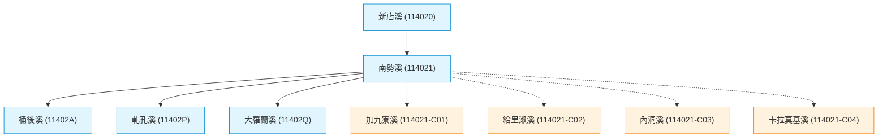

# 建構民間自主水網拓樸：相容水利署官方河川代碼的 WRA-Civ 延伸編碼規範

當我們成功透過 Python 從水利署（WRA）官方 PDF 中萃取出淡水河水系的完整拓樸後，我們發現了一個實踐上的痛點：**官方資料庫中只登錄了達到「中央管河川」或主要排水規模的河段，無數微細的主流源頭、山區溪谷或野溪（如烏來的加九寮溪、給里瀨溪等），在官方拓樸中是完全懸空或付諸闕如的。**

在河流探索中，這些細部小支流往往是現地走讀（如紅河谷步道、哈盆越嶺）最精彩的物理特徵。如果我們想手動補齊這些水網，又不想破壞官方原有的編碼體系，我們需要一套「官方資訊 ＋ 民間資訊」的聯邦式協作方案。

這就是 **「WRA-Civ」延伸編碼規範** 誕生的背景。這套規範將作為我們後續展開全台民間水網拓樸協作的底層依據。

---

## 🔍 拆解水利署（WRA）官方編碼邏輯

要設計延伸方案，必須先徹底理解官方是怎麼編碼的。官方河川代碼固定採用 **6 碼半形英數字**：

*   **第 1 碼 (分區)**：西部河川為 `1`、東部為 `2`。
*   **第 2~3 碼 (流域)**：主幹流域編號，如淡水河為 `14`。
*   **第 4 碼 (預留)**：通常為 `0`。
*   **第 5 碼 (一級分流)**：主流為 `0`，一級支流為 `1~9`（大漢溪為 `1`、新店溪為 `2`、基隆河為 `3`）。
*   **第 6 碼 (次級分流)**：二級及更深層支流以 `1~9` 及大寫英文字母 `A~Z` 輪流編列。

### ⚠️ 官方編碼的兩大天花板：
1.  **代碼用罄衝突**：第 6 碼只有 36 個字元（10 個數字 + 26 個字母）。只要一個分支下的三級、四級支流總數超過 36 條，官方代碼就無法再編列。
2.  **層級無法自指**：因為長度被鎖死在 6 碼，南勢溪二級支流（`114021`）其下的三級支流桶後溪（`11402A`），在代碼結構上看起來與北勢溪（`114022`）是同級的。這種扁平化的代碼設計，強烈依賴 `@` 符號串接的「路徑字串」才能推論階層。

---

## 💡 民間協作延伸方案：WRA-Civ 標準

為了解決上述限制，我們設計了 **WRA-Civ（Water Resources Agency - Civilian）** 編碼規範。核心概念是：**「以官方編碼為根結點，利用符號區隔，進行階層式無限延伸。」**

### 1. 延伸代碼格式
民間自訂的小支流或野溪，代碼格式定義如下：

$$\text{民間代碼} = \text{[官方最鄰近上級河川代碼]} - \text{C} \text{[兩碼流水號]}$$

*   **上級河川代碼**：小支流匯入的官方河川 6 碼代碼。
*   **`-C`**：固定識別字首（Civilian），用以**絕對避開**官方無符號的 6 碼英數格式。
*   **兩碼流水號**：`01` 至 `99`，建議依匯流口由下游往上游的地理順序編列。

#### 實戰範例：南勢溪 (`114021`) 的細部探索
*   **加九寮溪**（匯入南勢溪的第一條民間小支流）：
    *   代碼為：`114021-C01`
*   **給里瀨溪**（匯入南勢溪的第二條民間小支流）：
    *   代碼為：`114021-C02`
*   **加九寮溪的次級小支流**（下探至四級支流）：
    *   代碼向後延伸：`114021-C01-01`

以下為南勢溪流域（官方與民間 WRA-Civ 結合）的最新拓樸結構圖：
- [使用 mermaid.live 視覺化](https://mermaid.live/edit#pako:eNqNk29r01AUxr9KuGOwQVruTW6aNgWhbh-gFV9pZITm3jWYJiVNdFoK-mKIdg6Go5uKfyayibJ1L5yyCvs0Ju2-hTfJ0qQjyPIinOfmPL9zODm3B5q2ToAC1h2t0-Ju31Utjj1NU-t2VwnlbEqNpqGZHDVMU1kgiEqU8F3XsR8SZQEK5bKOrmThsaG7LQV1NqrXIE3jkWEamnUFoZSKBM4gVJKbEOZBYsydNYQwFOB9FQTDU3-8F4y_c0vx2bIKHnCFwq0kCbEk__WeP_iSJqEwKUbF78VFzj_ZD4bnwe4oOHvOLfmjw8nvd8tz5VAWWwtrH_zyL7ZSbC3F5lnqzDL9M_CPd1NL_f-WRtj816PJxeZ0_zh1NXL6D053Lodvkv6nb9_n9V_MzGVtBUazefX57_kHf3SSGU-Bfcpr7JpdYPbJ2eHli63Js2_zduEGdjGsvnkU_Pw47xVv4MXRXz0IBi-n2z_8T-N5Ao4JmZ2brQyfQJKglgT1JGjMVryaQ4jmxmenkBViVuDZmlcBz66ToQOFamaX8KBNnLYWatALa6jAbZE2UYHCQp1QzTNdFahWn_k6mnXPtttAcR2POR3bW28lwuvomktWDY3d1TSDWDpxVmzPcoGCoAgjBlB6YINpoVIsCZIsQYyxDFGFB0-AImChCCWMJCwLqCRBSerz4GlUFRblcrnCTktQlmUsloX-PxZnUk0)

---

### 2. 拓樸路徑（Topology Path）規則
延續水利署以 `@` 符號串接節點的邏輯，將自訂代碼作為新節點，追加於上級官方拓樸路徑之後：

*   **南勢溪官方拓樸**：`0@114000@114020@114021`
*   **加九寮溪自訂拓樸**：`0@114000@114020@114021@114021-C01`
*   **加九寮溪無名支流拓樸**：`0@114000@114020@114021@114021-C01@114021-C01-01`

---

## 🚀 WRA-Civ 方案的分布式協作優勢

這套方案不僅僅為了解決代碼長度，更是為了後續「社群共同維護」所作的架構準備：

1.  **衝突防禦 (100% Safe)**：官方代碼必為 6 碼無符號。自訂代碼內含 `-` 與 `C`。在執行 SQL 查詢、GIS 渲染或代碼解析時，系統能一眼辨識出何為官方資料，何為民間擴充，永不發生覆蓋衝突。
2.  **層級自指 (Self-Documenting)**：從代碼 `114021-C01` 就能直接看出它是南勢溪（`114021`）的子系，無須反查拓樸路徑。
3.  **分布式維護友好**：當不同的河流探索者分頭在不同的流域前線探勘時，比如 A 負責大漢溪，B 負責南勢溪，大家只需各自在其官方父代碼下累加流水號即可。**不需要全局協調代碼分配**，極易進行 Git 版本控制與民間共同編譯。

這套規範已正式收錄於河流探索方法論的編碼參考來源：[Chapter_11_5.md](https://github.com/wuulong/RiverExploration/blob/main/Chapter_11_5.md)。未來，我們在現地探勘時，將利用 WalkGIS 手動紀錄座標、標註 `WRA-Civ` 代碼，並逐步拼接出一幅真正完整、由下而上、融合官民資訊的台灣水網拓樸地圖。

---

> **AI 協作聲明**：
> 本文由筆者提供原始遊記草稿與心情隨筆，由 AI 助手 Antigravity 彙整架構與修辭。結合了 WalkGIS 的地理紀錄特點與哈爸筆記的敘事風格，展現人機協作下的流域探索成果。中英文與數字間保留半形空格，完美紀錄現場實遊軌跡。
