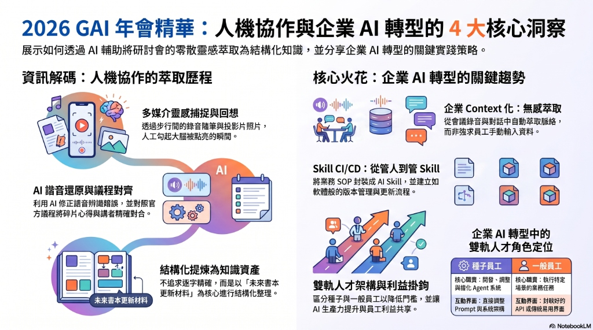

聽完一整天精彩的 2026 生成式 AI 年會，腦子被塞得滿滿的。下巴士走回家的時間中，我發現我正在分享與構思的企業 AI 賦能書，有好多可以修正與補充的點。但因為尊重智財，我沒有現場錄音，原本預期可以用 AI 直接整理現場錄音的方法完全派不上用場。再加上年會的資訊量實在太大，只覺得很豐富、啟發很多，但走出会場後自己幾乎都忘了。

此時的挑戰目標，是如何將腦袋裡被啟發的零散想法萃取出來，變成未來可以修正書本的材料清單。

這篇文章，就是記錄我如何透過人機協作，將這場年會的混亂洞察，萃取成未來書本更新材料的歷程，以及其中幾個點亮我思維的關鍵火花。

- 年會場的精彩議程可以參考官方的 [2026 生成式 AI 年會 Agenda](https://gaiconf.com/agenda)。

- [企業生成式 AI 轉型全書 (Enterprise GenAI Transformation)](https://github.com/wuulong/EnterpriseGenAIAdoption)

---

## 🤝 人機協作的解碼歷程：從金魚腦回想到結構化材料

老實說，因為沒有現場錄音，我的回想與筆記歷程是這樣的：
1. **走回家途中的靈感隨筆**（先錄音）：下巴士走回家的路上，我先對著手機錄下零星的直覺心得。
2. **投影片回放輔助回想**（後錄音）：到家之後，我翻看手機裡拍下的關鍵投影片照片，看著畫面再次勾起被點亮的瞬間，看著投影片講出關鍵啟發並再次錄音。

這兩部分合起來的語音逐字稿非常凌亂，前後句子不連貫，有些講者的名字甚至和洞察對不上（語音辨識還把許多名詞搞錯了，比如將「Context」變成了「看配」、「萃取」變成了「退取」、「林裕欽」變成了「林林玉清」）。

這時候，AI 助手 Antigravity 就派上用場了，它幫我完成了接下來的步驟：
3. **語音辨識修正**：將這些破碎的語音逐字稿丟給 AI，讓它根據上下文進行「諧音還原」，修正那些聽錯的名詞。
4. **對齊年會議程**：AI 對照年會的 Agenda 資訊，幫我將破碎的心得拼圖，重新與可能的講者、講題對合（Alignment）。
5. **結構化提煉**：因為有些細節記不清了，我不要求 AI 精確拆分哪句話是誰說的，而是以「我要修正的企業 AI 賦能書」為核心，整理出未來的補充材料清單。

這個從「投影片與語音輔助回想」到「結構化筆記」的歷程，本身就是一個非常典型且迷人的「個人 AI 賦能（Personal AI Empowerment）」實踐。

---

## 💡 年會點燃的 4 大關鍵洞察

在與 **Happy、李慕約、傑哥、Wisely、王大皓、Kytu Lin 林裕欽、紀懷新、Peggy Lo、汪志謙、吳哲宇、加恩、陳泰呈 Jackle、海總理、Sunny** 等多位 AI 實踐者的思想碰撞下，我整理出未來書本必須更新的四大核心區塊：

### 1. 企業 Context 化：無感萃取是唯一出路
在談企業 AI 轉型時，我們常遇到一個痛點：員工懶得主動往知識庫裡塞資料。
這次年會給了我很大的啟發——我們必須將「整間公司變成 Context」。不用強求員工寫規格書，而是從**會議工作流、數據資料、客戶溝通、LINE群組對話(已上是有優先順序的)**中，由系統自動且無感地「萃取」有價值的脈絡。
當 Context 被收集進來並與 CTA（Call to Action，關鍵行動）結合時，企業內部的決策系統與大腦才會真正活過來。

### 2. 從管人到管 Skill：AI 時代的「Skill CI/CD」
當企業內部累積了數百個 Agent 時，傳統的「管人」方式已經失效。
我們需要將行銷、企劃等業務 SOP 封裝成 AI 的 **Skill**。人的角色不再是親自執行，而是轉為「監看這些 Skill 的效能（透過 Dashboard）」與「管理 AI 的 OKR」。
更重要的是，這些 Skill Prompt 就像軟體程式碼一樣，需要有一套類似 **CI/CD** 的版本管理與更新流程，這對企業來說是全新的治理學問。

### 3. 三軌人才架構與利益掛鉤的細膩推動
全員 AI 轉型往往容易流於口號，因為門檻太高。
務實的作法是採用**三軌人才架構**：
- **AI 種子尖兵**：負責開發、調整 Agent 系統，是技術的開路先鋒。
- **各部門熟手**：直接運用 Agentic AI 解決部門內的業務痛點，能熟練串接與組合 AI 工作流。
- **App 一般使用者**：直接操作已經被封裝成「場景化 API」或傳統簡易界面的 AI 應用，門檻降到最低。

而在管理推動上，我們必須**關注以員工立場出發、細膩配套的推動**。唯有當我們能將 AI 帶來的**生產力提升直接與員工的利益掛鉤時**，員工才會有真正的動力去擁抱變革，轉型阻礙也才會降到最低。

### 4. 寫作代理人的 30 步反思流
這點對於個人創作與知識管理特別重要。
將複雜的寫作流程徹底拆解（從語音 → 關鍵字 → 清理 → 撰寫 → 上稿），每一段流程都由專屬 Agent 處理。其中最核心的關鍵是「反思（Reflection）對抗機制」（先見不改、改、刪除、補強），這是在人機協作中死守內容品質的關鍵手感。

---

## 📝 結語：我們正在走向「超人類」的協作時代

這次的歷程讓我深刻體會到，未來的知識工作者不再需要親自從頭寫到尾，而是提供足夠的 Context（上下文/情境），由 AI 協助我們架構與潤飾。

這場生成式 AI 年會帶給我的，不只是豐富的案例，也是一整套將「暗默知識」轉化為「系統化 AI 實踐」的實驗。這些點滴，都將成為我下一階段書本更新最肥沃的養分。
感謝愉快的年會與各講者無私的分享以及真實的實踐精華！

> **AI 協作聲明**：
> 本文由筆者提供原始心得隨筆與逐字稿，由 AI 助手 Antigravity 彙整架構與修辭。結合了哈爸筆記的敘事風格，展現人機協作下的年會洞察與書本更新材料萃取歷程。
