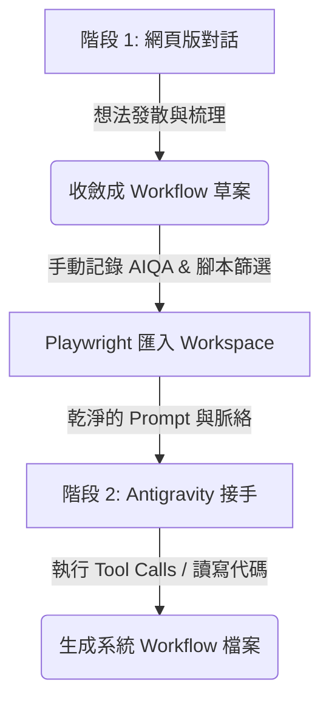

當我們開始擁抱具備「手」和「自主規劃能力」的代理人 AI (Agentic AI，如 Antigravity) 時，很多人會陷入一個誤區：既然 Agent 這麼強，那就把所有疑難雜症、甚至是最前期的混沌發想，通通塞給它處理。

但在實戰中，這種「全包式」的代理人工作流往往會帶來三個痛點：
1. **Token 消耗極快**：前期的想法梳理包含大量的發散與嘗試，會讓 Agent 在多輪對話中背負沉重的 Context 歷史，導致 Token 費用飆升。
2. **思維噪音干擾**：發想階段的「雜質」非常多。如果讓 Agent 直接在代碼庫中遊走，它可能會因為這些不成熟的想法而寫出大量無用程式碼或反覆修改。
3. **專注度被分散**：在 Agent 環境中，開發者常常要分心去看它的 Tool Calls、代碼執行結果與報錯，反而無法專心收斂思考。

為了解決這個問題，我最近摸索出一套 **「兩階段人機協作方法論」**。以「建構虛擬企業建模」的標準方法為例，我成功地讓 Antigravity 的使用量大幅減少，同時讓產出過程變得無比流暢，甚至還帶有一點幽默的樂趣！

---
## 🧠 兩階段協作的核心架構：發散在雲端，落地在地端

這套方法的精神其實很簡單：**把「發散發想」交給免費、快速的網頁版 AI；把「嚴謹落地」交給擁有本地環境操作能力的 Antigravity。**

### ### 階段 1：網頁版 AI (如 Gemini Web UI) 的思維收斂
在最前期的發想階段，我直接在網頁版的 Gemini 做想法與設計上的討論。
* **低成本的發散**：網頁版對話沒有本地 Token 的負擔，我可以毫無壓力地跟它聊各種天馬行空的想法。
* **專注於思考**：在這個環境中，我不需要管環境配置、不需要管 Python 報錯，只需要專心在邏輯與設計的收斂上。
* **產出 Workflow 草案**：當對話告一段落，想法逐漸清晰後，我請它幫我整理出一個大致的標準工作流文件草案。

### ### 階段 2：地端 Agentic AI (Antigravity) 的結構落地
有了前期的 Workflow 草案後，接下來就是讓 Antigravity 發揮實力的時刻：
1. **讀取脈絡**：我讓 Antigravity 讀取剛才在網頁版整理好的 Workflow 草案，並直接建構成系統內部的標準工作流檔案（即專案中的 [.agent/workflows/virtual-enterprise-modeling.md](file:///.agent/workflows/virtual-enterprise-modeling.md)）。
2. **精準執行**：因為進來的脈絡已經過度清洗與收斂，Antigravity 不用再猜測我的意圖，只需在我的 workspace 內，發揮它「有手、有代碼執行能力」的特長，精準完成目錄建置與架構寫作。

---

## 🛠️ 我的實戰小技巧：AIQA 紀錄與 script 篩選腳本

在這個流程中，我依然維持著傳統的 **AIQA** 記錄習慣。但如果把混亂的全過程都丟給 AI, 感覺容易將事情搞混。

於是我設計了一個小技巧：
* 雖然每一次網頁版的對話都有被手動記錄下來，但我寫了一個 Script，專門用來挑選與過濾出「我真正要的是哪幾個精華對話」。

---

## 🎯 實測結果：流暢且高度擬真的虛擬企業

有了這套經過網頁版收斂、再由 Antigravity 嚴謹建構的 `/agent/workflows/virtual-enterprise-modeling.md` 工作流，我試著真的去跑一次「虛擬企業建模」。

結果還意外不錯！以往在 Agent 環境裡直接發想，經常因為 context 膨脹導致 Agent 邏輯錯亂或卡住；而這次：
1. **極度流暢**：每一步都有 clear instructions，Antigravity 順暢地幫我把 APQC 的流程框架與 ISO 9001 條款，作為「骨架」牢牢定錨。

---

> **哈爸心得**：
> 人機協作的精髓不在於「誰取代誰」，而是「頻寬的分配」。發散階段的混亂與直覺，是人類（或低成本網頁 AI）最擅長的戰場；而結構化的程式碼撰寫與重複性高的檔案操作，則是 Agentic AI 的天下。學會用「雙核」進行大腦分工，不僅省下大筆 Token 費用，也讓開發過程好玩多了！

---

> **AI 協作聲明**：
> 本文由筆者提供原始筆記與實戰思維，由 AI 助手 Antigravity 彙整架構與修辭。結合了虛擬企業建模的兩階段實務與哈爸筆記的敘事風格，展現人機協作下的個人 AI 應用成果。
