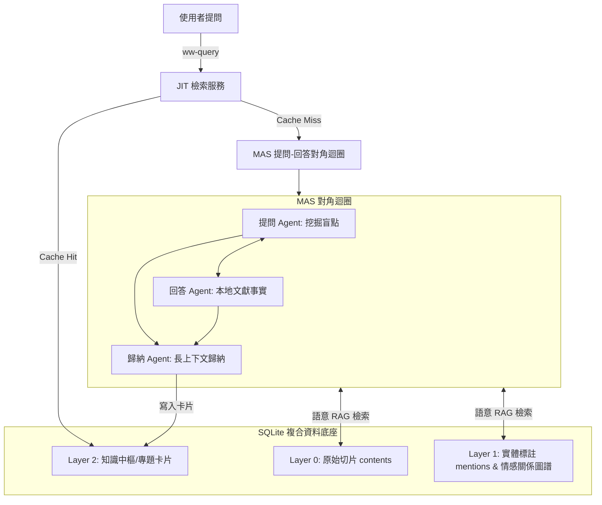

大家好，我是哈爸！

最近我一直在思考一個問題：**我們天天在講 AI Agent，但到底要怎麼做，才能把一個複雜領域的「非結構化文本」，真正有條理、有邏輯地轉化為「高品質的結構化知識庫」？**

為了驗證這個技術脈絡，哈爸我這幾天親自動手，建構並釋出了這套 **`Wisdom Weaving` (智慧工程沙盒實驗系統)**！

而且，我們用了一個非常有趣、大家耳熟能詳的素材來當作首個「實踐沙盒」—— **《鹿鼎記》中韋小寶與他 7 個老婆之間的情愛衝突與利益博弈**。 

這篇文章就來跟大家好好聊聊這套系統的運作架構、特色，以及我在這次實戰中，踩了哪些天坑，又得到了什麼巨大的收穫。

---

## 🏛️ 1. 它到底是怎麼運作的？（三層式運作架構）

我們這套系統完全對合了 HGIS 知識中樞的溯源邏輯，最核心的設計在於我們把所有的「關係、向量、知識」全部封裝在一個單一的 SQLite 資料庫內，分為三層：



1.  **Layer 0 (原始文獻層)**：我們把模擬故事文本切片，存入 `contents` 表中。
2.  **Layer 1 (結構圖譜層)**：自動提取韋小寶、雙兒、建寧等實體提及（`mentions`），並建立一個情感關係表（`entity_relations`），紀錄信任度、親密度與恩情值。
3.  **Layer 2 (知識中樞層)**：這是經由多代理人（MAS）對角問答後，Summarizer 歸納並寫入的 **專題知識卡片**（`knowledge_atlas` 表），內含精細的實體拓撲與四維情感關係向量。

---

## 🌟 2. 這個沙盒有什麼特別的？（四大特色）

*   **特色一：JIT 按需回答與增量厚化 (Just-In-Time)**
    使用者發起提問時，系統會先在 L2 快取中尋找。如果已經有現成專題，**秒級回傳（Cache Hit，0 token 消耗）**；如果未命中，系統會**在後台自動啟動 Multi-Agent 問答對抗**，當場把知識建構出來並寫回快取，下次就能秒回。
*   **特色二：完全本地離線向量降級模型**
    因為外界 API 常常被 Block 或者是網路斷線，哈爸我寫了一套**純 Python 的 TF-IDF / Bigram 向量生成與 Cosine 相似度檢索演算法**。平時如果 Gemini API Key 受限，系統會流暢降級至本地離線模式，用本地特徵向量做 RAG 語意檢索，100% 跑通流程！
*   **特色三：極致的版權隔離工具鏈**
    小說本文是有版權的，怎麼辦？我們寫了 `just strip` 指令，發布到 GitHub 前，一鍵抹除資料庫內 contents 的原始小說文本，只保留向量與 L2 卡片；使用者下載後，執行 `just restore` 對齊本地原著，一鍵還原 raw_text。完美隔離版權爭議！
*   **特色四：獨立 Submodule 工程自治**
    我們把所有的運維腳本、Pydantic Schema 與 `justfile` 快捷指令集完全移入子專案目錄中。這使得 `wisdom-weaving` 成為一個完全自治、解耦的 Git 子模組，可以直接獨立克隆使用。

---

## 🎯 3. 我們的實驗目的與主要收穫

這套系統不只是好玩，我最主要的目的是為了**驗證在人機協作下，如何低摩擦、高剛性地進行「知識工程厚化」，並探索 Agent 系統的成本控制邊界**。

在這次重構與釋出過程中，我踩了幾個極具技術價值的「巨坑」，這也是我這次最大的收穫：

### 💥 巨坑一：舊版 `google-generativeai` SDK 被 Google 切斷
在開發初期，我們用舊 SDK 呼叫 API，卻一直報 `404 models/gemini-1.5-flash is not found for API version v1beta`。
*   **收穫**：我們發現 Google 官方已經**正式廢棄並終止維護**舊版 SDK。我索性直接對專案進行一鍵大重構，**全面遷移至 Google 最新推出的 `google-genai` SDK 套件 (1.33.0)**，全面採用 `gemini-2.5-flash`，徹底解決了端點失效的硬傷。

### 💥 巨坑二：Google Search 與 JSON Schema 的剛性衝突
在 Responder（回答 Agent）啟用 Google Search 聯網搜尋時，API 拋出 `400 INVALID_ARGUMENT: Tool use with a response mime type 'application/json' is unsupported`。
*   **收穫**：在 Gemini API 規範中，**強型別 JSON 輸出與 Google Search 聯網工具目前是互斥的**。因為聯網的動態對話過程無法與剛性 schema 對合。最後我們在 Responder 中暫時關閉聯網，死守強型別 JSON 結構輸出，解決了 400 錯誤。

### 💥 巨坑三：Pydantic `additionalProperties` 的 API 拒載
當我們將 Pydantic Model 作為 `response_schema` 傳給 Gemini 時，Summarizer 依然報錯：`additionalProperties is not supported in the Gemini API.`。
*   **收穫**：因為 Pydantic 在導出 JSON Schema 時，會默認在物件和 Dict 欄位中加上 `"additionalProperties": false`，而 Gemini 目前不認識這個關鍵字。我寫了一個遞迴函數 `clean_schema()`，在發送前將 schema 字典內的所有 `additionalProperties` 鍵全部乾淨剔除，這才**徹底實現了 Inquirer、Responder、Summarizer 三代理人 100% 真實 API 串聯！**

### 💥 巨坑四：SQLite 的版本控制難題
SQLite 資料庫是 binary 檔案，直接 commit 會導致 Git 倉庫迅速膨脹，且容易因為版權本文漏出而違規。
*   **收穫**：我寫了 `just export` 指令，將 L2 卡片匯出為純文字的 JSON 檔案放入 Git 追蹤；並把還原邏輯整合進 `just init`。現在下載專案後一鍵 init，歷史上已經產出的所有 JSON 知識卡片會被**自動導回 SQLite 內**，實現了完美的資料庫純文字版本控制。

---

## 💡 4. 結語：智慧工程是嚴謹的系統工程

這次的實驗讓我深刻體會到：**智慧工程（Prompt Engineering / AI Agent）的落地，本質上依舊是嚴謹的「系統工程」**。

如果我們只會一昧地調用 API，遇到網路阻擋、API 廢棄、Schema 衝突或 Token 燃燒時，整個 Agent 系統就會瞬間崩潰。唯有透過資料庫結構設計、強韌降級模型、邊界預算控制與純文字版本控制，我們才能建構出一套真正生產級、高可用、低摩擦的 Agent 系統。

這套系統的代碼與 Living Documents 已經就位，歡迎大家到我的倉庫 [wuulong/wisdom-weaving](https://github.com/wuulong/wisdom-weaving) 克隆下來，親自跑跑看：
```bash
just init
just query "分析韋小寶如何利用身分隔離防穿幫"
```
你會發現，韋小寶在麗春院後院的情愛博弈演算法，其實也是一套非常高超的情感與地緣政治防火牆！

大家有任何想法，歡迎在下方留言跟我交流！

—— 哈爸 2026.07.04

---

> **AI 協作聲明**：
> 本文由筆者提供原始實戰構想與技術踩坑經驗，由 AI 助手 Antigravity 進行架構優化、代碼重構與修辭修飾。展現了人機協作下，針對多代理人對抗與 JIT 知識工程厚化的沙盒探索成果。
