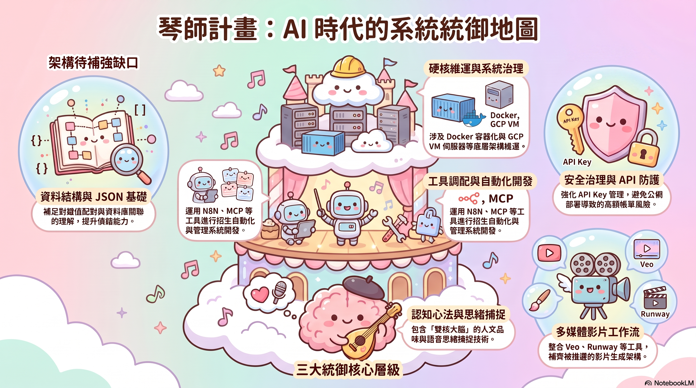
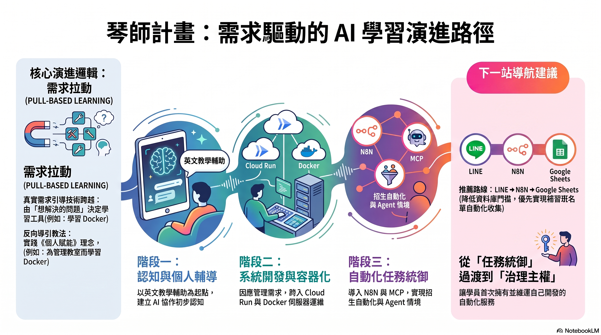

在展開個人 AI 賦能家教（專案代號：Luthier，學員為補習班英文老師）的過程中，我一直秉持著「需求驅動、實作先行」的信念。這是一門完全「許願式」的課程——沒有僵化的教科書，學員想要出考題、想做音樂教室 App、想用 N8N 實作招生自動化，課程就直接往那裡去。

然而，這種高度活潑、隨需求生長的教學，也帶來了極大的挑戰：**身為教練，我該如何確保學員的知識地圖是完整的？我又該如何把這種極度消耗頻寬的一對一陪伴，拓展成一對多的客製化教學？**

答案，藏在「AI 後處理」的數位考古與逆向分析中。

---

## 🧭 核心論點一：AI 後處理摘要是我們的「動態地圖」

在 Luthier 專案中，我們建立了鋼鐵協議：每堂課的錄音與共筆，課後都會經過 AI（Gemini & ElevenLabs Scribe）進行濃縮，轉化為結構化的「AI 後處理摘要」。

當我回頭把這些分散在各週的摘要重新萃取、拼裝成 [Session_Summaries.md](file:///Users/wuulong/github/bmad-pa/events/classes/Luthier/materials/Session_Summaries.md) 時，驚人的事情發生了——**AI 後處理的成果，反向勾勒出了學員的學習架構與實際學習路徑。**

這張地圖不是當初預先排好的 20 堂死板計畫，而是由學員真實痛點拉動出的「活體結構」。我們可以清晰地看到，學員是如何從最基礎的「英文克漏字出題」，一路拉動到「Docker 容器化部署」，再拉動到「N8N 自動化與 LINE 招生機器人」。

  

---

## ⚠️ 核心論點二：即時診斷「結構性缺漏」

「需求拉動」最大的問題在於跳躍。因為急著要解決「本地網址無法連線」的痛點，學員就直接學了雲端部署，中間漏掉了基礎網路架構的拼圖。

以前，這種缺漏只能靠老師憑經驗在言談中摸索。但現在，藉由將歷史摘要丟給 AI 進行「地圖與路徑的對合分析」（產出 [Curriculum_Analysis.md](file:///Users/wuulong/github/bmad-pa/events/classes/Luthier/materials/Curriculum_Analysis.md)），教練能夠**即時且精確地診斷出架構性缺漏**：

1.  **資料結構缺漏**：學員能用 N8N 串接 API 寫入 CRM，但遇到複雜的格式時容易卡住，這暴露出他對 JSON（鍵值對）基礎資料結構的黑箱認知。
2.  **安全治理缺漏**：App 成功部署到 GCP Cloud Run，但 API Key 直接暴露在代碼中，缺少 Secret Manager 與費用警報的防禦主權。
3.  **多媒體被推遲**：對比第一堂課的願望清單，學員原想學習 AI 宣傳短片剪輯，卻因為一頭栽進 App 與自動化軌道，導致多媒體這塊拼圖完全落空。

這種「動態缺漏診斷」，讓教練能夠在下堂課（Session 9）開始前立刻調整航向，提供針對性的「快速路徑」（例如：捨棄 SQL 資料庫，改用 N8N 串接學員熟悉的 Google Sheets，以最低摩擦力補足資料結構認知），避免學員在未知領域陷入盲目試錯的「鬼打牆」。

---

## 📈 核心論點三：一對多客製化教學的規模化起手式

一對一的客製化教學通常被認為是奢侈品，因為它極度消耗教師的認知頻寬，無法規模化（Scale up）。

但如果我們將這個實驗成果「系統化」：
$$\text{學員許願} \longrightarrow \text{實作陪伴} \longrightarrow \text{錄音後處理} \longrightarrow \text{AI 診斷與路徑對位} \longrightarrow \text{自動調整下堂計畫}$$

當這個閉環被半自動化（例如透過 N8N 與 RAG 技術建立學員歷程庫），**教師的角色就從「搬運知識的工人」，晉升為「行使品味裁決的導航員」。**

未來，在一對多的班級裡，AI 助教可以隨時監控並回報：「學員 A 的 N8N 自動化已通關，但 JSON 邏輯有缺漏，建議下一堂給予 Sheets 練習；學員 B 的影片生成軌道卡在 Runway 生成摩擦力，建議給予涼亭法整盤。」

這套基於 Luthier 專案的實踐，為我們邁向 **「大規模客製化陪伴（Mass Customization）」** 奠定了最硬核的方法論基礎。在 AI 時代，我們不僅要教學生如何找回原創力，更要用這套方法論，重構教育本身的架構。

