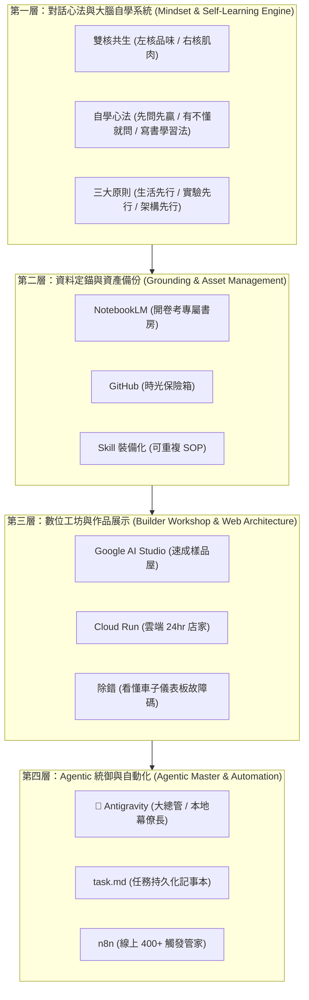

非 IT 人員學習 AI 最怕的不是「不努力」，而是「名詞壁壘與資訊過載」。

在 **Project Luthier（琴師計畫）** 進行到第九堂前夕，學員（一位補習班英文老師）對我提出了一個非常深刻的「許願」：

> **學員的許願**：  
> 「我覺得第 9 堂值得做的，不是再學更多新工具，而是把前 8 堂學到的內容全部串成一個完整的知識地圖。等這個地圖建立起來，之後學任何新工具都能立刻知道它在整個 AI 生態系中扮演什麼角色，也更容易把它應用到我想打造的音樂教室 AI 助理上。」

面對學員這樣精準的需求，身為教練，我的**核心企圖**不是去上一堂高高在上的理論課，而是要**「利用真實資料」**帶她看清自己的演化軌跡，同時**「將資訊過載降到最低」**。

以下是我在第九堂課前夕所採取的實際行動與教學心法。

---

## 一、 哈爸的實務做法：三步驟從「真實紀錄」到「簡報降維」

為了回應這個許願，我沒有憑空想像寫講義，而是透過三個實作步驟來建構這堂課：

### 步驟 1：整理每一堂課的真實歷史資料 (Data Extraction)
我先透過腳本把前 8 堂課的對話紀錄、錄音筆記與 AI 後處理摘要，進行結構化剖析，系統性地整理到各自獨立的目錄中（`lesson#01` 到 `lesson#08` 的 `README.md`）。

**為什麼要這麼做？** 因為最好的教材不是課本範例，而是學員自己走過、留下的「真實證據」。

### 步驟 2：從真實資料中萃取「知識積木與演化路徑」 (Path Analysis)
有了 1 到 8 堂課的乾淨資料後，我從中提煉出四個層級的概念積木（如：雙核共生、NotebookLM 開卷考、AI Studio 樣品屋、Antigravity 大總管、n8n 線上管家）與「三大先行原則（生活先行、實驗先行、架構先行）」。

### 步驟 3：餵入 NotebookLM 自動生成縮圖與投影片 (Information Compression)
資料整理完後，如果直接把長篇大論印給學員，只會造成第二次的認知過載。
因此，我將整理好的 8 堂課資料一次性餵入 `NotebookLM`，利用模型進行極致的「資訊壓縮與降維」：
- **生成高濃縮簡報投影片 (Slides Blueprint)**
- **生成章節視覺縮圖與結構心智圖**

透過 NotebookLM 的降維打擊，學員在課堂上只需要看著幾張高度濃縮的視覺投影片與結構圖，就能在 10 分鐘內重溫過去 8 堂課的成長脈絡。

---

## 二、 企圖與心法：從「工具人」到「樂團指揮家」

這堂課我真正想傳達的企圖只有一個：**「讓學員從被軟體奴役的工具人，轉變為手握指揮棒的樂團指揮家。」**

1. **去技術化與生活對位**：
   不講複雜的 `API` 或 `Docker`，而是讓她明白：`Antigravity` 是首席幕僚長，`NotebookLM` 是開卷考書房，`AI Studio` 是樣品屋，`GitHub` 是遊戲存檔點。
2. **釐清「積木縫隙的摩擦力」**：
   學員卡關往往不是因為不會寫代碼，而是不知道工具間怎麼接：改 App 沒更新是因為 **Cache（快取）**；工具傳不了資料是因為需要 **n8n（傳聲筒）**；不敢改壞是因為少了 **GitHub Commit（保險箱）**。
3. **無代碼畫出「流水線」**：
   課堂最後完全不開工具、不寫代碼，純粹請她扮演「系統架構師」，畫出她的補習班 AI 助理藍圖，並在關鍵關卡行使她的**「品味裁決（說 OK 或 不 OK）」**。

---

## 💡 教練總結

「許願式客製化教學」的魅力在於：**學員的需求就是最新的導航羅盤。** 

透過「整理真實資料 ➔ 剖析知識路徑 ➔ NotebookLM 簡報降維」的閉環，我們不僅滿足了學員「串聯知識地圖」的許願，更示範了如何利用 AI 工具鏈來極致降低學習門檻。

> **AI 協作聲明**：
> 本文由筆者提供 Project Luthier 第九堂課的教學企圖、許願契機與真實資料整理步驟，由 AI 助手 Antigravity 整理文章架構、Mermaid 流程圖與修辭。展現人機協作下將許願式教學實踐轉化為系統化部落格筆記的成果。
